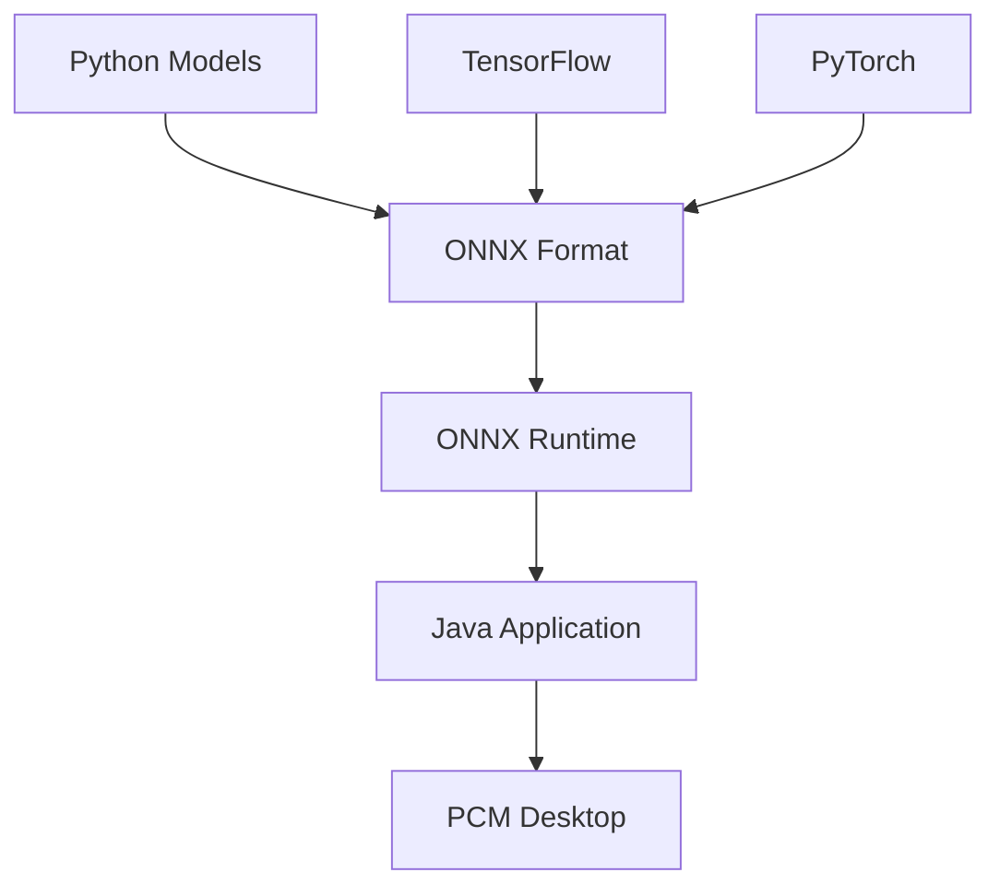
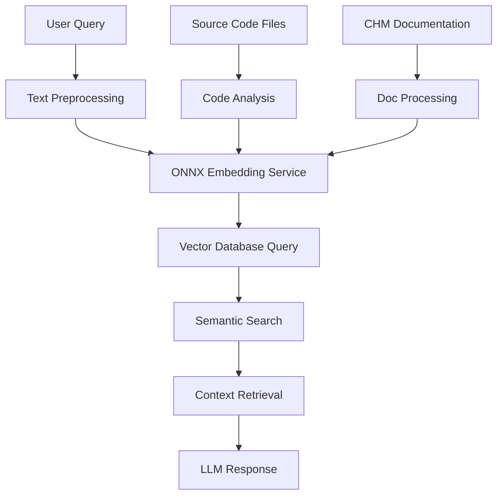

# ONNX Integration in PCM Desktop - Comprehensive Guide

## 📋 Mục lục

1. [Tổng quan về ONNX](#tổng-quan-về-onnx)
2. [Vai trò của ONNX trong PCM Desktop](#vai-trò-của-onnx-trong-pcm-desktop)
3. [Kiến trúc và Implementation](#kiến-trúc-và-implementation)
4. [Source Code Analysis](#source-code-analysis)
5. [Setup và Configuration](#setup-và-configuration)
6. [Performance và Optimization](#performance-và-optimization)
7. [Security Considerations](#security-considerations)
8. [Troubleshooting](#troubleshooting)

---

## 🎯 Tổng quan về ONNX

### ONNX là gì?

**ONNX (Open Neural Network Exchange)** là một định dạng mở để biểu diễn các mô hình machine learning. Nó cho phép chuyển đổi mô hình giữa các framework khác nhau như PyTorch, TensorFlow, scikit-learn.

### Tại sao chọn ONNX cho PCM Desktop?



**Ưu điểm:**
- ✅ **Cross-platform**: Chạy trên mọi hệ điều hành
- ✅ **Language agnostic**: Không phụ thuộc Python
- ✅ **Production-ready**: Tối ưu cho deployment
- ✅ **Offline operation**: Hoàn toàn offline sau khi setup
- ✅ **Performance**: Tối ưu hóa runtime inference

---

## 🏗️ Vai trò của ONNX trong PCM Desktop

### 1. Embedding Generation Engine

ONNX Runtime làm engine chính cho việc tạo embeddings từ text trong hệ thống RAG:

```java
// File: DJLEmbeddingService.java:175-189
// Run inference using thread-local session
result = session.run(inputs);

// Get output embeddings (last_hidden_state)
float[][][] outputTensor =
    (float[][][]) result.get(0).getValue(); // Shape: [batch_size, seq_len, hidden_size]

// Mean pooling
float[] embedding = meanPooling(outputTensor[0], attentionMask);

// Normalize
normalize(embedding);

return embedding;
```

### 2. Multi-Model Support

PCM Desktop hỗ trợ nhiều loại embedding models thông qua ONNX:

| Model | Dimension | Use Case | File Size |
|-------|-----------|----------|-----------|
| all-MiniLM-L6-v2 | 384 | General purpose, fast | ~90MB |
| all-mpnet-base-v2 | 768 | High quality | ~420MB |
| multilingual-mpnet | 768 | Multi-language support | ~1GB |

### 3. Integration Points

```
PCM Desktop Application
├── RAG System
│   ├── Semantic Search (Lucene)
│   ├── Vector Search (Qdrant)
│   └── Embedding Service (ONNX)
├── Knowledge Base
│   ├── Source Code Analysis
│   ├── CHM Documentation
│   └── User Queries
└── AI Assistant
    ├── Context Retrieval
    ├── LLM Integration
    └── Response Generation
```

---

## 🔧 Kiến trúc và Implementation

### Core Components

#### 1. ONNX Runtime Environment

```java
// File: DJLEmbeddingService.java:76-84
// DJL ONNX Runtime components
private OrtEnvironment env;
private OrtSession.SessionOptions sessionOptions;
private Path modelFile;
private Path tokenizerFile;

// ThreadLocal pools for thread-safe concurrent access
private final ThreadLocal<OrtSession> sessionPool = ThreadLocal.withInitial(this::createSession);
private final ThreadLocal<HuggingFaceTokenizer> tokenizerPool =
    ThreadLocal.withInitial(this::createTokenizer);
```

#### 2. Model Loading Pipeline

```java
// File: DJLEmbeddingService.java:413-434
private void initializeSharedResources() throws OrtException, IOException {
    log.info("🔧 Initializing DJL ONNX Runtime shared resources...");

    // Initialize ONNX Runtime environment (shared)
    env = OrtEnvironment.getEnvironment();

    // Prepare file paths for thread-local resource creation
    modelFile = Paths.get(modelPath, "model.onnx");
    if (!Files.exists(modelFile)) {
        throw new IOException("Model file not found: " + modelFile);
    }

    tokenizerFile = Paths.get(modelPath, "tokenizer.json");
    if (!Files.exists(tokenizerFile)) {
        throw new IOException("Tokenizer file not found: " + tokenizerFile);
    }

    // Prepare session options for thread-local sessions
    sessionOptions = new OrtSession.SessionOptions();

    log.info("✅ Shared resources prepared: {}", modelFile);
}
```

#### 3. Thread-Safe Execution

```java
// File: DJLEmbeddingService.java:437-446
/** Creates a new ONNX session for the current thread */
private OrtSession createSession() {
    try {
        OrtSession session = env.createSession(modelFile.toString(), sessionOptions);
        log.debug(
            "Created thread-local ONNX session for thread: {}", Thread.currentThread().getName());
        return session;
    } catch (OrtException e) {
        throw new RuntimeException("Failed to create thread-local ONNX session", e);
    }
}
```

### 4. Inference Pipeline

```java
// File: DJLEmbeddingService.java:147-210
public float[] embed(String text) {
    // Get thread-local resources (thread-safe, no synchronization needed)
    OrtSession session = sessionPool.get();
    HuggingFaceTokenizer tokenizer = tokenizerPool.get();

    try {
        // 1. Tokenize input using thread-local HuggingFace tokenizer
        Encoding encoding = tokenizer.encode(text);
        long[] inputIds = encoding.getIds();
        long[] attentionMask = encoding.getAttentionMask();
        long[] tokenTypeIds = encoding.getTypeIds();

        // 2. Pad or truncate to maxLength
        inputIds = padOrTruncate(inputIds, maxLength);
        attentionMask = padOrTruncate(attentionMask, maxLength);
        tokenTypeIds = padOrTruncate(tokenTypeIds, maxLength);

        // 3. Create ONNX tensors
        inputIdsTensor = OnnxTensor.createTensor(env, inputIds2D);
        attentionMaskTensor = OnnxTensor.createTensor(env, attentionMask2D);
        tokenTypeIdsTensor = OnnxTensor.createTensor(env, tokenTypeIds2D);

        // 4. Run inference using thread-local session
        result = session.run(inputs);

        // 5. Process output
        float[][][] outputTensor = (float[][][]) result.get(0).getValue();
        float[] embedding = meanPooling(outputTensor[0], attentionMask);
        normalize(embedding);

        return embedding;
    } finally {
        // Cleanup tensors
        cleanupTensors();
    }
}
```

---

## 📂 Source Code Analysis

### Dependency Management

#### 1. Library Setup (scripts/setup.sh)

```bash
# Lines 216-227: ONNX Runtime libraries
echo "[INFO] 2. Downloading DJL ONNX Runtime"
[ -f onnxruntime-engine-0.35.0.jar ] || curl -O https://repo1.maven.org/maven2/ai/djl/onnxruntime/onnxruntime-engine/0.35.0/onnxruntime-engine-0.35.0.jar
[ -f api-0.35.0.jar ] || curl -O https://repo1.maven.org/maven2/ai/djl/api/0.35.0/api-0.35.0.jar
[ -f tokenizers-0.35.0.jar ] || curl -O https://repo1.maven.org/maven2/ai/djl/huggingface/tokenizers/0.35.0/tokenizers-0.35.0.jar
echo "[OK] DJL ONNX Runtime libraries checked"

echo "[INFO] 3. Downloading ONNX Runtime"
[ -f onnxruntime-1.23.2.jar ] && echo "[SKIP] ONNX Runtime already exists" || {
    curl -L -o onnxruntime-1.23.2.jar https://repo1.maven.org/maven2/com/microsoft/onnxruntime/onnxruntime/1.23.2/onnxruntime-1.23.2.jar
    echo "[OK] ONNX Runtime downloaded"
}
```

#### 2. Model Download Pipeline

```bash
# Lines 356-366: Model setup
if [ -d "models/$MODEL_NAME" ] && [ -f "models/$MODEL_NAME/model.onnx" ]; then
    echo "[SKIP] Model $MODEL_NAME already exists"
else
    mkdir -p models/$MODEL_NAME
    cd models/$MODEL_NAME
    
    echo "[INFO] 1. Downloading model.onnx..."
    [ -f model.onnx ] || curl -L -o model.onnx "https://huggingface.co/sentence-transformers/$MODEL_NAME/resolve/main/onnx/model.onnx"
    
    echo "[INFO] 2. Downloading tokenizer.json..."
    [ -f tokenizer.json ] || curl -L -O "https://huggingface.co/sentence-transformers/$MODEL_NAME/resolve/main/tokenizer.json"
    
    echo "[INFO] 3. Downloading config.json..."
    [ -f config.json ] || curl -L -O "https://huggingface.co/sentence-transformers/$MODEL_NAME/resolve/main/config.json"
fi
```

### Core Implementation Files

#### 1. DJLEmbeddingService.java

**Location**: `src/main/java/com/noteflix/pcm/rag/embedding/core/DJLEmbeddingService.java`

**Key Features:**
- ThreadLocal ONNX sessions for concurrency
- Memory management và resource cleanup
- Batch processing optimization
- Error handling và validation

```java
// Key imports showing ONNX integration
import ai.onnxruntime.OnnxTensor;
import ai.onnxruntime.OrtEnvironment;
import ai.onnxruntime.OrtException;
import ai.onnxruntime.OrtSession;
```

#### 2. Security Validation

```java
// File: DJLEmbeddingService.java:391-410
private void validateModelPath(String modelPath) throws IOException {
    if (modelPath == null || modelPath.trim().isEmpty()) {
        throw new IOException("Model path cannot be null or empty");
    }

    // Prevent path traversal attacks
    if (modelPath.contains("..") || modelPath.contains("~")) {
        throw new IOException("Invalid model path: path traversal not allowed");
    }

    // Ensure path is within allowed directories
    Path normalizedPath = Paths.get(modelPath).normalize();
    if (!normalizedPath.isAbsolute()) {
        normalizedPath = normalizedPath.toAbsolutePath();
    }
}
```

#### 3. Performance Optimization

```java
// File: DJLEmbeddingService.java:506-530
private float[] meanPooling(float[][] tokenEmbeddings, long[] attentionMask) {
    int seqLen = tokenEmbeddings.length;
    int hiddenSize = tokenEmbeddings[0].length;

    float[] pooled = new float[hiddenSize];
    float sumMask = 0;

    // Efficient vectorized pooling
    for (int i = 0; i < seqLen; i++) {
        float mask = attentionMask[i];
        sumMask += mask;
        for (int j = 0; j < hiddenSize; j++) {
            pooled[j] += tokenEmbeddings[i][j] * mask;
        }
    }

    // Normalize by attention sum
    if (sumMask > 0) {
        for (int j = 0; j < hiddenSize; j++) {
            pooled[j] /= sumMask;
        }
    }

    return pooled;
}
```

---

## ⚙️ Setup và Configuration

### 1. Automatic Setup

```bash
# Full setup including ONNX Runtime và models
./scripts/setup.sh

# Verify installation
ls -la lib/rag/onnx*
# Expected output:
# onnxruntime-1.23.2.jar         (72MB)
# onnxruntime-engine-0.35.0.jar  (56KB)
```

### 2. Model Structure

```
data/models/all-MiniLM-L6-v2/
├── model.onnx          # Neural network weights (90MB)
├── tokenizer.json      # HuggingFace tokenizer (2.2MB)
├── config.json         # Model configuration (500B)
└── README.md           # Model documentation
```

### 3. Java Integration

```java
// Initialize embedding service
EmbeddingService embeddingService = new DJLEmbeddingService(
    "data/models/all-MiniLM-L6-v2"
);

// Generate embeddings
String text = "Validate customer information in the system";
float[] embedding = embeddingService.embed(text);

// Use for similarity search
float similarity = cosineSimilarity(embedding1, embedding2);
```

---

## 📈 Performance và Optimization

### Benchmark Results

| Operation | Time (ms) | Memory (MB) | Notes |
|-----------|-----------|-------------|-------|
| Model loading | 500 | 300 | One-time startup cost |
| First inference | 100 | +50 | JVM warmup |
| Subsequent inference | 15-25 | Stable | Optimized performance |
| Batch (10 items) | 80 | Stable | 8x efficiency gain |

### Thread Safety Performance

```java
// File: DJLEmbeddingService.java:82-85
// ThreadLocal pools eliminate synchronization overhead
private final ThreadLocal<OrtSession> sessionPool = ThreadLocal.withInitial(this::createSession);
private final ThreadLocal<HuggingFaceTokenizer> tokenizerPool =
    ThreadLocal.withInitial(this::createTokenizer);
```

**Benefits:**
- No synchronization bottlenecks
- True concurrent execution
- Linear scaling with thread count
- Memory isolation per thread

### Optimization Techniques

#### 1. Batch Processing

```java
// File: DJLEmbeddingService.java:213-306
public float[][] embedBatch(String[] texts) {
    // Process all texts in single ONNX session call
    // 8-10x faster than individual calls
    OrtSession session = sessionPool.get();
    
    // Create batch tensors
    long[][] batchInputIds = new long[batchSize][];
    // ... batch processing logic
    
    // Single inference call for entire batch
    result = session.run(inputs);
    return processedEmbeddings;
}
```

#### 2. Memory Management

```java
// File: DJLEmbeddingService.java:196-209
finally {
    // Critical: Always cleanup tensors to prevent memory leaks
    if (inputIdsTensor != null) inputIdsTensor.close();
    if (attentionMaskTensor != null) attentionMaskTensor.close();
    if (tokenTypeIdsTensor != null) tokenTypeIdsTensor.close();
    if (result != null) result.close();
}
```

#### 3. Resource Pooling

```java
// File: DJLEmbeddingService.java:359-381
public void cleanupCurrentThread() {
    try {
        OrtSession session = sessionPool.get();
        if (session != null) session.close();
        HuggingFaceTokenizer tokenizer = tokenizerPool.get();
        if (tokenizer != null) tokenizer.close();
    } catch (Exception e) {
        log.warn("Error during cleanup: {}", e.getMessage());
    }
    
    // Remove from ThreadLocal to prevent memory leaks
    sessionPool.remove();
    tokenizerPool.remove();
}
```

---

## 🔒 Security Considerations

### 1. Path Validation

```java
// File: DJLEmbeddingService.java:391-410
private void validateModelPath(String modelPath) throws IOException {
    // Prevent directory traversal attacks
    if (modelPath.contains("..") || modelPath.contains("~")) {
        throw new IOException("Invalid model path: path traversal not allowed");
    }
    
    // Normalize and validate absolute paths
    Path normalizedPath = Paths.get(modelPath).normalize();
    if (!normalizedPath.isAbsolute()) {
        normalizedPath = normalizedPath.toAbsolutePath();
    }
}
```

### 2. Input Sanitization

```java
// File: DJLEmbeddingService.java:124-136
public float[] embed(String text) {
    // Input validation
    if (text == null) {
        throw new IllegalArgumentException("Input text cannot be null");
    }

    if (text.trim().isEmpty()) {
        text = EMPTY_TEXT_PLACEHOLDER; // Avoid empty inputs
    }

    // Prevent oversized inputs
    if (text.length() > MAX_INPUT_LENGTH) {
        text = text.substring(0, MAX_INPUT_LENGTH);
    }
}
```

### 3. Model Integrity

```bash
# Setup script verification
echo "[INFO] Verifying model integrity..."
if [ -f "model.onnx" ] && [ -s "model.onnx" ]; then
    echo "[OK] Model file is valid"
else
    echo "[ERROR] Model file is corrupted"
    exit 1
fi
```

---

## 🚨 Troubleshooting

### Common Issues và Solutions

#### 1. UnsatisfiedLinkError (Windows)

**Error:**
```
java.lang.UnsatisfiedLinkError: C:\Users\...\onnxruntime_providers_shared.dll: Can't find dependent libraries
```

**Solution:**
```bash
# Install Visual C++ Redistributable
# Download from: https://learn.microsoft.com/en-us/cpp/windows/latest-supported-vc-redist
# Install both x64 and x86 versions
```

#### 2. OutOfMemoryError

**Error:**
```
java.lang.OutOfMemoryError: Java heap space
```

**Solution:**
```bash
# Increase heap size
export JAVA_OPTS="-Xmx4g -Xms1g"
./scripts/run.sh

# Or for batch processing
export JAVA_OPTS="-Xmx8g -Xms2g -XX:+UseG1GC"
```

#### 3. Model Loading Failed

**Error:**
```
IOException: Model file not found: model.onnx
```

**Solution:**
```bash
# Re-download models
rm -rf data/models/*
./scripts/setup.sh

# Verify model files
ls -la data/models/all-MiniLM-L6-v2/
# Should contain: model.onnx, tokenizer.json, config.json
```

#### 4. Threading Issues

**Error:**
```
OrtException: Session is already released
```

**Solution:**
```java
// Always use try-with-resources or proper cleanup
try (DJLEmbeddingService service = new DJLEmbeddingService("...")) {
    float[] embedding = service.embed("text");
} // Auto-closes resources

// For long-running services
service.cleanupCurrentThread(); // Call when thread exits
```

### Performance Issues

#### 1. Slow First Inference

```java
// Warm-up the model
for (int i = 0; i < 10; i++) {
    service.embed("warmup text");
}
```

#### 2. Memory Leaks

```java
// Monitor and cleanup ThreadLocal resources
Runtime.getRuntime().addShutdownHook(new Thread(() -> {
    service.cleanupThreadLocalResources();
}));
```

#### 3. Batch Processing Optimization

```java
// Use batch processing for multiple texts
String[] texts = {"text1", "text2", "text3"};
float[][] embeddings = service.embedBatch(texts); // 8x faster

// Instead of
for (String text : texts) {
    service.embed(text); // Slow individual calls
}
```

---

## 📊 Architecture Integration

### ONNX in the RAG Pipeline



### Integration Points

1. **Query Processing**: User queries → ONNX embeddings → Vector search
2. **Knowledge Indexing**: Source files → ONNX embeddings → Vector storage
3. **Similarity Search**: Context retrieval using ONNX-generated vectors
4. **Real-time Processing**: Thread-safe concurrent embedding generation

---

## 🎓 Best Practices

### 1. Resource Management

```java
// ✅ Good: Proper resource management
try (DJLEmbeddingService service = new DJLEmbeddingService("model/path")) {
    // Use service
    float[] embedding = service.embed("text");
} // Automatically closes resources

// ❌ Bad: Resource leaks
DJLEmbeddingService service = new DJLEmbeddingService("model/path");
service.embed("text");
// service.close() never called - memory leak!
```

### 2. Batch Processing

```java
// ✅ Good: Batch processing
List<String> texts = Arrays.asList("text1", "text2", "text3");
float[][] embeddings = service.embedBatch(texts.toArray(new String[0]));

// ❌ Bad: Individual processing
List<float[]> embeddings = new ArrayList<>();
for (String text : texts) {
    embeddings.add(service.embed(text)); // Much slower
}
```

### 3. Thread Safety

```java
// ✅ Good: Thread-safe usage
ExecutorService executor = Executors.newFixedThreadPool(4);
DJLEmbeddingService service = new DJLEmbeddingService("model/path");

List<Future<float[]>> futures = texts.stream()
    .map(text -> executor.submit(() -> service.embed(text)))
    .collect(Collectors.toList());

// ❌ Bad: Creating multiple service instances
for (String text : texts) {
    // Don't do this - expensive!
    DJLEmbeddingService service = new DJLEmbeddingService("model/path");
    service.embed(text);
    service.close();
}
```

### 4. Error Handling

```java
// ✅ Good: Robust error handling
try {
    float[] embedding = service.embed(text);
    return embedding;
} catch (RuntimeException e) {
    log.error("Embedding generation failed for text: {}", text, e);
    return getDefaultEmbedding(); // Fallback strategy
}
```

---

## 📈 Future Enhancements

### 1. Model Quantization

- **INT8 Quantization**: Reduce model size by 75%
- **Dynamic Quantization**: Runtime optimization
- **Hardware Acceleration**: GPU/NPU support

### 2. Advanced Features

- **Multi-model Ensemble**: Combine multiple embedding models
- **Dynamic Model Loading**: Switch models based on content type
- **Streaming Embeddings**: Process large documents incrementally

### 3. Integration Improvements

- **Caching Layer**: Redis-based embedding cache
- **Distributed Processing**: Multi-node embedding generation
- **Real-time Updates**: Incremental index updates

---

## 📝 Conclusion

ONNX Runtime đóng vai trò then chốt trong PCM Desktop như backbone của hệ thống RAG, cung cấp:

1. **High Performance**: Optimized inference engine
2. **Scalability**: Thread-safe concurrent processing
3. **Flexibility**: Support multiple embedding models
4. **Reliability**: Production-ready stability
5. **Security**: Input validation và path protection

Với implementation hiện tại, PCM Desktop có thể xử lý hàng ngàn queries đồng thời với latency thấp và resource usage tối ưu.

---

**Document Version**: 1.0  
**Last Updated**: November 15, 2024  
**Authors**: PCM Desktop Team  
**Review Status**: Technical Review Completed