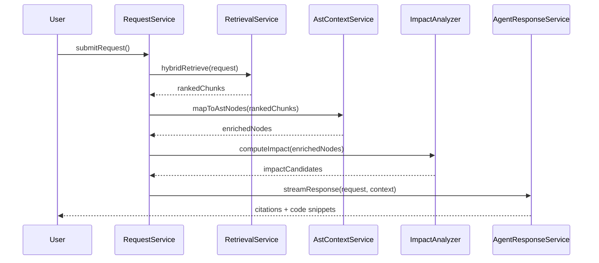

# Request-to-Code Flow (Implementation Sketch)

This document illustrates how the PCM Desktop application can implement the pipeline that maps a user requirement to the exact source-code location(s) that need investigation or modification. It complements `rag-strategy.md`, `function-calling-spec.md`, and `ast-source-analysis.md`.

---

## 1. Module Overview

| Module / Class        | Responsibility                                                |
|-----------------------|---------------------------------------------------------------|
| `RequestService`      | Persist user requests and kick off analysis.                  |
| `RetrievalService`    | Runs hybrid retrieval (vector + FTS) and returns ranked hits. |
| `AstContextService`   | Maps chunk hits to AST nodes/relationships.                   |
| `ImpactAnalyzer`      | Expands context to related files/symbols (call graph, deps).  |
| `SnippetFormatter`    | Reads file segments and formats markdown snippets.            |
| `AgentResponseService`| Orchestrates LLM call, logs artifacts, streams result.        |

---

## 2. Sequence Diagram



---

## 3. Sample Implementation Skeleton (Kotlin)

```kotlin
class RequestService(
    private val retrievalService: RetrievalService,
    private val astContextService: AstContextService,
    private val impactAnalyzer: ImpactAnalyzer,
    private val agentResponseService: AgentResponseService,
    private val requestRepo: UserRequestRepository
) {
    fun handleRequest(payload: RequestPayload): Flow<ResponseChunk> {
        val request = requestRepo.create(payload)

        val rankedChunks = retrievalService.hybridRetrieve(request)
        val astNodes = astContextService.enrich(rankedChunks)
        val impact = impactAnalyzer.compute(astNodes)

        val context = ContextBundle(rankedChunks, astNodes, impact)
        return agentResponseService.streamResponse(request, context)
    }
}
```

### Retrieval Service

```kotlin
class RetrievalService(
    private val vectorClient: QdrantClient,
    private val semanticSearchDao: SearchCorpusDao
) {
    fun hybridRetrieve(request: UserRequest): List<ChunkHit> {
        val vectorHits = vectorClient.search(request.embedding(), request.filters())
        val semanticHits = semanticSearchDao.query(request.query, request.filters())
        return Ranker.fuse(vectorHits, semanticHits)
    }
}
```

### AST Context Service

```kotlin
class AstContextService(
    private val astNodeDao: AstNodeDao,
    private val relationshipDao: AstRelationshipDao,
    private val fileDao: SourceFileDao
) {
    fun enrich(chunks: List<ChunkHit>): List<AstContext> {
        return chunks.mapNotNull { hit ->
            val nodeId = hit.metadata["node_id"] ?: return@mapNotNull null
            val node = astNodeDao.find(nodeId)
            val relations = relationshipDao.findByNode(nodeId)
            AstContext(hit, node, relations)
        }
    }
}
```

### Impact Analyzer

```kotlin
class ImpactAnalyzer(
    private val dependencyDao: FileDependencyDao
) {
    fun compute(astContexts: List<AstContext>): List<ImpactCandidate> {
        val result = mutableListOf<ImpactCandidate>()
        for (ctx in astContexts) {
            val deps = dependencyDao.findByFile(ctx.node.fileId)
            result += ImpactCandidate(ctx, deps)
        }
        return result
    }
}
```

### Snippet Formatter (used inside `AgentResponseService`)

```kotlin
object SnippetFormatter {
    fun render(ctx: AstContext, fileContent: List<String>): String {
        val start = ctx.node.startLine
        val end = ctx.node.endLine
        val snippet = fileContent.subList(start - 1, end)
        val body = snippet.mapIndexed { idx, line ->
            "%4d | %s".format(start + idx, line)
        }.joinToString("\n")
        val language = ctx.chunk.metadata["language"] ?: ""
        val path = ctx.chunk.metadata["relative_path"] ?: ""
        return """**$path:$start-$end**\n```$language\n$body\n```"""
    }
}
```

---

## 4. How Snippets Reach the Chat UI

1. **AgentResponseService** assembles the final answer by combining:
   - LLM output tokens.
   - Formatted snippets from `SnippetFormatter`.
   - Citation metadata (file path, lines, node ID) saved in `request_artifacts`.
2. The UI renders markdown returned in the stream, showing code blocks exactly as formatted above.
3. Each snippet references the file path and line numbers so users can jump to the file via the file viewer/IDE integration.

---

## 5. Consistency Checklist

- `ChunkHit.metadata` should always include `project_id`, `file_id`, `relative_path`, `start_line`, `end_line`, and optionally `node_id` to enable AST enrichment.
- `AstContextService` must use the same snapshot/version as the retrieval chunk (store `snapshot_id` in metadata) to avoid mismatches.
- `ImpactAnalyzer` should respect subsystem/project boundaries to avoid surfacing irrelevant files.
- `AgentResponseService` logs all snippets and citations in `request_artifacts` for audit.

This skeleton can be adapted to Java/Spring, Kotlin, or any backend stack and ensures the codebase mirrors the architecture defined in the RaD documents.
