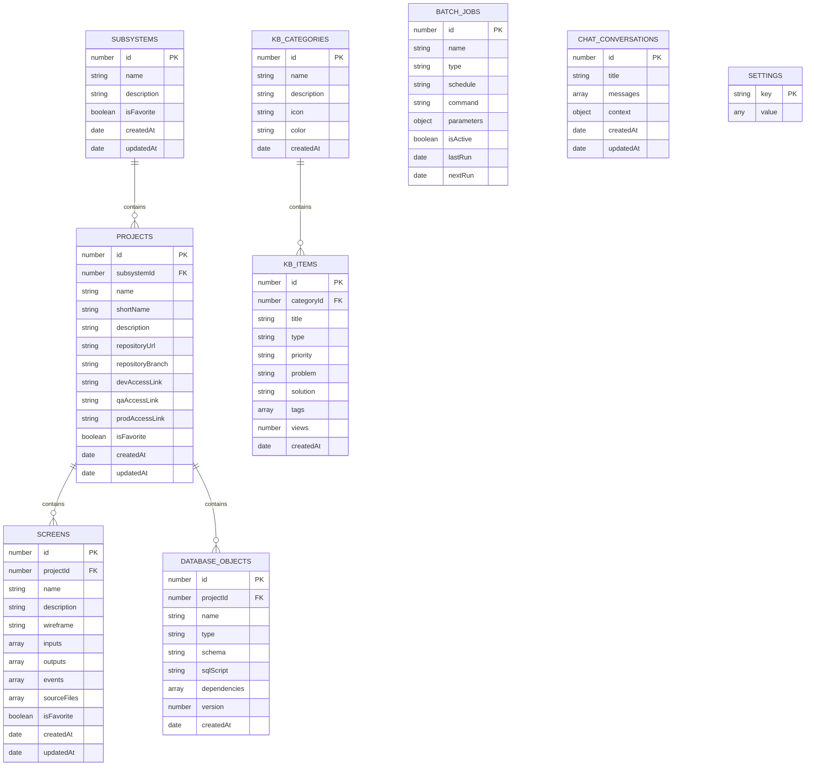

# PCM WebApp - Database Entity Relationship Diagram

## 📊 Visual Schema Diagram



---

## 🗂️ Store Hierarchy

```
📦 PCM_WebApp_Database (v9)
│
├── 🏢 Organization Structure
│   ├── subsystems/
│   │   └── projects/
│   │       ├── screens/
│   │       └── databaseObjects/
│
├── 📚 Knowledge Management
│   └── knowledgeBaseCategories/
│       └── knowledgeBaseItems/
│
├── ⚙️ Operations
│   ├── batchJobs/
│   └── chatConversations/
│
└── 🔧 System
    └── settings/
```

---

## 🔄 Data Flow Diagram

```
┌─────────────────────────────────────────────────────────────┐
│                        User Interface                        │
└───────────────┬─────────────────────────────────────────────┘
                │
                ▼
┌─────────────────────────────────────────────────────────────┐
│                    DatabaseManager.js                        │
│  ┌─────────────────────────────────────────────────────┐   │
│  │ CRUD Operations: create, read, update, delete       │   │
│  │ Query Operations: getAll, getAllByIndex, search     │   │
│  │ Batch Operations: import, export, backup            │   │
│  └─────────────────────────────────────────────────────┘   │
└───────────────┬─────────────────────────────────────────────┘
                │
                ▼
┌─────────────────────────────────────────────────────────────┐
│                    IndexedDB Browser API                     │
│  ┌─────────────────────────────────────────────────────┐   │
│  │ Object Stores: 9 stores                             │   │
│  │ Indexes: 30+ indexes for query optimization         │   │
│  │ Transactions: Auto-managed by DatabaseManager       │   │
│  └─────────────────────────────────────────────────────┘   │
└───────────────┬─────────────────────────────────────────────┘
                │
                ▼
┌─────────────────────────────────────────────────────────────┐
│               Browser Storage (Local Disk)                   │
│            Size: Typically 50-100MB available                │
└─────────────────────────────────────────────────────────────┘
```

---

## 📈 Index Usage Map

### Subsystems

- `name` → Search và sort
- `isFavorite` → Filter favorites

### Projects

- `subsystemId` → List projects by subsystem
- `name` → Search projects
- `isFavorite` → Filter favorites

### Screens

- `projectId` → List screens by project
- `name` → Search screens
- `isFavorite` → Filter favorites

### KB Items

- `categoryId` → Filter by category
- `type` → Filter by type (bug, feature, etc.)
- `status` → Filter published items
- `createdAt` → Sort by date
- `views` → Sort by popularity

### Batch Jobs

- `name` → Search jobs
- `status` → Filter active/paused
- `type` → Filter by job type
- `schedule` → Group by schedule
- `lastRun` → Recent activity
- `nextRun` → Upcoming jobs
- `isActive` → Filter enabled jobs

### Database Objects

- `name` → Search objects
- `type` → Filter by type (TABLE, VIEW, etc.)
- `schema` → Filter by Oracle schema
- `projectId` → Project-related objects
- `version` → Version tracking

---

## 🔐 Data Relationships & Constraints

### Parent-Child Relationships

**Subsystem → Projects:**

```javascript
// Cascade delete
deleteSubsystem(id) {
  // 1. Get all projects in subsystem
  projects = getProjectsBySubsystem(id);

  // 2. Delete all related screens
  projects.forEach(project => {
    deleteProject(project.id); // Cascade
  });

  // 3. Delete subsystem
  delete subsystem(id);
}
```

**Project → Screens:**

```javascript
// Cascade delete
deleteProject(id) {
  // 1. Get all screens in project
  screens = getScreensByProject(id);

  // 2. Delete all screens
  screens.forEach(screen => {
    delete screen(screen.id);
  });

  // 3. Delete project
  delete project(id);
}
```

**Category → KB Items:**

```javascript
// Prevent delete if has items
deleteKBCategory(id) {
  items = getKBItemsByCategory(id);

  if (items.length > 0) {
    throw Error("Cannot delete category with existing items");
  }

  delete category(id);
}
```

---

## 💡 Query Performance Tips

### ✅ DO: Use Indexes

```javascript
// GOOD: Uses index
await databaseManager.getAllByIndex("projects", "subsystemId", subsystemId);
```

### ❌ DON'T: Full Table Scan

```javascript
// BAD: No index, scans all records
const all = await databaseManager.getAll("projects");
const filtered = all.filter((p) => p.subsystemId === subsystemId);
```

### ✅ DO: Batch Operations

```javascript
// GOOD: Single transaction
await databaseManager.bulkCreate("screens", screensArray);
```

### ❌ DON'T: Loop with Individual Calls

```javascript
// BAD: Multiple transactions
for (const screen of screensArray) {
  await databaseManager.createScreen(screen);
}
```

---

## 🔄 Migration Strategy

### Version Upgrade Flow

```
Application Starts
       │
       ▼
┌──────────────┐
│ Check DB Ver │
└───────┬──────┘
        │
        ├─ Same Version ──→ Use Existing DB
        │
        ├─ Higher Version ──→ Run onupgradeneeded
        │                      │
        │                      ├─ Create Missing Stores
        │                      ├─ Add Missing Indexes
        │                      └─ Migrate Data
        │
        └─ Missing Stores ──→ Force Recreate
                               │
                               ├─ Export Current Data
                               ├─ Delete Database
                               ├─ Create New DB
                               └─ Import Data
```

---

## 📊 Storage Estimation

| Store              | Average Record Size | Max Records | Est. Storage |
| ------------------ | ------------------- | ----------- | ------------ |
| Settings           | 100 bytes           | 50          | 5 KB         |
| Subsystems         | 500 bytes           | 100         | 50 KB        |
| Projects           | 2 KB                | 500         | 1 MB         |
| Screens            | 5 KB                | 2000        | 10 MB        |
| Chat Conversations | 10 KB               | 500         | 5 MB         |
| KB Categories      | 300 bytes           | 50          | 15 KB        |
| KB Items           | 3 KB                | 1000        | 3 MB         |
| Batch Jobs         | 1 KB                | 200         | 200 KB       |
| DB Objects         | 5 KB                | 1000        | 5 MB         |

**Total Estimated:** ~25 MB (typical usage)  
**Browser Limit:** 50-100 MB (varies by browser)

---

## 🛠️ Development Tools

### Chrome DevTools

1. Open DevTools (F12)
2. Go to Application tab
3. Click "Storage" → "IndexedDB"
4. Expand "PCM_WebApp_Database"
5. View/edit stores and records

### Firefox DevTools

1. Open DevTools (F12)
2. Go to Storage tab
3. Expand "Indexed DB"
4. Browse stores

### Export/Import via UI

Settings → Data Backup → Export/Import buttons

---

**Document Version:** 1.0  
**Last Updated:** 2025-11-08  
**Database Version:** 9
