# 🎨 AI Chat Message Flow - Visual Diagrams

**Interactive visual diagrams for message processing flow**

**Version**: 1.0.0  
**Last Updated**: November 10, 2025

---

## 📊 Complete Message Flow Diagram

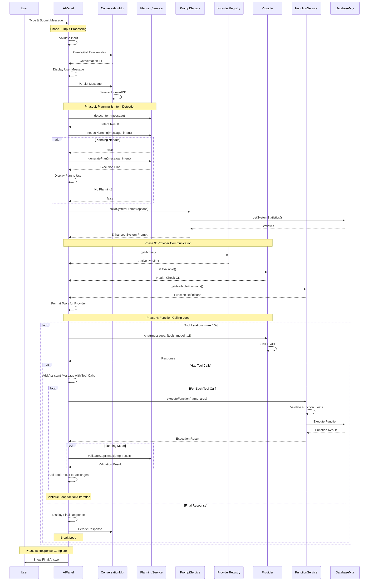

---

## 🔀 Simple Flow (No Planning)

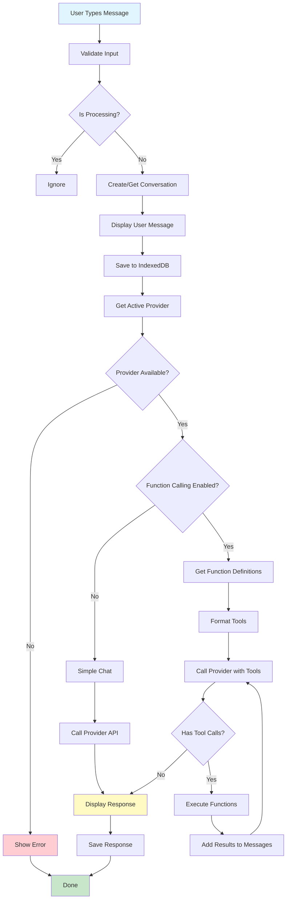

---

## 🧠 Planning Flow (Complex Queries)

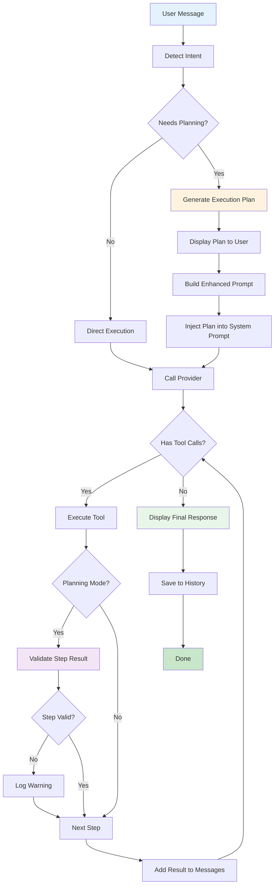

---

## 🔄 Function Calling Iteration Loop

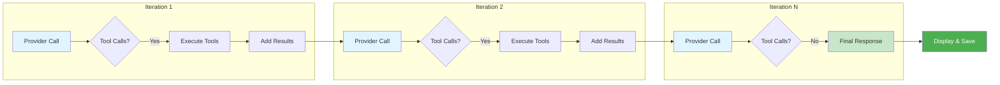

---

## 🎯 Intent Detection Flow

```mermaid
flowchart TD
    MSG[User Message] --> ANALYZE[Analyze Message]

    ANALYZE --> KEYWORDS[Check Keywords]
    ANALYZE --> ENTITIES[Extract Entities]
    ANALYZE --> PATTERNS[Match Patterns]

    KEYWORDS --> CATEGORY{Determine Category}
    ENTITIES --> CATEGORY
    PATTERNS --> CATEGORY

    CATEGORY -->|"analyze", "impact"| ANALYSIS[ANALYSIS]
    CATEGORY -->|"compare", "vs"| COMPARISON[COMPARISON]
    CATEGORY -->|"find", "search"| SEARCH[SEARCH]
    CATEGORY -->|"get", "show"| INFO[INFORMATION]
    CATEGORY -->|"why", "error"| TROUBLE[TROUBLESHOOTING]

    ANALYSIS --> RESULT[Intent Result]
    COMPARISON --> RESULT
    SEARCH --> RESULT
    INFO --> RESULT
    TROUBLE --> RESULT

    RESULT --> CONFIDENCE[Calculate Confidence]
    CONFIDENCE --> TOOLS[Suggest Tools]
    TOOLS --> OUTPUT[Output Intent]

    style MSG fill:#e3f2fd
    style ANALYSIS fill:#ffccbc
    style COMPARISON fill:#ffccbc
    style SEARCH fill:#c5e1a5
    style INFO fill:#c5e1a5
    style TROUBLE fill:#ffccbc
    style OUTPUT fill:#fff9c4
```

---

## 🛠️ Function Execution Flow

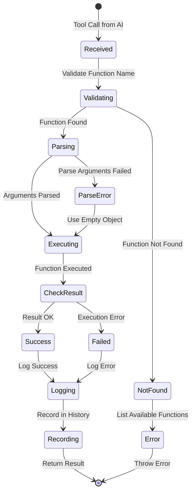

---

## 📦 Provider Architecture

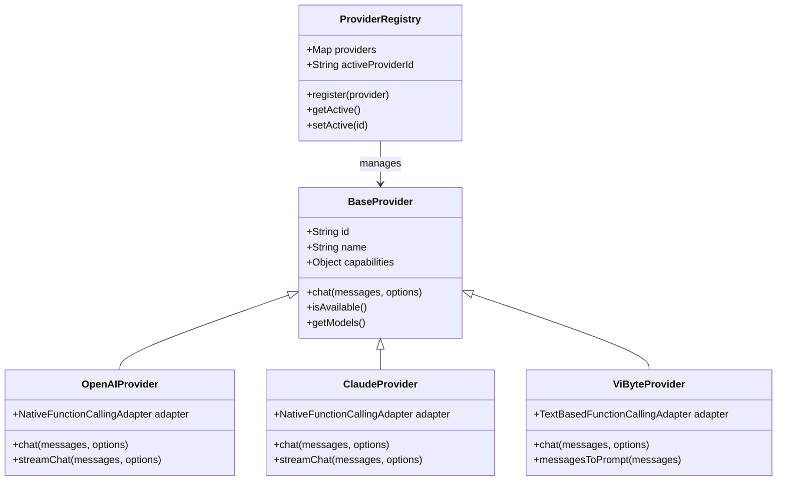

---

## 🗂️ Component Relationships

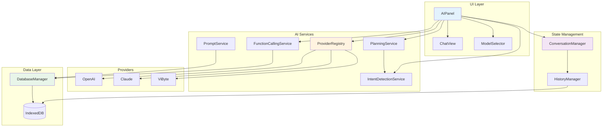

---

## 🔐 Error Handling Flow

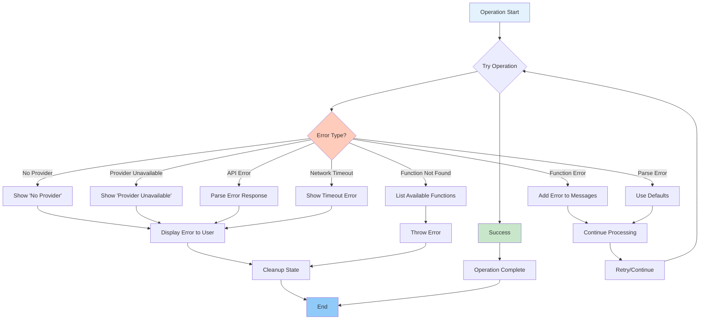

---

## 📊 Data Flow Diagram

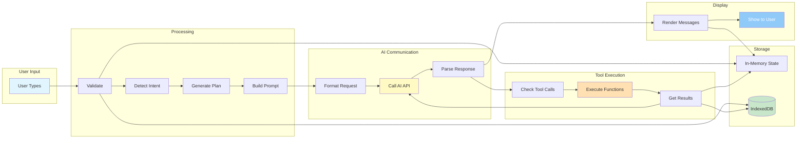

---

## 🎭 Lifecycle Diagram

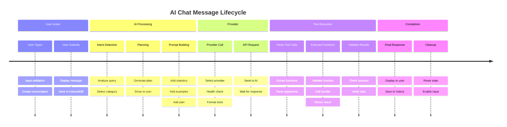

---

## 🔄 State Machine

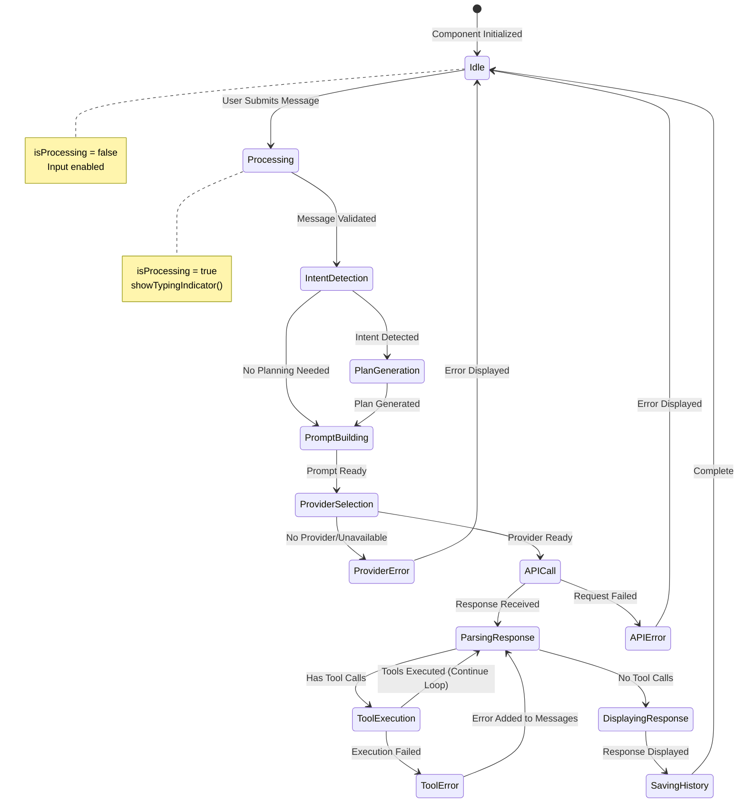

---

## 📝 Summary

### Diagram Types

| Diagram              | Purpose                              | Best For                          |
|----------------------|--------------------------------------|-----------------------------------|
| **Sequence Diagram** | Show interactions between components | Understanding communication flow  |
| **Flowchart**        | Show decision logic                  | Understanding control flow        |
| **State Machine**    | Show state transitions               | Understanding component lifecycle |
| **Class Diagram**    | Show relationships                   | Understanding architecture        |
| **Timeline**         | Show chronological flow              | Understanding process steps       |

### Key Takeaways

1. **Message flow** involves 5 main phases
2. **Function calling** uses iterative loops (max 10)
3. **Planning** enhances complex queries
4. **Error handling** occurs at multiple levels
5. **State management** is critical for conversation continuity

---

## 🔗 Related Documents

- [MESSAGE_FLOW_ARCHITECTURE.md](./MESSAGE_FLOW_ARCHITECTURE.md) - Detailed text documentation
- [AI_PLANNING_STRATEGY_GUIDE.md](./AI_PLANNING_STRATEGY_GUIDE.md) - Planning strategy
- [IMPACT_ANALYSIS_TRACEABILITY_GUIDE.md](./IMPACT_ANALYSIS_TRACEABILITY_GUIDE.md) - Impact analysis

---

**Version**: 1.0.0  
**Created**: November 10, 2025  
**Format**: Mermaid.js Diagrams

**Note**: These diagrams can be rendered in:

- GitHub/GitLab markdown viewers
- VS Code with Mermaid extension
- Mermaid Live Editor (https://mermaid.live)
- Documentation sites (Docusaurus, VitePress, etc.)
