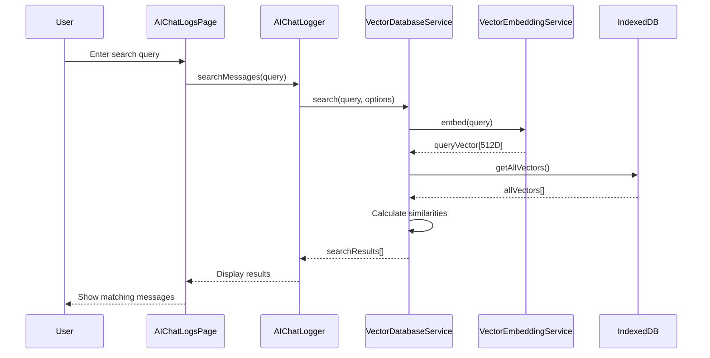

# 🧠 Hướng Dẫn Toàn Diện: Vector Database Offline trong PCM-WebApp

## 📋 Mục Lục

1. [Tổng Quan](#-tổng-quan)
2. [Kiến Trúc Hệ Thống](#-kiến-trúc-hệ-thống)
3. [Cài Đặt và Khởi Tạo](#-cài-đặt-và-khởi-tạo)
4. [Sử Dụng Offline Mode](#-sử-dụng-offline-mode)
5. [API Reference](#-api-reference)
6. [Use Cases và Examples](#-use-cases-và-examples)
7. [Tối Ưu Hóa Performance](#-tối-ưu-hóa-performance)
8. [Troubleshooting](#-troubleshooting)

---

## 🎯 Tổng Quan

### ✨ Tính Năng Chính

Vector Database trong PCM-WebApp cung cấp khả năng **semantic search hoàn toàn offline** với các đặc điểm:

- ✅ **100% Offline Capable**: Không cần internet sau khi khởi tạo
- 🧠 **AI-Powered Search**: Tìm kiếm theo ngữ nghĩa, không chỉ keyword
- 💾 **IndexedDB Storage**: Lưu trữ local trên trình duyệt
- 🔄 **Hybrid Mode**: TensorFlow.js + Fallback cho reliability
- 📊 **High Performance**: Cache thông minh, tìm kiếm nhanh
- 🎯 **No External Dependencies (Fallback Mode)**: Hoạt động 100% độc lập

### 📊 So Sánh Các Chế Độ Hoạt Động

| Mode              | Quality | Offline            | Dependencies | Dimension | Use Case                     |
| ----------------- | ------- | ------------------ | ------------ | --------- | ---------------------------- |
| **TensorFlow.js** | 95%     | ✅ (Cần pre-cache) | External CDN | 512D      | Production với pre-download  |
| **Fallback**      | 65%     | ✅ Hoàn toàn       | Không        | 64D       | Offline-first, low bandwidth |
| **Hybrid**        | Auto    | ✅                 | Linh hoạt    | Auto      | Khuyến nghị mặc định         |

---

## 🏗️ Kiến Trúc Hệ Thống

### Các Component Chính

```
┌─────────────────────────────────────────────────────────┐
│                  User Interface Layer                    │
│  • AIChatLogsPage.js - Search UI                       │
│  • AIPanel.js - Chat interface                         │
└─────────────────┬───────────────────────────────────────┘
                  │
┌─────────────────▼───────────────────────────────────────┐
│               Service Layer                              │
│  • AIChatLogger.js - Auto indexing                     │
│  • OfflineVectorSetup.js - Initialization              │
└─────────────────┬───────────────────────────────────────┘
                  │
┌─────────────────▼───────────────────────────────────────┐
│            Vector Database Layer                         │
│  • VectorDatabaseService.js - CRUD + Search            │
│  • VectorEmbeddingService.js - Embeddings              │
└─────────────────┬───────────────────────────────────────┘
                  │
┌─────────────────▼───────────────────────────────────────┐
│              Storage Layer                               │
│  • IndexedDB (vectors) - Persistent storage            │
│  • Memory Cache - LRU cache                            │
│  • Browser Cache - TensorFlow models                   │
└─────────────────────────────────────────────────────────┘
```

### Data Flow



---

## 🚀 Cài Đặt và Khởi Tạo

### 1. Khởi Tạo Cơ Bản (Hybrid Mode - Khuyến Nghị)

```javascript
// Import services
import { offlineVectorSetup } from "./modules/ai/services/OfflineVectorSetup.js";
import vectorDatabaseService from "./modules/ai/services/VectorDatabaseService.js";
import vectorEmbeddingService from "./modules/ai/services/VectorEmbeddingService.js";

// Initialize với hybrid mode (tự động fallback nếu TensorFlow không available)
async function initializeVectorDatabase() {
  try {
    // Setup offline capability
    const result = await offlineVectorSetup.initializeOffline({
      preferredMode: "hybrid", // 'hybrid', 'tensorflow', hoặc 'fallback'
      downloadModels: false, // true nếu muốn download TensorFlow
      forceMode: null, // Force specific mode nếu cần
    });

    console.log("✅ Vector DB initialized:", result);
    // { mode: 'tensorflow' | 'fallback', offline: true, features: [...] }

    // Initialize database
    await vectorDatabaseService.initialize();

    return { success: true, mode: result.mode };
  } catch (error) {
    console.error("❌ Initialization failed:", error);
    return { success: false, error: error.message };
  }
}
```

### 2. Khởi Tạo Cho Production (Pre-download Models)

```javascript
// BƯỚC 1: Download và cache models khi có internet
async function setupForOffline() {
  if (!navigator.onLine) {
    console.warn("⚠️ No internet connection. Cannot download models.");
    return;
  }

  console.log("📥 Downloading TensorFlow.js models for offline use...");

  const result = await offlineVectorSetup.initializeOffline({
    preferredMode: "tensorflow",
    downloadModels: true, // Download và cache models
  });

  console.log("✅ Models downloaded and cached:", result);
  // Models sẽ được cache trong browser và available offline
}

// BƯỚC 2: Sử dụng offline sau khi đã download
async function useOffline() {
  // Không cần internet, models đã cached
  const result = await offlineVectorSetup.initializeOffline({
    preferredMode: "hybrid", // Sẽ dùng cached TensorFlow
  });

  await vectorDatabaseService.initialize();
  console.log("🚀 Ready to use offline!");
}
```

### 3. Khởi Tạo Fallback Only (Zero Dependencies)

```javascript
// Chế độ này KHÔNG cần internet, KHÔNG cần TensorFlow
async function initializeFallbackOnly() {
  const result = await offlineVectorSetup.initializeOffline({
    preferredMode: "fallback", // Chỉ dùng text-based similarity
  });

  await vectorDatabaseService.initialize();

  console.log("📝 Fallback mode active:", result.features);
  // Features: ['64-dimensional vectors', 'Text-based similarity',
  //            'TF-IDF matching', '~65% accuracy', 'No dependencies']
}
```

---

## 🌐 Sử Dụng Offline Mode

### Scenario 1: Download Trước, Dùng Offline Sau

```javascript
// === BƯỚC 1: Khi có internet (làm 1 lần) ===
async function prepareOffline() {
  console.log("🔧 Preparing for offline use...");

  // Download TensorFlow.js models
  await offlineVectorSetup.initializeOffline({
    preferredMode: "tensorflow",
    downloadModels: true,
  });

  console.log("✅ Offline preparation complete!");
  console.log("💡 You can now use the app without internet");
}

// === BƯỚC 2: Khi offline (sau này) ===
async function useOfflineApp() {
  // Kiểm tra network status
  if (!navigator.onLine) {
    console.log("🔴 Offline mode detected");
  }

  // Initialize với cached models
  const result = await offlineVectorSetup.initializeOffline({
    preferredMode: "hybrid",
  });

  if (result.mode === "tensorflow") {
    console.log("✅ Using cached TensorFlow.js (95% accuracy)");
  } else {
    console.log("⚠️ Using fallback mode (65% accuracy)");
  }

  await vectorDatabaseService.initialize();

  // Sử dụng bình thường
  await addMessages();
  await searchMessages();
}
```

### Scenario 2: 100% Offline Từ Đầu (Fallback Mode)

```javascript
// Không cần internet, không cần pre-download
async function pureOfflineMode() {
  console.log("📝 Starting in pure offline mode...");

  // Force fallback mode
  await offlineVectorSetup.initializeOffline({
    forceMode: "fallback",
  });

  await vectorDatabaseService.initialize();

  // Hoạt động hoàn toàn offline
  console.log("✅ 100% offline ready!");
}
```

### Scenario 3: Hybrid với Auto-Fallback

```javascript
// Tự động detect và fallback
async function autoDetectMode() {
  try {
    // Thử TensorFlow trước
    const result = await offlineVectorSetup.initializeOffline({
      preferredMode: "hybrid",
    });

    await vectorDatabaseService.initialize();

    // Log mode đang dùng
    const status = offlineVectorSetup.getStatus();
    console.log("🎯 Active mode:", status.setupMode);
    console.log("📋 Features:", status.features);

    return status;
  } catch (error) {
    // Fallback sẽ tự động kích hoạt
    console.log("⚠️ Auto-fallback activated");
  }
}
```

---

## 📚 API Reference

### VectorDatabaseService

#### `initialize()`

Khởi tạo vector database và embedding service.

```javascript
await vectorDatabaseService.initialize();
```

#### `addVector(data)`

Thêm một vector vào database.

```javascript
const result = await vectorDatabaseService.addVector({
  id: "msg_123",
  text: "Hello, how can I help you?",
  type: "user_message",
  metadata: {
    sessionId: "session_456",
    timestamp: new Date().toISOString(),
  },
});
```

#### `search(query, options)`

Tìm kiếm semantic.

```javascript
const results = await vectorDatabaseService.search("greeting", {
  limit: 10, // Max số kết quả
  threshold: 0.3, // Minimum similarity (0-1)
  type: "user_message", // Filter by type (optional)
  sessionId: null, // Filter by session (optional)
  includeEmbedding: false, // Include vector trong result (optional)
});

// Results structure:
// [
//   {
//     id: 'msg_123',
//     text: 'Hello, how can I help you?',
//     type: 'user_message',
//     metadata: { ... },
//     timestamp: 1699123456789,
//     similarity: 0.87  // 0-1 scale
//   }
// ]
```

#### `batchAddVectors(dataArray)`

Thêm nhiều vectors cùng lúc.

```javascript
const results = await vectorDatabaseService.batchAddVectors([
  { id: "msg1", text: "Hello", type: "user_message" },
  { id: "msg2", text: "Help me", type: "user_message" },
  { id: "msg3", text: "Thank you", type: "user_message" },
]);
```

#### `getStats()`

Lấy thống kê database.

```javascript
const stats = await vectorDatabaseService.getStats();
console.log(stats);
// {
//   totalVectors: 150,
//   typeDistribution: {
//     user_message: 75,
//     ai_response: 75
//   },
//   embeddingServiceStatus: {
//     isInitialized: true,
//     modelType: 'browser',
//     cacheSize: 45
//   }
// }
```

### VectorEmbeddingService

#### `embed(text)`

Generate embedding cho text.

```javascript
const vector = await vectorEmbeddingService.embed("Hello world");
console.log(vector.length); // 512 (TensorFlow) hoặc 64 (Fallback)
```

#### `cosineSimilarity(vectorA, vectorB)`

Tính cosine similarity giữa 2 vectors.

```javascript
const similarity = vectorEmbeddingService.cosineSimilarity(vectorA, vectorB);
console.log(similarity); // 0.0 - 1.0
```

#### `getStatus()`

Kiểm tra trạng thái service.

```javascript
const status = vectorEmbeddingService.getStatus();
console.log(status);
// {
//   isInitialized: true,
//   modelType: 'browser', // 'browser', 'api', 'fallback'
//   cacheSize: 45,
//   maxCacheSize: 1000
// }
```

### OfflineVectorSetup

#### `initializeOffline(options)`

Khởi tạo offline capability.

```javascript
const result = await offlineVectorSetup.initializeOffline({
  preferredMode: "hybrid", // 'hybrid', 'tensorflow', 'fallback'
  downloadModels: false, // Download TensorFlow models
  forceMode: null, // Force specific mode
});
```

#### `testOfflineCapability()`

Test offline functionality.

```javascript
const testResult = await offlineVectorSetup.testOfflineCapability();
console.log(testResult);
// {
//   success: true,
//   mode: 'tensorflow',
//   embeddingDimensions: 512,
//   searchResults: 1
// }
```

#### `getStatus()`

Lấy trạng thái offline setup.

```javascript
const status = offlineVectorSetup.getStatus();
console.log(status);
// {
//   isOfflineReady: true,
//   setupMode: 'tensorflow',
//   features: [...]
// }
```

---

## 💡 Use Cases và Examples

### Use Case 1: Auto-Index Chat Messages

```javascript
import aiChatLogger from "./modules/ai/services/AIChatLogger.js";

// Initialize
await aiChatLogger.initializeVectorDB();

// Messages sẽ tự động được indexed
aiChatLogger.logMessage("Hello, I need help", "user", "session_123");
aiChatLogger.logAIResponse("How can I assist you?", "openai", "session_123");

// Search sau đó
const results = await aiChatLogger.searchMessages("help", {
  limit: 5,
  threshold: 0.3,
});
```

### Use Case 2: Semantic Search trong UI

```javascript
// In AIChatLogsPage.js or custom component
async function handleSearch(searchQuery) {
  // Show loading
  showLoading();

  try {
    const results = await aiChatLogger.searchMessages(searchQuery, {
      limit: 10,
      threshold: 0.2,
    });

    // Display results với similarity scores
    displaySearchResults(results);

    // Log analytics
    console.log(`Found ${results.length} results for "${searchQuery}"`);
  } catch (error) {
    showError("Search failed: " + error.message);
  } finally {
    hideLoading();
  }
}

function displaySearchResults(results) {
  const container = document.getElementById("searchResults");

  container.innerHTML = results
    .map(
      (result) => `
    <div class="search-result" onclick="highlightMessage('${result.id}')">
      <div class="result-header">
        <span class="result-type">${result.type}</span>
        <span class="similarity-score">${Math.round(result.similarity * 100)}%</span>
      </div>
      <div class="result-text">${result.text}</div>
      <div class="result-meta">
        ${new Date(result.timestamp).toLocaleString()}
      </div>
    </div>
  `,
    )
    .join("");
}
```

### Use Case 3: Find Similar Messages

```javascript
// Tìm messages tương tự với một message cụ thể
async function findSimilarMessages(messageId) {
  const results = await vectorDatabaseService.findSimilarDocuments(messageId, {
    limit: 5,
    threshold: 0.5,
  });

  console.log("Similar messages:", results);
}
```

### Use Case 4: Context-Aware Search

```javascript
// Search trong một session cụ thể
async function searchInSession(query, sessionId) {
  const results = await vectorDatabaseService.search(query, {
    sessionId: sessionId,
    threshold: 0.3,
  });

  return results;
}

// Search chỉ user messages
async function searchUserMessages(query) {
  const results = await vectorDatabaseService.search(query, {
    type: "user_message",
    threshold: 0.3,
  });

  return results;
}
```

### Use Case 5: Bulk Import và Search

```javascript
// Import historical data
async function importHistoricalData(messages) {
  console.log(`Importing ${messages.length} messages...`);

  const batchSize = 50;
  for (let i = 0; i < messages.length; i += batchSize) {
    const batch = messages.slice(i, i + batchSize);
    const results = await vectorDatabaseService.batchAddVectors(batch);

    const successful = results.filter((r) => !r.error).length;
    console.log(
      `Batch ${i / batchSize + 1}: ${successful}/${batch.length} successful`,
    );
  }

  console.log("✅ Import completed");
}
```

---

## ⚡ Tối Ưu Hóa Performance

### 1. Cache Management

```javascript
// Clear cache khi cần
vectorEmbeddingService.clearCache();

// Adjust cache size
vectorEmbeddingService.maxCacheSize = 2000; // Tăng cache size
```

### 2. Batch Operations

```javascript
// ✅ GOOD: Batch add
const vectors = messages.map((m) => ({
  id: m.id,
  text: m.content,
  type: m.type,
}));
await vectorDatabaseService.batchAddVectors(vectors);

// ❌ BAD: Sequential add
for (const message of messages) {
  await vectorDatabaseService.addVector(message); // Slow!
}
```

### 3. Text Truncation

```javascript
// Giới hạn text length cho performance
const maxLength = 1000;
const truncatedText = longText.substring(0, maxLength);

await vectorDatabaseService.addVector({
  id: "msg_123",
  text: truncatedText,
  type: "user_message",
});
```

### 4. Threshold Tuning

```javascript
// Điều chỉnh threshold theo use case
const strictSearch = await vectorDatabaseService.search(query, {
  threshold: 0.7, // Chỉ kết quả rất tương tự
});

const looseSearch = await vectorDatabaseService.search(query, {
  threshold: 0.2, // Nhiều kết quả hơn
});
```

### 5. Lazy Initialization

```javascript
let isInitialized = false;

async function ensureInitialized() {
  if (!isInitialized) {
    await vectorDatabaseService.initialize();
    isInitialized = true;
  }
}

// Chỉ initialize khi cần
async function search(query) {
  await ensureInitialized();
  return await vectorDatabaseService.search(query);
}
```

---

## 🐛 Troubleshooting

### Problem 1: TensorFlow.js Không Load Được

**Triệu chứng**:

```
Failed to initialize browser model: Script loading error
```

**Giải pháp**:

```javascript
// Fallback sẽ tự động kích hoạt
const result = await offlineVectorSetup.initializeOffline({
  preferredMode: 'hybrid'  // Auto fallback to text-based
});

// Hoặc force fallback
const result = await offlineVectorSetup.initializeOffline({
  forceMode: 'fallback'
});
```

### Problem 2: IndexedDB Không Hoạt Động

**Triệu chứng**:

```
Failed to open database: QuotaExceededError
```

**Giải pháp**:

```javascript
// Check storage quota
const estimate = await navigator.storage.estimate();
const usedMB = (estimate.usage / 1024 / 1024).toFixed(2);
const quotaMB = (estimate.quota / 1024 / 1024).toFixed(2);
console.log(`Storage: ${usedMB}MB / ${quotaMB}MB`);

// Clear old data
await vectorDatabaseService.clearAll();

// Request persistent storage
if (navigator.storage && navigator.storage.persist) {
  const isPersisted = await navigator.storage.persist();
  console.log(`Persistent storage: ${isPersisted}`);
}
```

### Problem 3: Search Results Không Chính Xác

**Triệu chứng**: Kết quả search không liên quan

**Giải pháp**:

```javascript
// 1. Kiểm tra mode đang dùng
const status = offlineVectorSetup.getStatus();
console.log("Current mode:", status.setupMode);

// 2. Điều chỉnh threshold
const results = await vectorDatabaseService.search(query, {
  threshold: 0.5, // Tăng để chỉ lấy kết quả tốt hơn
});

// 3. Nếu dùng fallback, consider upgrade to TensorFlow
if (status.setupMode === "fallback") {
  // Download TensorFlow cho accuracy tốt hơn
  await offlineVectorSetup.initializeOffline({
    preferredMode: "tensorflow",
    downloadModels: true,
  });
}
```

### Problem 4: Memory Leak

**Triệu chứng**: Browser chậm dần, memory tăng

**Giải pháp**:

```javascript
// 1. Clear cache định kỳ
setInterval(() => {
  if (vectorEmbeddingService.cache.size > 1000) {
    vectorEmbeddingService.clearCache();
    console.log("Cache cleared");
  }
}, 60000); // Mỗi phút

// 2. Limit vector count
const stats = await vectorDatabaseService.getStats();
if (stats.totalVectors > 10000) {
  // Implement cleanup strategy
  console.warn("Too many vectors, consider cleanup");
}

// 3. Dispose TensorFlow tensors
// (Already handled internally in VectorEmbeddingService)
```

### Problem 5: Slow Search Performance

**Triệu chứng**: Search mất > 1 giây

**Giải pháp**:

```javascript
// 1. Reduce vector count
await vectorDatabaseService.clearAll();
// Re-index chỉ recent messages

// 2. Increase cache size
vectorEmbeddingService.maxCacheSize = 2000;

// 3. Filter before search
const results = await vectorDatabaseService.search(query, {
  type: "user_message", // Chỉ search 1 type
  sessionId: currentSession, // Chỉ search trong session
  limit: 5, // Giảm số results
});

// 4. Monitor performance
console.time("search");
await vectorDatabaseService.search(query);
console.timeEnd("search");
```

---

## 🎯 Best Practices

### 1. Production Setup

```javascript
// ✅ RECOMMENDED: Production initialization
async function initProduction() {
  // Step 1: Check if offline-ready
  const isOfflineReady = await checkOfflineCapability();

  if (!isOfflineReady && navigator.onLine) {
    // Download models nếu có internet
    console.log("📥 Downloading models for offline use...");
    await offlineVectorSetup.initializeOffline({
      preferredMode: "tensorflow",
      downloadModels: true,
    });
  }

  // Step 2: Initialize với hybrid mode
  const result = await offlineVectorSetup.initializeOffline({
    preferredMode: "hybrid",
  });

  // Step 3: Initialize database
  await vectorDatabaseService.initialize();

  // Step 4: Test functionality
  await testVectorFunctionality();

  console.log("✅ Production setup complete");
  return result;
}

async function checkOfflineCapability() {
  try {
    const testResult = await offlineVectorSetup.testOfflineCapability();
    return testResult.success;
  } catch {
    return false;
  }
}
```

### 2. Error Handling

```javascript
// ✅ RECOMMENDED: Comprehensive error handling
async function robustSearch(query) {
  try {
    const results = await vectorDatabaseService.search(query, {
      limit: 10,
      threshold: 0.3,
    });

    if (results.length === 0) {
      console.log("ℹ️ No results found");
      // Maybe suggest alternative queries
    }

    return { success: true, results };
  } catch (error) {
    console.error("❌ Search failed:", error);

    // Fallback to simple text search
    const fallbackResults = await simpleTextSearch(query);
    return { success: false, results: fallbackResults, error: error.message };
  }
}
```

### 3. Testing

```javascript
// ✅ RECOMMENDED: Test suite
async function runTests() {
  console.log("🧪 Running vector database tests...");

  // Test 1: Initialization
  await testInitialization();

  // Test 2: Add vector
  await testAddVector();

  // Test 3: Search
  await testSearch();

  // Test 4: Offline capability
  await testOfflineMode();

  console.log("✅ All tests passed");
}

async function testInitialization() {
  const result = await offlineVectorSetup.initializeOffline({
    preferredMode: "hybrid",
  });
  console.assert(result.offline === true, "Should be offline-ready");
}

async function testAddVector() {
  const result = await vectorDatabaseService.addVector({
    id: "test_" + Date.now(),
    text: "Test message",
    type: "test",
  });
  console.assert(result.id, "Should return vector document");
}

async function testSearch() {
  const results = await vectorDatabaseService.search("test", {
    threshold: 0.1,
  });
  console.assert(Array.isArray(results), "Should return array");
}
```

---

## 📦 Storage Management

### Kiểm Tra Storage Usage

```javascript
async function checkStorage() {
  // Browser storage API
  if ("storage" in navigator && "estimate" in navigator.storage) {
    const estimate = await navigator.storage.estimate();

    const usedMB = (estimate.usage / 1024 / 1024).toFixed(2);
    const quotaMB = (estimate.quota / 1024 / 1024).toFixed(2);
    const usagePercent = ((estimate.usage / estimate.quota) * 100).toFixed(1);

    console.log(`📊 Storage Usage:
      Used: ${usedMB}MB
      Quota: ${quotaMB}MB
      Usage: ${usagePercent}%
    `);

    // Warning nếu gần hết quota
    if (usagePercent > 80) {
      console.warn("⚠️ Storage quota almost full!");
      await cleanupOldData();
    }
  }

  // Vector database stats
  const stats = await vectorDatabaseService.getStats();
  console.log(
    `📊 Vector Database:
    Total vectors: ${stats.totalVectors}
    Type distribution:`,
    stats.typeDistribution,
  );
}
```

### Cleanup Strategies

```javascript
// Strategy 1: Delete old vectors
async function cleanupByAge(daysOld = 30) {
  const cutoffDate = Date.now() - daysOld * 24 * 60 * 60 * 1000;
  const allVectors = await vectorDatabaseService.getAllVectors();

  for (const vector of allVectors) {
    if (vector.timestamp < cutoffDate) {
      await vectorDatabaseService.deleteVector(vector.id);
    }
  }

  console.log(`🗑️ Cleaned up vectors older than ${daysOld} days`);
}

// Strategy 2: Keep only top N most relevant
async function keepTopVectors(maxCount = 1000) {
  const allVectors = await vectorDatabaseService.getAllVectors();

  if (allVectors.length <= maxCount) {
    return; // No cleanup needed
  }

  // Sort by timestamp (keep newest)
  allVectors.sort((a, b) => b.timestamp - a.timestamp);

  // Delete old ones
  for (let i = maxCount; i < allVectors.length; i++) {
    await vectorDatabaseService.deleteVector(allVectors[i].id);
  }

  console.log(
    `🗑️ Kept top ${maxCount} vectors, deleted ${allVectors.length - maxCount}`,
  );
}
```

---

## 🔗 Integration với Existing Code

### Tích Hợp vào AI Chat Panel

```javascript
// In AIPanel.js
import aiChatLogger from "./services/AIChatLogger.js";
import vectorDatabaseService from "./services/VectorDatabaseService.js";

class AIPanel {
  constructor(containerId, options = {}) {
    // ... existing code ...

    // Initialize vector database
    this.initVectorDB();
  }

  async initVectorDB() {
    try {
      await aiChatLogger.initializeVectorDB();
      console.log("✅ Vector DB initialized in AIPanel");
    } catch (error) {
      console.warn("⚠️ Vector DB initialization failed:", error);
      // Continue without vector search
    }
  }

  async handleSendMessage(message) {
    // ... existing send logic ...

    // Messages sẽ tự động được indexed bởi aiChatLogger
    await aiChatLogger.logMessage(message, "user", this.currentSessionId);
  }
}
```

### Tích Hợp vào Search UI

```javascript
// Add search functionality to existing UI
function addSemanticSearchToUI() {
  const searchContainer = document.createElement("div");
  searchContainer.className = "semantic-search-container";
  searchContainer.innerHTML = `
    <input type="text" 
           id="semanticSearch" 
           placeholder="🔍 Search messages by meaning..."
           class="semantic-search-input" />
    <div id="semanticSearchResults" class="search-results"></div>
  `;

  // Add to page
  document.querySelector(".ai-chat-logs").prepend(searchContainer);

  // Add event listener
  document
    .getElementById("semanticSearch")
    .addEventListener("input", debounce(handleSemanticSearch, 300));
}

async function handleSemanticSearch(event) {
  const query = event.target.value.trim();

  if (query.length < 3) {
    document.getElementById("semanticSearchResults").innerHTML = "";
    return;
  }

  try {
    const results = await aiChatLogger.searchMessages(query, {
      limit: 5,
      threshold: 0.3,
    });

    displaySearchResults(results);
  } catch (error) {
    console.error("Search failed:", error);
  }
}

function debounce(func, wait) {
  let timeout;
  return function (...args) {
    clearTimeout(timeout);
    timeout = setTimeout(() => func.apply(this, args), wait);
  };
}
```

---

## 🎓 Kết Luận

### ✅ Key Takeaways

1. **Hoàn toàn có thể offline**: Vector database hoạt động 100% offline với fallback mode
2. **Linh hoạt**: Hybrid mode tự động chọn best available option
3. **Production-ready**: TensorFlow.js cung cấp 95% accuracy khi cached
4. **Easy to use**: Simple API, auto-indexing, minimal setup
5. **Scalable**: IndexedDB storage, cache management, batch operations

### 🚀 Next Steps

1. **Test offline capability**: Run `offlineVectorSetup.testOfflineCapability()`
2. **Integrate vào UI**: Add semantic search to your pages
3. **Monitor performance**: Track search times và storage usage
4. **Optimize**: Adjust thresholds, cache sizes theo use case
5. **Deploy**: Pre-download models cho production

### 📚 Additional Resources

- **Demo**: `/apps/pcm-webapp/public/js/modules/ai/docs-intergration/offline-vector-demo.html`
- **Documentation**: `/apps/pcm-webapp/public/js/modules/ai/docs-intergration/VECTOR_DATABASE_DOCUMENTATION.md`
- **Source Code**: `/apps/pcm-webapp/public/js/modules/ai/services/`

---

**Happy Coding! 🎉**

Nếu có câu hỏi hoặc vấn đề, hãy tham khảo [Troubleshooting](#-troubleshooting) section hoặc check console logs để debug.
