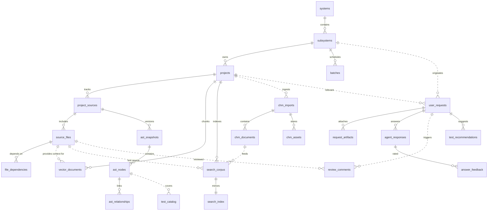

# Database Schema - Detailed Design Specification

**Tạo từ các file nguồn:**

- `docs/RaD/ideas/system-hierarchy.md`
- `docs/RaD/ideas/system-analysis.md`
- `docs/RaD/ideas/system-analysis-erd.md`
- `docs/RaD/ideas/0003_add_semantic_search.sql`
- `docs/RaD/ideas/0004_add_chm_tables.sql`

**Phiên bản:** 1.0  
**Ngày tạo:** 2025-11-15

---

## 1. Tổng quan

Tài liệu này mô tả chi tiết schema cơ sở dữ liệu SQLite cho hệ thống PCM Desktop, bao gồm:

- Quản lý phân cấp hệ thống (System → Subsystem → Project → Batch)
- Metadata mã nguồn và AST (Abstract Syntax Tree)
- Tìm kiếm ngữ nghĩa và toàn văn (FTS5)
- Tích hợp tài liệu CHM
- Quản lý yêu cầu người dùng và phản hồi AI

### 1.1 Lựa chọn công nghệ

| Mục đích                 | Công nghệ        | Lý do                                 |
|--------------------------|------------------|---------------------------------------|
| Metadata hoạt động       | SQLite           | Nhẹ, có transaction, dễ triển khai    |
| Tìm kiếm ngữ nghĩa (RAG) | Qdrant           | Vector similarity, filtering, payload |
| Tìm kiếm toàn văn        | SQLite FTS5      | Tích hợp sẵn, BM25 scoring            |
| Artifacts/BLOBs          | Local filesystem | Lưu trữ AST snapshots, uploads        |

---

## 2. Phân cấp hệ thống (System Hierarchy)

### 2.1 Mô hình quan hệ

```
System ──┬─< Subsystem ──┬─< Project
         │               └─< Batch
```

- **System**: Nền tảng hoặc domain nghiệp vụ cấp cao nhất
- **Subsystem**: Nhóm logic trong một hệ thống (module, capability)
- **Project**: Ứng dụng hoặc initiative cụ thể trong subsystem
- **Batch**: Công việc batch/scheduled liên kết với subsystem

### 2.2 Bảng `systems`

```sql
CREATE TABLE IF NOT EXISTS systems (
    system_id   INTEGER PRIMARY KEY AUTOINCREMENT,
    code        TEXT UNIQUE NOT NULL,
    name        TEXT NOT NULL,
    description TEXT,
    owner       TEXT,
    created_at  DATETIME DEFAULT CURRENT_TIMESTAMP,
    updated_at  DATETIME DEFAULT CURRENT_TIMESTAMP
);

CREATE INDEX IF NOT EXISTS idx_systems_code ON systems(code);
```

**Các trường:**

- `system_id`: Khóa chính tự tăng
- `code`: Mã định danh ngắn gọn, duy nhất (ví dụ: "ERP", "CRM")
- `name`: Tên đầy đủ của hệ thống
- `description`: Mô tả chi tiết
- `owner`: Người chịu trách nhiệm
- `created_at`, `updated_at`: Timestamp để audit

**Ràng buộc:**

- `code` phải duy nhất
- Không cho phép xóa nếu còn subsystems

### 2.3 Bảng `subsystems`

```sql
CREATE TABLE IF NOT EXISTS subsystems (
    subsystem_id INTEGER PRIMARY KEY AUTOINCREMENT,
    system_id    INTEGER NOT NULL REFERENCES systems(system_id) ON DELETE CASCADE,
    code         TEXT NOT NULL,
    name         TEXT NOT NULL,
    description  TEXT,
    tech_stack   TEXT,
    status       TEXT DEFAULT 'active',
    created_at   DATETIME DEFAULT CURRENT_TIMESTAMP,
    updated_at   DATETIME DEFAULT CURRENT_TIMESTAMP,
    UNIQUE(system_id, code)
);

CREATE INDEX IF NOT EXISTS idx_subsystems_system ON subsystems(system_id);
CREATE INDEX IF NOT EXISTS idx_subsystems_status ON subsystems(status);
```

**Các trường:**

- `subsystem_id`: Khóa chính
- `system_id`: Khóa ngoại tới `systems`
- `code`: Mã duy nhất trong phạm vi system
- `tech_stack`: Công nghệ sử dụng (Java, Python, React, v.v.)
- `status`: Trạng thái ('active', 'deprecated', 'archived')

**Ràng buộc:**

- Cặp (`system_id`, `code`) phải duy nhất
- `ON DELETE CASCADE`: Xóa system sẽ xóa tất cả subsystems

### 2.4 Bảng `projects`

```sql
CREATE TABLE IF NOT EXISTS projects (
    project_id   INTEGER PRIMARY KEY AUTOINCREMENT,
    subsystem_id INTEGER NOT NULL REFERENCES subsystems(subsystem_id) ON DELETE CASCADE,
    code         TEXT NOT NULL,
    name         TEXT NOT NULL,
    description  TEXT,
    lead         TEXT,
    status       TEXT DEFAULT 'draft',
    start_date   DATE,
    end_date     DATE,
    created_at   DATETIME DEFAULT CURRENT_TIMESTAMP,
    updated_at   DATETIME DEFAULT CURRENT_TIMESTAMP,
    UNIQUE(subsystem_id, code)
);

CREATE INDEX IF NOT EXISTS idx_projects_subsystem ON projects(subsystem_id);
CREATE INDEX IF NOT EXISTS idx_projects_status ON projects(status);
CREATE INDEX IF NOT EXISTS idx_projects_dates ON projects(start_date, end_date);
```

**Các trường:**

- `project_id`: Khóa chính
- `subsystem_id`: Khóa ngoại tới `subsystems`
- `lead`: Người lãnh đạo dự án
- `status`: 'draft', 'active', 'completed', 'cancelled'
- `start_date`, `end_date`: Thời gian dự án

**Ràng buộc:**

- Cặp (`subsystem_id`, `code`) phải duy nhất
- `ON DELETE CASCADE`: Xóa subsystem sẽ xóa tất cả projects

### 2.5 Bảng `batches`

```sql
CREATE TABLE IF NOT EXISTS batches (
    batch_id      INTEGER PRIMARY KEY AUTOINCREMENT,
    subsystem_id  INTEGER NOT NULL REFERENCES subsystems(subsystem_id) ON DELETE CASCADE,
    code          TEXT NOT NULL,
    name          TEXT NOT NULL,
    description   TEXT,
    schedule_cron TEXT,
    last_run_at   DATETIME,
    status        TEXT DEFAULT 'idle',
    created_at    DATETIME DEFAULT CURRENT_TIMESTAMP,
    updated_at    DATETIME DEFAULT CURRENT_TIMESTAMP,
    UNIQUE(subsystem_id, code)
);

CREATE INDEX IF NOT EXISTS idx_batches_subsystem ON batches(subsystem_id);
CREATE INDEX IF NOT EXISTS idx_batches_status ON batches(status);
```

**Các trường:**

- `batch_id`: Khóa chính
- `subsystem_id`: Khóa ngoại tới `subsystems`
- `schedule_cron`: Cron expression cho lịch chạy
- `last_run_at`: Lần chạy cuối cùng
- `status`: 'idle', 'running', 'failed', 'disabled'

---

## 3. Quản lý mã nguồn (Source Repository)

### 3.1 Bảng `project_sources`

```sql
CREATE TABLE IF NOT EXISTS project_sources (
    source_id       INTEGER PRIMARY KEY AUTOINCREMENT,
    project_id      INTEGER NOT NULL REFERENCES projects(project_id) ON DELETE CASCADE,
    root_path       TEXT NOT NULL,
    vcs_type        TEXT CHECK (vcs_type IN ('git','svn','none')) DEFAULT 'git',
    default_branch  TEXT,
    current_commit  TEXT,
    language        TEXT,
    scan_status     TEXT DEFAULT 'pending',
    last_scanned_at DATETIME,
    created_at      DATETIME DEFAULT CURRENT_TIMESTAMP
);

CREATE INDEX IF NOT EXISTS idx_project_sources_project ON project_sources(project_id);
CREATE INDEX IF NOT EXISTS idx_project_sources_status ON project_sources(scan_status);
```

**Các trường:**

- `source_id`: Khóa chính
- `project_id`: Dự án sở hữu
- `root_path`: Đường dẫn gốc tới repository
- `vcs_type`: Loại version control ('git', 'svn', 'none')
- `current_commit`: Commit/revision hiện tại
- `scan_status`: 'pending', 'scanning', 'complete', 'failed'

**Use cases:**

- Cho phép một project có nhiều source roots
- Theo dõi trạng thái scan để tránh quét trùng lặp
- Lưu commit hash để reproducibility

### 3.2 Bảng `source_files`

```sql
CREATE TABLE IF NOT EXISTS source_files (
    file_id       INTEGER PRIMARY KEY AUTOINCREMENT,
    source_id     INTEGER NOT NULL REFERENCES project_sources(source_id) ON DELETE CASCADE,
    relative_path TEXT NOT NULL,
    language      TEXT,
    size_bytes    INTEGER,
    checksum      TEXT,
    last_modified DATETIME,
    is_binary     INTEGER DEFAULT 0,
    created_at    DATETIME DEFAULT CURRENT_TIMESTAMP,
    UNIQUE(source_id, relative_path)
);

CREATE INDEX IF NOT EXISTS idx_source_files_source ON source_files(source_id);
CREATE INDEX IF NOT EXISTS idx_source_files_checksum ON source_files(checksum);
CREATE INDEX IF NOT EXISTS idx_source_files_language ON source_files(language);
```

**Các trường:**

- `file_id`: Khóa chính
- `relative_path`: Đường dẫn tương đối từ `root_path`
- `language`: Ngôn ngữ lập trình (Java, Python, JavaScript, v.v.)
- `checksum`: MD5/SHA-256 hash của nội dung file
- `is_binary`: Flag cho file nhị phân (0=text, 1=binary)

**Checksum logic:**

- Dùng để phát hiện thay đổi file
- Nếu checksum giống nhau → bỏ qua re-parse AST
- Nếu khác → trigger re-indexing

### 3.3 Bảng `file_dependencies`

```sql
CREATE TABLE IF NOT EXISTS file_dependencies (
    dependency_id   INTEGER PRIMARY KEY AUTOINCREMENT,
    file_id         INTEGER NOT NULL REFERENCES source_files(file_id) ON DELETE CASCADE,
    target_file_id  INTEGER REFERENCES source_files(file_id) ON DELETE SET NULL,
    dependency_type TEXT NOT NULL,
    symbol_name     TEXT,
    UNIQUE(file_id, target_file_id, dependency_type, symbol_name)
);

CREATE INDEX IF NOT EXISTS idx_file_deps_file ON file_dependencies(file_id);
CREATE INDEX IF NOT EXISTS idx_file_deps_target ON file_dependencies(target_file_id);
```

**Các trường:**

- `file_id`: File nguồn
- `target_file_id`: File đích (được import/gọi)
- `dependency_type`: Loại phụ thuộc ('import', 'call', 'extends', 'implements', 'reference')
- `symbol_name`: Tên symbol (class, function, v.v.)

**Use cases:**

- Impact analysis: tìm files bị ảnh hưởng khi thay đổi một file
- Visualize dependency graph
- Detect circular dependencies

---

## 4. AST (Abstract Syntax Tree) Storage

### 4.1 Bảng `ast_snapshots`

```sql
CREATE TABLE IF NOT EXISTS ast_snapshots (
    snapshot_id   INTEGER PRIMARY KEY AUTOINCREMENT,
    source_id     INTEGER NOT NULL REFERENCES project_sources(source_id) ON DELETE CASCADE,
    commit_hash   TEXT,
    created_at    DATETIME DEFAULT CURRENT_TIMESTAMP,
    tool_version  TEXT,
    root_checksum TEXT
);

CREATE INDEX IF NOT EXISTS idx_ast_snapshots_source ON ast_snapshots(source_id);
CREATE INDEX IF NOT EXISTS idx_ast_snapshots_commit ON ast_snapshots(commit_hash);
```

**Các trường:**

- `snapshot_id`: Khóa chính
- `source_id`: Source root được parse
- `commit_hash`: Git commit tương ứng
- `tool_version`: Parser version (JavaParser, tree-sitter, v.v.)
- `root_checksum`: Checksum tổng hợp của toàn bộ source tree

**Use cases:**

- Snapshot management: so sánh AST giữa các commits
- Historical analysis: rollback hoặc diff
- Version tracking cho reproducibility

### 4.2 Bảng `ast_nodes`

```sql
CREATE TABLE IF NOT EXISTS ast_nodes (
    node_id     INTEGER PRIMARY KEY AUTOINCREMENT,
    snapshot_id INTEGER NOT NULL REFERENCES ast_snapshots(snapshot_id) ON DELETE CASCADE,
    file_id     INTEGER REFERENCES source_files(file_id) ON DELETE SET NULL,
    node_type   TEXT NOT NULL,
    name        TEXT,
    fq_name     TEXT,
    start_line  INTEGER,
    end_line    INTEGER,
    checksum    TEXT,
    payload     TEXT
);

CREATE INDEX IF NOT EXISTS idx_ast_nodes_snapshot ON ast_nodes(snapshot_id);
CREATE INDEX IF NOT EXISTS idx_ast_nodes_file ON ast_nodes(file_id);
CREATE INDEX IF NOT EXISTS idx_ast_nodes_type ON ast_nodes(node_type);
CREATE INDEX IF NOT EXISTS idx_ast_nodes_name ON ast_nodes(name);
CREATE INDEX IF NOT EXISTS idx_ast_nodes_fq_name ON ast_nodes(fq_name);
```

**Các trường:**

- `node_id`: Khóa chính
- `snapshot_id`: Snapshot chứa node này
- `file_id`: File chứa node
- `node_type`: Loại node ('class', 'method', 'function', 'variable', 'interface', v.v.)
- `name`: Tên đơn giản của symbol
- `fq_name`: Fully qualified name (com.example.MyClass.myMethod)
- `start_line`, `end_line`: Vị trí trong file
- `checksum`: Hash của node content (để detect changes)
- `payload`: JSON chứa attributes bổ sung (modifiers, parameters, return type, v.v.)

**Payload example:**

```json
{
  "modifiers": ["public", "static"],
  "return_type": "String",
  "parameters": [
    {"name": "arg1", "type": "int"},
    {"name": "arg2", "type": "String"}
  ],
  "annotations": ["@Override"],
  "complexity": 5
}
```

### 4.3 Bảng `ast_relationships`

```sql
CREATE TABLE IF NOT EXISTS ast_relationships (
    relationship_id INTEGER PRIMARY KEY AUTOINCREMENT,
    snapshot_id     INTEGER NOT NULL REFERENCES ast_snapshots(snapshot_id) ON DELETE CASCADE,
    parent_node_id  INTEGER NOT NULL REFERENCES ast_nodes(node_id) ON DELETE CASCADE,
    child_node_id   INTEGER NOT NULL REFERENCES ast_nodes(node_id) ON DELETE CASCADE,
    relation_type   TEXT NOT NULL
);

CREATE INDEX IF NOT EXISTS idx_ast_rels_parent ON ast_relationships(parent_node_id);
CREATE INDEX IF NOT EXISTS idx_ast_rels_child ON ast_relationships(child_node_id);
CREATE INDEX IF NOT EXISTS idx_ast_rels_type ON ast_relationships(relation_type);
```

**Các trường:**

- `relationship_id`: Khóa chính
- `parent_node_id`: Node cha
- `child_node_id`: Node con
- `relation_type`: Loại quan hệ:
    - `parent`: Quan hệ cây AST (class chứa method)
    - `calls`: Method A gọi method B
    - `implements`: Class implements interface
    - `extends`: Class extends base class
    - `references`: Variable reference
    - `overrides`: Method override
    - `annotates`: Annotation relationship

**Use cases:**

- Traverse AST tree
- Call graph analysis
- Inheritance hierarchy
- Reference tracking

---

## 5. Tìm kiếm ngữ nghĩa (Semantic Search)

### 5.1 Bảng `search_corpus`

```sql
CREATE TABLE IF NOT EXISTS search_corpus (
    corpus_id       INTEGER PRIMARY KEY AUTOINCREMENT,
    project_id      INTEGER REFERENCES projects(project_id) ON DELETE CASCADE,
    file_id         INTEGER REFERENCES source_files(file_id) ON DELETE CASCADE,
    source_type     TEXT NOT NULL,
    label           TEXT,
    content         TEXT NOT NULL,
    checksum        TEXT,
    last_indexed_at DATETIME DEFAULT CURRENT_TIMESTAMP
);

CREATE INDEX IF NOT EXISTS idx_search_corpus_project ON search_corpus(project_id);
CREATE INDEX IF NOT EXISTS idx_search_corpus_file ON search_corpus(file_id);
CREATE INDEX IF NOT EXISTS idx_search_corpus_type ON search_corpus(source_type);
CREATE INDEX IF NOT EXISTS idx_search_corpus_checksum ON search_corpus(checksum);
```

**Các trường:**

- `corpus_id`: Khóa chính
- `project_id`: Project chứa content
- `file_id`: File nguồn (nếu có)
- `source_type`: Loại nguồn:
    - `code`: Mã nguồn
    - `doc`: Documentation
    - `kb_article`: Knowledge base article
    - `chm_doc`: CHM documentation
    - `response`: AI agent response (để reuse)
- `label`: Nhãn/tiêu đề (filename, article title)
- `content`: Nội dung text đầy đủ
- `checksum`: Hash để detect duplicates/changes

**Use cases:**

- Base table cho FTS5 index
- Store normalized text cho search
- Map search hits về file/project

### 5.2 FTS5 Virtual Table `search_index`

```sql
CREATE VIRTUAL TABLE IF NOT EXISTS search_index USING fts5(
    corpus_id UNINDEXED,
    project_id UNINDEXED,
    source_type,
    label,
    content,
    tokenize = 'unicode61 remove_diacritics 2',
    detail = 'column'
);
```

**Cấu hình:**

- `corpus_id`, `project_id`: UNINDEXED (không tham gia full-text, chỉ dùng để filter)
- `source_type`, `label`, `content`: Được index để search
- `tokenize='unicode61 remove_diacritics 2'`: Hỗ trợ Unicode, bỏ diacritics
- `detail='column'`: Giữ chi tiết column để tính BM25 chính xác

**Query syntax:**

```sql
-- Basic search
SELECT * FROM search_index WHERE search_index MATCH 'user authentication';

-- Boolean operators
SELECT * FROM search_index WHERE search_index MATCH 'login AND password';

-- Phrase search
SELECT * FROM search_index WHERE search_index MATCH '"exact phrase"';

-- Prefix search
SELECT * FROM search_index WHERE search_index MATCH 'auth*';

-- BM25 scoring
SELECT *, bm25(search_index, 1.2, 0.75) AS score 
FROM search_index 
WHERE search_index MATCH :query
ORDER BY score
LIMIT 50;
```

### 5.3 FTS5 Sync Triggers

```sql
CREATE TRIGGER IF NOT EXISTS trg_search_corpus_insert AFTER INSERT ON search_corpus
BEGIN
    INSERT INTO search_index(rowid, corpus_id, project_id, source_type, label, content)
    VALUES (new.corpus_id, new.corpus_id, new.project_id, new.source_type, new.label, new.content);
END;

CREATE TRIGGER IF NOT EXISTS trg_search_corpus_update AFTER UPDATE ON search_corpus
BEGIN
    UPDATE search_index
       SET project_id = new.project_id,
           source_type = new.source_type,
           label = new.label,
           content = new.content
     WHERE rowid = new.corpus_id;
END;

CREATE TRIGGER IF NOT EXISTS trg_search_corpus_delete AFTER DELETE ON search_corpus
BEGIN
    DELETE FROM search_index WHERE rowid = old.corpus_id;
END;
```

**Hoạt động:**

- Tự động đồng bộ `search_corpus` → `search_index`
- Không cần maintain index thủ công
- Đảm bảo consistency

**Maintenance:**

```sql
-- Optimize index (nên chạy định kỳ)
INSERT INTO search_index(search_index) VALUES('optimize');

-- Rebuild index (khi corrupt)
INSERT INTO search_index(search_index) VALUES('rebuild');
```

---

## 6. Tích hợp CHM (Compiled HTML Help)

### 6.1 Bảng `chm_imports`

```sql
CREATE TABLE IF NOT EXISTS chm_imports (
    import_id      INTEGER PRIMARY KEY AUTOINCREMENT,
    system_id      INTEGER REFERENCES systems(system_id) ON DELETE SET NULL,
    subsystem_id   INTEGER REFERENCES subsystems(subsystem_id) ON DELETE SET NULL,
    project_id     INTEGER REFERENCES projects(project_id) ON DELETE SET NULL,
    chm_path       TEXT NOT NULL,
    chm_checksum   TEXT,
    extracted_path TEXT,
    status         TEXT DEFAULT 'pending',
    notes          TEXT,
    imported_at    DATETIME DEFAULT CURRENT_TIMESTAMP
);

CREATE INDEX IF NOT EXISTS idx_chm_imports_project ON chm_imports(project_id);
CREATE INDEX IF NOT EXISTS idx_chm_imports_status ON chm_imports(status);
```

**Các trường:**

- `import_id`: Khóa chính
- `system_id`, `subsystem_id`, `project_id`: Scope của import (có thể null)
- `chm_path`: Đường dẫn tới file CHM gốc
- `chm_checksum`: Hash của file CHM (để detect re-import)
- `extracted_path`: Thư mục chứa HTML đã extract
- `status`: 'pending', 'extracting', 'complete', 'failed'

**Workflow:**

1. User chọn CHM file → insert row với `status='pending'`
2. Background job extract CHM → update `status='extracting'`
3. Parse HTML pages → populate `chm_documents`
4. Update `status='complete'`

### 6.2 Bảng `chm_documents`

```sql
CREATE TABLE IF NOT EXISTS chm_documents (
    document_id   INTEGER PRIMARY KEY AUTOINCREMENT,
    import_id     INTEGER NOT NULL REFERENCES chm_imports(import_id) ON DELETE CASCADE,
    relative_path TEXT NOT NULL,
    title         TEXT,
    toc_path      TEXT,
    order_index   INTEGER,
    content       TEXT NOT NULL,
    checksum      TEXT,
    metadata      TEXT
);

CREATE UNIQUE INDEX IF NOT EXISTS uq_chm_documents_path ON chm_documents(import_id, relative_path);
CREATE INDEX IF NOT EXISTS idx_chm_documents_import ON chm_documents(import_id);
```

**Các trường:**

- `document_id`: Khóa chính
- `import_id`: CHM import chứa document này
- `relative_path`: Đường dẫn trong CHM (ví dụ: "topics/intro.html")
- `title`: Tiêu đề từ `<title>` hoặc heading
- `toc_path`: Đường dẫn trong TOC tree (ví dụ: "User Guide/Getting Started")
- `order_index`: Thứ tự trong TOC
- `content`: Nội dung text (đã strip HTML tags)
- `metadata`: JSON chứa thông tin bổ sung

**Metadata example:**

```json
{
  "original_encoding": "UTF-8",
  "keywords": ["authentication", "security"],
  "author": "Documentation Team",
  "last_updated": "2024-01-15"
}
```

### 6.3 Bảng `chm_assets`

```sql
CREATE TABLE IF NOT EXISTS chm_assets (
    asset_id      INTEGER PRIMARY KEY AUTOINCREMENT,
    import_id     INTEGER NOT NULL REFERENCES chm_imports(import_id) ON DELETE CASCADE,
    relative_path TEXT NOT NULL,
    mime_type     TEXT,
    size_bytes    INTEGER,
    checksum      TEXT
);

CREATE UNIQUE INDEX IF NOT EXISTS uq_chm_assets_path ON chm_assets(import_id, relative_path);
CREATE INDEX IF NOT EXISTS idx_chm_assets_import ON chm_assets(import_id);
```

**Các trường:**

- `asset_id`: Khóa chính
- `import_id`: CHM import chứa asset này
- `relative_path`: Đường dẫn asset (images, CSS, JS)
- `mime_type`: Loại file ('image/png', 'text/css', v.v.)
- `size_bytes`: Kích thước file
- `checksum`: Hash để detect duplicates

**Use cases:**

- Track images, stylesheets từ CHM
- Serve assets khi render documentation trong UI
- Deduplicate common assets

---

## 7. Quản lý yêu cầu và phản hồi

### 7.1 Bảng `user_requests`

```sql
CREATE TABLE IF NOT EXISTS user_requests (
    request_id   INTEGER PRIMARY KEY AUTOINCREMENT,
    user_id      TEXT,
    subsystem_id INTEGER REFERENCES subsystems(subsystem_id) ON DELETE SET NULL,
    project_id   INTEGER REFERENCES projects(project_id) ON DELETE SET NULL,
    title        TEXT,
    description  TEXT,
    request_type TEXT DEFAULT 'question',
    priority     TEXT DEFAULT 'normal',
    status       TEXT DEFAULT 'received',
    created_at   DATETIME DEFAULT CURRENT_TIMESTAMP,
    resolved_at  DATETIME
);

CREATE INDEX IF NOT EXISTS idx_user_requests_user ON user_requests(user_id);
CREATE INDEX IF NOT EXISTS idx_user_requests_subsystem ON user_requests(subsystem_id);
CREATE INDEX IF NOT EXISTS idx_user_requests_project ON user_requests(project_id);
CREATE INDEX IF NOT EXISTS idx_user_requests_status ON user_requests(status);
CREATE INDEX IF NOT EXISTS idx_user_requests_created ON user_requests(created_at);
```

**Các trường:**

- `request_id`: Khóa chính
- `user_id`: Người tạo request
- `subsystem_id`, `project_id`: Scope của request
- `title`: Tiêu đề ngắn gọn
- `description`: Mô tả chi tiết yêu cầu/câu hỏi
- `request_type`: 'question', 'feature', 'bug', 'analysis', 'review'
- `priority`: 'low', 'normal', 'high', 'urgent'
- `status`: 'received', 'processing', 'answered', 'resolved', 'cancelled'
- `resolved_at`: Thời điểm hoàn thành

### 7.2 Bảng `request_artifacts`

```sql
CREATE TABLE IF NOT EXISTS request_artifacts (
    artifact_id    INTEGER PRIMARY KEY AUTOINCREMENT,
    request_id     INTEGER NOT NULL REFERENCES user_requests(request_id) ON DELETE CASCADE,
    artifact_type  TEXT,
    reference_path TEXT,
    metadata       TEXT,
    content_hash   TEXT
);

CREATE INDEX IF NOT EXISTS idx_request_artifacts_request ON request_artifacts(request_id);
CREATE INDEX IF NOT EXISTS idx_request_artifacts_type ON request_artifacts(artifact_type);
```

**Các trường:**

- `artifact_id`: Khóa chính
- `request_id`: Request liên quan
- `artifact_type`: Loại artifact:
    - `file`: File đính kèm
    - `code_segment`: Đoạn code
    - `document`: Tài liệu
    - `url`: Link tham khảo
    - `retrieved_chunk`: Chunk từ RAG retrieval
- `reference_path`: Đường dẫn/URL
- `metadata`: JSON với thông tin bổ sung
- `content_hash`: Hash của content

### 7.3 Bảng `agent_responses`

```sql
CREATE TABLE IF NOT EXISTS agent_responses (
    response_id   INTEGER PRIMARY KEY AUTOINCREMENT,
    request_id    INTEGER NOT NULL REFERENCES user_requests(request_id) ON DELETE CASCADE,
    answer_text   TEXT,
    reasoning     TEXT,
    cited_sources TEXT,
    status        TEXT DEFAULT 'draft',
    created_at    DATETIME DEFAULT CURRENT_TIMESTAMP
);

CREATE INDEX IF NOT EXISTS idx_agent_responses_request ON agent_responses(request_id);
CREATE INDEX IF NOT EXISTS idx_agent_responses_status ON agent_responses(status);
```

**Các trường:**

- `response_id`: Khóa chính
- `request_id`: Request được trả lời
- `answer_text`: Câu trả lời từ AI
- `reasoning`: Quá trình suy luận (chain-of-thought)
- `cited_sources`: JSON array các nguồn tham khảo
- `status`: 'draft', 'complete', 'edited'

**cited_sources example:**

```json
[
  {
    "type": "code",
    "file": "src/main/java/AuthService.java",
    "lines": "42-55",
    "snippet": "public void login(User user) { ... }",
    "relevance_score": 0.92
  },
  {
    "type": "doc",
    "label": "Authentication Guide",
    "corpus_id": 1234,
    "relevance_score": 0.85
  }
]
```

### 7.4 Bảng `answer_feedback`

```sql
CREATE TABLE IF NOT EXISTS answer_feedback (
    feedback_id INTEGER PRIMARY KEY AUTOINCREMENT,
    response_id INTEGER NOT NULL REFERENCES agent_responses(response_id) ON DELETE CASCADE,
    rating      INTEGER CHECK (rating BETWEEN 1 AND 5),
    comment     TEXT,
    created_at  DATETIME DEFAULT CURRENT_TIMESTAMP
);

CREATE INDEX IF NOT EXISTS idx_answer_feedback_response ON answer_feedback(response_id);
CREATE INDEX IF NOT EXISTS idx_answer_feedback_rating ON answer_feedback(rating);
```

**Các trường:**

- `feedback_id`: Khóa chính
- `response_id`: Response được đánh giá
- `rating`: Điểm 1-5 (1=rất tệ, 5=rất tốt)
- `comment`: Nhận xét chi tiết

**Use cases:**

- Quality monitoring
- Continuous improvement
- Identify problematic responses
- Analytics dashboard

---

## 8. Vector Documents (Metadata cho RAG)

### 8.1 Bảng `vector_documents`

```sql
CREATE TABLE IF NOT EXISTS vector_documents (
    document_id  INTEGER PRIMARY KEY AUTOINCREMENT,
    project_id   INTEGER REFERENCES projects(project_id) ON DELETE CASCADE,
    file_id      INTEGER REFERENCES source_files(file_id) ON DELETE SET NULL,
    chunk_id     TEXT UNIQUE,
    content_type TEXT,
    start_line   INTEGER,
    end_line     INTEGER,
    metadata     TEXT,
    qdrant_point TEXT NOT NULL
);

CREATE INDEX IF NOT EXISTS idx_vector_docs_project ON vector_documents(project_id);
CREATE INDEX IF NOT EXISTS idx_vector_docs_file ON vector_documents(file_id);
CREATE INDEX IF NOT EXISTS idx_vector_docs_chunk ON vector_documents(chunk_id);
CREATE INDEX IF NOT EXISTS idx_vector_docs_qdrant ON vector_documents(qdrant_point);
```

**Các trường:**

- `document_id`: Khóa chính SQLite
- `project_id`: Project chứa document
- `file_id`: File nguồn (nếu có)
- `chunk_id`: Unique ID của chunk (UUID hoặc hash)
- `content_type`: 'code', 'doc', 'comment', 'test', v.v.
- `start_line`, `end_line`: Vị trí trong file
- `metadata`: JSON với context
- `qdrant_point`: ID của point trong Qdrant

**Metadata example:**

```json
{
  "language": "java",
  "node_type": "method",
  "fq_name": "com.example.AuthService.login",
  "file_path": "src/main/java/com/example/AuthService.java",
  "snapshot_id": 42,
  "token_count": 150,
  "embedding_model": "text-embedding-3-large"
}
```

**Qdrant payload (stored in Qdrant):**

```json
{
  "chunk_id": "abc123",
  "project_id": 5,
  "file_path": "src/main/java/com/example/AuthService.java",
  "language": "java",
  "content_type": "code",
  "lines": "42-55",
  "content": "public void login(User user) { ... }"
}
```

---

## 9. Review và Test Case Management

### 9.1 Bảng `review_comments`

```sql
CREATE TABLE IF NOT EXISTS review_comments (
    comment_id INTEGER PRIMARY KEY AUTOINCREMENT,
    request_id INTEGER REFERENCES user_requests(request_id) ON DELETE SET NULL,
    file_id    INTEGER REFERENCES source_files(file_id) ON DELETE SET NULL,
    start_line INTEGER,
    end_line   INTEGER,
    severity   TEXT,
    message    TEXT,
    suggestion TEXT,
    metadata   TEXT,
    created_at DATETIME DEFAULT CURRENT_TIMESTAMP
);

CREATE INDEX IF NOT EXISTS idx_review_comments_request ON review_comments(request_id);
CREATE INDEX IF NOT EXISTS idx_review_comments_file ON review_comments(file_id);
CREATE INDEX IF NOT EXISTS idx_review_comments_severity ON review_comments(severity);
```

**Các trường:**

- `comment_id`: Khóa chính
- `request_id`: Request trigger review (nếu có)
- `file_id`: File được review
- `start_line`, `end_line`: Vị trí code
- `severity`: 'info', 'warning', 'error', 'critical'
- `message`: Mô tả vấn đề
- `suggestion`: Đề xuất fix
- `metadata`: JSON với context (rule ID, references, v.v.)

### 9.2 Bảng `test_catalog`

```sql
CREATE TABLE IF NOT EXISTS test_catalog (
    test_id       INTEGER PRIMARY KEY AUTOINCREMENT,
    name          TEXT NOT NULL,
    description   TEXT,
    scope         TEXT,
    related_nodes TEXT,
    tags          TEXT,
    created_at    DATETIME DEFAULT CURRENT_TIMESTAMP
);

CREATE INDEX IF NOT EXISTS idx_test_catalog_scope ON test_catalog(scope);
```

**Các trường:**

- `test_id`: Khóa chính
- `name`: Tên test case
- `description`: Mô tả test
- `scope`: 'unit', 'integration', 'e2e', 'performance'
- `related_nodes`: JSON array các `ast_node_id`
- `tags`: JSON array tags ('security', 'i18n', 'boundary', v.v.)

### 9.3 Bảng `test_recommendations`

```sql
CREATE TABLE IF NOT EXISTS test_recommendations (
    recommendation_id INTEGER PRIMARY KEY AUTOINCREMENT,
    request_id        INTEGER REFERENCES user_requests(request_id) ON DELETE CASCADE,
    test_type         TEXT,
    description       TEXT,
    priority          TEXT,
    metadata          TEXT,
    created_at        DATETIME DEFAULT CURRENT_TIMESTAMP
);

CREATE INDEX IF NOT EXISTS idx_test_recs_request ON test_recommendations(request_id);
CREATE INDEX IF NOT EXISTS idx_test_recs_priority ON test_recommendations(priority);
```

**Các trường:**

- `recommendation_id`: Khóa chính
- `request_id`: Request yêu cầu test
- `test_type`: 'unit', 'integration', 'boundary', 'i18n', 'security'
- `description`: Mô tả test case cần thực hiện
- `priority`: 'low', 'medium', 'high', 'critical'
- `metadata`: JSON với test data examples

---

## 10. Entity Relationship Diagram



**Chú thích:**

- `||--o{`: Quan hệ 1-nhiều bắt buộc
- `||..o{`: Quan hệ 1-nhiều tùy chọn (nullable foreign key)

---

## 11. Quy trình xử lý (Processing Flows)

### 11.1 Project Registration

```
1. User creates System → Subsystem → Project in UI
2. User selects local source root
3. Insert into project_sources (status='pending')
4. Optionally capture VCS info (branch/commit)
5. Schedule source scan
```

### 11.2 Source Scan & AST Build

```
1. Worker reads project_sources with scan_status='pending'
2. Walk filesystem:
   - Insert/update source_files
   - Compute checksum (MD5/SHA-256)
   - Detect deleted files → mark or remove
3. Dependency extraction:
   - Parse imports/includes
   - Fill file_dependencies
4. Build AST snapshot:
   - Insert ast_snapshots row
   - Parse each file → ast_nodes
   - Extract relationships → ast_relationships
5. Update scan_status='complete'
```

### 11.3 Chunking & Vectorization

```
1. For each source_file (where language is parseable):
   - Split into chunks (200-300 tokens with 20% overlap)
   - Store metadata in vector_documents
2. Generate embedding for each chunk:
   - Call embedding API (OpenAI, local BGE, etc.)
   - Cache by checksum
3. Upsert into Qdrant:
   - chunk_id as point ID
   - payload includes project_id, file_path, lines
4. Insert into search_corpus + search_index (FTS5)
```

### 11.4 Handling User Requests

```
1. User submits request → insert user_requests
2. Pipeline:
   a. Classify intent (extract keywords, infer project/subsystem)
   b. Hybrid retrieval:
      - Query Qdrant (vector search)
      - Query search_index (FTS5/BM25)
      - Fuse results (reciprocal rank fusion)
   c. Optional AST lookup:
      - Map chunks → ast_nodes
      - Fetch relationships
   d. Build context (chunks + metadata)
   e. Prompt LLM with context
   f. Stream response
3. Store response in agent_responses
4. Log artifacts (retrieved chunks) in request_artifacts
5. User rates → answer_feedback
```

### 11.5 Impact Analysis

```
1. Select code element (AST node) referenced in requirement
2. Walk ast_relationships + file_dependencies:
   - Find all nodes that depend on this node
   - Traverse call graph
   - Check inheritance hierarchy
3. Locate embeddings for affected files (vector_documents)
4. Fetch related documentation chunks from Qdrant
5. Present impact report to user
```

### 11.6 CHM Ingestion

```
1. User uploads CHM file → insert chm_imports (status='pending')
2. Background job:
   a. Extract CHM using extract_chmLib or hh.exe
   b. Parse .hhc (TOC) and .hhk (index)
   c. For each HTML page:
      - Parse title, headings
      - Convert to plain text
      - Insert into chm_documents
   d. Copy assets → chm_assets
3. Update status='complete'
4. Feed chm_documents.content → search_corpus
5. Chunk and embed → vector_documents + Qdrant
```

---

## 12. Chiến lược Index và Performance

### 12.1 Index Strategy

**Ưu tiên cao:**

- Foreign keys: Luôn tạo index trên FK để JOIN nhanh
- Status fields: Để filter theo trạng thái
- Dates/timestamps: Để query range
- Checksum: Để lookup nhanh

**Optional indexes:**

- Full-text fields: Dùng FTS5 thay vì B-tree
- Large TEXT fields: Không nên index trực tiếp

### 12.2 Performance Tips

1. **Batch Operations:**
    - Dùng transactions cho bulk inserts
    - Batch size: 500-1000 rows
    - Disable triggers nếu cần import lớn

2. **Checksum Logic:**
    - Tránh re-parse files không đổi
    - Cache embeddings theo checksum
    - Incremental updates only

3. **FTS5 Maintenance:**
   ```sql
   -- Chạy định kỳ (nightly)
   INSERT INTO search_index(search_index) VALUES('optimize');
   
   -- Monitor size
   SELECT * FROM search_index_data;
   ```

4. **Compression:**
    - Compress large `payload` fields (JSON)
    - Consider BLOB storage cho AST snapshots lớn
    - External storage cho binary assets

5. **Sharding (future):**
    - Partition theo `project_id` nếu quá lớn
    - Separate Qdrant collections per subsystem

### 12.3 Backup & Migration

```bash
# Backup
sqlite3 pcm-desktop.db ".backup backup.db"

# Export schema
sqlite3 pcm-desktop.db ".schema" > schema.sql

# Export data (CSV)
sqlite3 pcm-desktop.db <<EOF
.mode csv
.headers on
.output systems.csv
SELECT * FROM systems;
EOF
```

**Migration strategy:**

- Sử dụng versioned migration scripts (V0001__init.sql, V0002__add_chm.sql)
- Store migration version in `schema_version` table
- Forward-only migrations

---

## 13. Security & Data Integrity

### 13.1 Foreign Key Constraints

```sql
PRAGMA foreign_keys = ON;
```

**Luôn bật foreign keys để:**

- Đảm bảo referential integrity
- Cascade deletes tự động
- Prevent orphaned records

### 13.2 Data Sanitization

1. **Before indexing:**
    - Strip credentials/secrets từ code
    - Remove PII từ comments
    - Escape SQL injection patterns

2. **User input:**
    - Parameterized queries (no string concatenation)
    - Validate FTS5 query syntax
    - Escape markdown/HTML trong UI

### 13.3 Access Control

**Future enhancement:**

```sql
CREATE TABLE IF NOT EXISTS user_permissions (
    permission_id INTEGER PRIMARY KEY,
    user_id       TEXT NOT NULL,
    resource_type TEXT NOT NULL,
    resource_id   INTEGER NOT NULL,
    permission    TEXT NOT NULL,
    granted_at    DATETIME DEFAULT CURRENT_TIMESTAMP
);
```

**Permissions:**

- `read`: Xem dữ liệu
- `write`: Sửa dữ liệu
- `delete`: Xóa dữ liệu
- `admin`: Quản trị hệ thống

---

## 14. Testing Guidelines

### 14.1 Unit Tests

```java
@Test
public void testSystemHierarchy() {
    // Create system
    System sys = systemRepo.create("ERP", "Enterprise Resource Planning");
    
    // Create subsystem
    Subsystem sub = subsystemRepo.create(sys.getId(), "HR", "Human Resources");
    
    // Create project
    Project proj = projectRepo.create(sub.getId(), "PAYROLL", "Payroll System");
    
    // Verify cascade
    systemRepo.delete(sys.getId());
    assertNull(projectRepo.findById(proj.getId()));
}
```

### 14.2 Integration Tests

```java
@Test
public void testFullTextSearch() {
    // Populate corpus
    searchCorpusRepo.insert(projectId, fileId, "code", "AuthService.java", 
        "public void login(User user) { ... }");
    
    // Search
    List<Hit> results = fts5Service.search("login user");
    
    // Verify
    assertFalse(results.isEmpty());
    assertEquals("AuthService.java", results.get(0).getLabel());
}
```

### 14.3 Performance Tests

```java
@Test
public void testBulkInsertPerformance() {
    long start = System.currentTimeMillis();
    
    // Insert 10k AST nodes
    for (int i = 0; i < 10000; i++) {
        astNodeRepo.insert(...);
    }
    
    long duration = System.currentTimeMillis() - start;
    assertTrue(duration < 5000); // < 5 seconds
}
```

---

## 15. Monitoring & Observability

### 15.1 Metrics to Track

```sql
-- Database size
SELECT page_count * page_size AS size_bytes FROM pragma_page_count(), pragma_page_size();

-- Table row counts
SELECT name, (SELECT COUNT(*) FROM sqlite_master WHERE type='table' AND name=m.name) AS count
FROM sqlite_master m WHERE type='table';

-- FTS5 index size
SELECT * FROM search_index_data;

-- Recent activity
SELECT DATE(created_at), COUNT(*) 
FROM user_requests 
GROUP BY DATE(created_at) 
ORDER BY created_at DESC 
LIMIT 30;
```

### 15.2 Telemetry Events

Log các events sau:

- Source scan started/completed
- AST snapshot created
- Embedding generated
- Search query executed (latency, result count)
- LLM request (tokens, latency, cost)
- User feedback submitted

---

## 16. Migration Scripts

### 16.1 Migration Execution Order

```
V0001__system_hierarchy.sql
V0002__source_repository.sql
V0003__ast_storage.sql
V0004__user_requests.sql
V0005__vector_metadata.sql
V0006__semantic_search.sql
V0007__chm_integration.sql
V0008__review_testcase.sql
```

### 16.2 Example Migration Script

```sql
-- V0001__system_hierarchy.sql
PRAGMA foreign_keys = ON;

CREATE TABLE IF NOT EXISTS systems (
    system_id   INTEGER PRIMARY KEY AUTOINCREMENT,
    code        TEXT UNIQUE NOT NULL,
    name        TEXT NOT NULL,
    description TEXT,
    owner       TEXT,
    created_at  DATETIME DEFAULT CURRENT_TIMESTAMP,
    updated_at  DATETIME DEFAULT CURRENT_TIMESTAMP
);

-- Insert default system
INSERT OR IGNORE INTO systems (code, name, description)
VALUES ('DEFAULT', 'Default System', 'Auto-created default system');

-- Create version tracking
CREATE TABLE IF NOT EXISTS schema_version (
    version     TEXT PRIMARY KEY,
    description TEXT,
    applied_at  DATETIME DEFAULT CURRENT_TIMESTAMP
);

INSERT INTO schema_version (version, description)
VALUES ('V0001', 'System hierarchy tables');
```

---

## 17. Phụ lục

### 17.1 Enumerations

**source_type:**

- `code`: Source code files
- `doc`: Documentation (Markdown, HTML)
- `kb_article`: Knowledge base articles
- `chm_doc`: CHM documentation pages
- `response`: AI agent responses

**node_type:**

- `class`, `interface`, `enum`, `annotation`
- `method`, `function`, `constructor`
- `field`, `variable`, `parameter`
- `import`, `package`, `module`

**relation_type:**

- `parent`: AST tree parent-child
- `calls`: Method invocation
- `implements`: Interface implementation
- `extends`: Class inheritance
- `references`: Variable/field reference
- `overrides`: Method override
- `annotates`: Annotation application

**dependency_type:**

- `import`: Static import
- `call`: Method call across files
- `extends`: Inheritance
- `implements`: Interface implementation
- `reference`: Field/constant reference

**scan_status:**

- `pending`: Chờ quét
- `scanning`: Đang quét
- `complete`: Hoàn thành
- `failed`: Lỗi

**request_type:**

- `question`: Câu hỏi chung
- `feature`: Yêu cầu tính năng
- `bug`: Báo lỗi
- `analysis`: Phân tích hệ thống
- `review`: Code review

**severity:**

- `info`: Thông tin
- `warning`: Cảnh báo
- `error`: Lỗi
- `critical`: Nghiêm trọng

### 17.2 Naming Conventions

- Tables: `snake_case`, plural (systems, source_files)
- Columns: `snake_case`
- Indexes: `idx_<table>_<column(s)>`
- Unique constraints: `uq_<table>_<column(s)>`
- Triggers: `trg_<table>_<action>`
- Foreign keys: `<referenced_table>_id`

### 17.3 SQL Style Guide

```sql
-- Good
CREATE TABLE IF NOT EXISTS users (
    user_id    INTEGER PRIMARY KEY AUTOINCREMENT,
    username   TEXT UNIQUE NOT NULL,
    email      TEXT,
    created_at DATETIME DEFAULT CURRENT_TIMESTAMP
);

-- Bad (no formatting, no NOT NULL)
CREATE TABLE users(user_id INTEGER PRIMARY KEY,username TEXT,email TEXT);

-- Good query
SELECT u.user_id, u.username, COUNT(r.request_id) AS request_count
  FROM users u
  LEFT JOIN user_requests r ON u.user_id = r.user_id
 WHERE u.created_at >= DATE('now', '-30 days')
 GROUP BY u.user_id, u.username
 ORDER BY request_count DESC
 LIMIT 10;

-- Bad (no formatting)
SELECT * FROM users WHERE created_at>='2024-01-01';
```

---

## 18. Tổng kết

Schema này cung cấp nền tảng hoàn chỉnh cho hệ thống PCM Desktop, bao gồm:

✅ **Hierarchy Management**: Systems → Subsystems → Projects → Batches  
✅ **Source Analysis**: Files, AST, dependencies  
✅ **Semantic Search**: FTS5 full-text + BM25 scoring  
✅ **Vector Storage**: Metadata cho RAG pipeline  
✅ **CHM Integration**: Legacy documentation  
✅ **Request Tracking**: User requests, AI responses, feedback  
✅ **Code Review**: Automated comments and suggestions  
✅ **Test Management**: Test catalog and recommendations

**Next Steps:**

1. Implement migration scripts
2. Build DAO/Repository layer
3. Create service layer with business logic
4. Integrate with Qdrant for embeddings
5. Build UI screens following domain model
6. Add monitoring and observability

---

**Document Version:** 1.0  
**Last Updated:** 2025-11-15  
**Maintainer:** PCM Desktop Team

