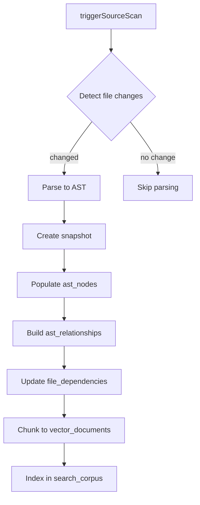

# AST & Code Analysis - Detailed Design Specification

**Tạo từ các file nguồn:**

- `docs/RaD/ideas/ast-source-analysis.md`

**Phiên bản:** 1.0  
**Ngày tạo:** 2025-11-15

---

## 1. Tổng quan

Tài liệu này mô tả chi tiết hệ thống phân tích cú pháp trừu tượng (AST - Abstract Syntax Tree) và quản lý metadata mã
nguồn trong PCM Desktop. Hệ thống này cung cấp:

- Biểu diễn cấu trúc chính xác của source code (theo commit/snapshot)
- Theo dõi quan hệ giữa files, symbols và references
- Hỗ trợ impact analysis khi code thay đổi
- Tích hợp với RAG pipeline để trả lời user queries

### 1.1 Mục tiêu

✅ Maintain precise structural representation của source code  
✅ Track relationships (call graph, inheritance, dependencies)  
✅ Surface relevant code sections in response to queries  
✅ Support impact analysis và change detection  
✅ Enable automated refactoring và code review

---

## 2. Data Structures

### 2.1 Source Files

```sql
CREATE TABLE source_files (
    file_id       INTEGER PRIMARY KEY AUTOINCREMENT,
    source_id     INTEGER NOT NULL REFERENCES project_sources(source_id) ON DELETE CASCADE,
    relative_path TEXT NOT NULL,
    language      TEXT,
    size_bytes    INTEGER,
    checksum      TEXT,
    last_modified DATETIME,
    is_binary     INTEGER DEFAULT 0,
    UNIQUE(source_id, relative_path)
);

CREATE INDEX idx_source_files_checksum ON source_files(checksum);
CREATE INDEX idx_source_files_language ON source_files(language);
```

**Mục đích:**

- File-level metadata cho change detection
- Checksum để phát hiện modifications
- Language classification cho parser selection

### 2.2 AST Snapshots

```sql
CREATE TABLE ast_snapshots (
    snapshot_id   INTEGER PRIMARY KEY AUTOINCREMENT,
    source_id     INTEGER NOT NULL REFERENCES project_sources(source_id) ON DELETE CASCADE,
    commit_hash   TEXT,
    created_at    DATETIME DEFAULT CURRENT_TIMESTAMP,
    tool_version  TEXT,
    root_checksum TEXT
);

CREATE INDEX idx_ast_snapshots_source ON ast_snapshots(source_id);
CREATE INDEX idx_ast_snapshots_commit ON ast_snapshots(commit_hash);
```

**Mục đích:**

- Capture each parsing run tied to specific code state
- Link to VCS commit for reproducibility
- Track parser version for compatibility

### 2.3 AST Nodes

```sql
CREATE TABLE ast_nodes (
    node_id     INTEGER PRIMARY KEY AUTOINCREMENT,
    snapshot_id INTEGER NOT NULL REFERENCES ast_snapshots(snapshot_id) ON DELETE CASCADE,
    file_id     INTEGER REFERENCES source_files(file_id) ON DELETE SET NULL,
    node_type   TEXT NOT NULL,
    name        TEXT,
    fq_name     TEXT,
    start_line  INTEGER,
    end_line    INTEGER,
    checksum    TEXT,
    payload     TEXT
);

CREATE INDEX idx_ast_nodes_snapshot ON ast_nodes(snapshot_id);
CREATE INDEX idx_ast_nodes_file ON ast_nodes(file_id);
CREATE INDEX idx_ast_nodes_type ON ast_nodes(node_type);
CREATE INDEX idx_ast_nodes_name ON ast_nodes(name);
CREATE INDEX idx_ast_nodes_fq_name ON ast_nodes(fq_name);
CREATE INDEX idx_ast_nodes_checksum ON ast_nodes(checksum);
```

**Các trường:**

- `node_id`: Unique identifier
- `snapshot_id`: Snapshot chứa node này
- `file_id`: File chứa node
- `node_type`: Loại node
    - `class`, `interface`, `enum`, `annotation`
    - `method`, `function`, `constructor`
    - `field`, `variable`, `parameter`
    - `import`, `package`, `module`
- `name`: Tên đơn giản (ví dụ: "login")
- `fq_name`: Fully qualified name (ví dụ: "com.example.AuthService.login")
- `start_line`, `end_line`: Vị trí trong file
- `checksum`: Hash của node content
- `payload`: JSON với attributes bổ sung

**Payload structure:**

```json
{
  "modifiers": ["public", "static", "final"],
  "return_type": "String",
  "parameters": [
    {
      "name": "username",
      "type": "String",
      "annotations": ["@NotNull"]
    },
    {
      "name": "password",
      "type": "String"
    }
  ],
  "exceptions": ["AuthenticationException"],
  "annotations": ["@Override", "@Transactional"],
  "complexity": 8,
  "lines_of_code": 25,
  "comment": "Authenticates user with username/password"
}
```

### 2.4 AST Relationships

```sql
CREATE TABLE ast_relationships (
    relationship_id INTEGER PRIMARY KEY AUTOINCREMENT,
    snapshot_id     INTEGER NOT NULL REFERENCES ast_snapshots(snapshot_id) ON DELETE CASCADE,
    parent_node_id  INTEGER NOT NULL REFERENCES ast_nodes(node_id) ON DELETE CASCADE,
    child_node_id   INTEGER NOT NULL REFERENCES ast_nodes(node_id) ON DELETE CASCADE,
    relation_type   TEXT NOT NULL
);

CREATE INDEX idx_ast_rels_parent ON ast_relationships(parent_node_id);
CREATE INDEX idx_ast_rels_child ON ast_relationships(child_node_id);
CREATE INDEX idx_ast_rels_type ON ast_relationships(relation_type);
```

**Relation types:**

- `parent`: Structural parent trong AST tree (class → method)
- `calls`: Method A gọi method B
- `implements`: Class implements interface
- `extends`: Class extends base class
- `references`: Variable/field reference
- `overrides`: Method override
- `annotates`: Annotation application
- `declares`: Declaration relationship
- `uses`: Type usage

### 2.5 File Dependencies

```sql
CREATE TABLE file_dependencies (
    dependency_id   INTEGER PRIMARY KEY AUTOINCREMENT,
    file_id         INTEGER NOT NULL REFERENCES source_files(file_id) ON DELETE CASCADE,
    target_file_id  INTEGER REFERENCES source_files(file_id) ON DELETE SET NULL,
    dependency_type TEXT NOT NULL,
    symbol_name     TEXT,
    UNIQUE(file_id, target_file_id, dependency_type, symbol_name)
);

CREATE INDEX idx_file_deps_file ON file_dependencies(file_id);
CREATE INDEX idx_file_deps_target ON file_dependencies(target_file_id);
```

**Dependency types:**

- `import`: Static import
- `include`: C/C++ include
- `require`: JavaScript/TypeScript require
- `call`: Cross-file method call
- `extends`: Inheritance across files
- `implements`: Interface implementation across files

---

## 3. Processing Pipeline

### 3.1 Flow Diagram



### 3.2 Source Scan

**Responsibility:** `SourceScanService`

```java
public class SourceScanService {
    public ScanResult scanProjectSource(int sourceId, ScanMode mode) {
        ProjectSource source = projectSourceRepo.findById(sourceId);
        Path rootPath = Paths.get(source.getRootPath());
        
        // Update scan status
        source.setScanStatus("scanning");
        projectSourceRepo.save(source);
        
        List<SourceFile> existingFiles = sourceFileRepo.findBySourceId(sourceId);
        Map<String, SourceFile> fileMap = existingFiles.stream()
            .collect(Collectors.toMap(SourceFile::getRelativePath, f -> f));
        
        // Walk directory tree
        FileVisitor visitor = new FileVisitor() {
            @Override
            public void visitFile(Path file) {
                String relativePath = rootPath.relativize(file).toString();
                String checksum = computeChecksum(file);
                
                SourceFile existing = fileMap.get(relativePath);
                
                if (existing == null) {
                    // New file
                    SourceFile newFile = new SourceFile();
                    newFile.setSourceId(sourceId);
                    newFile.setRelativePath(relativePath);
                    newFile.setLanguage(detectLanguage(file));
                    newFile.setChecksum(checksum);
                    newFile.setSizeBytes(Files.size(file));
                    newFile.setLastModified(Files.getLastModifiedTime(file));
                    sourceFileRepo.save(newFile);
                    
                } else if (!checksum.equals(existing.getChecksum())) {
                    // Modified file
                    existing.setChecksum(checksum);
                    existing.setSizeBytes(Files.size(file));
                    existing.setLastModified(Files.getLastModifiedTime(file));
                    sourceFileRepo.save(existing);
                    
                } else {
                    // Unchanged file - remove from map
                    fileMap.remove(relativePath);
                }
            }
        };
        
        Files.walkFileTree(rootPath, visitor);
        
        // Remaining files in map are deleted
        fileMap.values().forEach(f -> {
            sourceFileRepo.delete(f.getFileId());
        });
        
        // Update status
        source.setScanStatus("complete");
        source.setLastScannedAt(LocalDateTime.now());
        projectSourceRepo.save(source);
        
        return new ScanResult(visitor.getStats());
    }
    
    private String computeChecksum(Path file) {
        try {
            MessageDigest md = MessageDigest.getInstance("SHA-256");
            byte[] bytes = Files.readAllBytes(file);
            byte[] hash = md.digest(bytes);
            return Base64.getEncoder().encodeToString(hash);
        } catch (Exception e) {
            throw new RuntimeException("Failed to compute checksum", e);
        }
    }
    
    private String detectLanguage(Path file) {
        String ext = getFileExtension(file);
        return switch (ext) {
            case "java" -> "java";
            case "kt", "kts" -> "kotlin";
            case "py" -> "python";
            case "js", "mjs" -> "javascript";
            case "ts" -> "typescript";
            case "cpp", "cc", "cxx" -> "c++";
            case "c", "h" -> "c";
            case "go" -> "go";
            case "rs" -> "rust";
            default -> "unknown";
        };
    }
}
```

### 3.3 AST Generation

**Responsibility:** `AstParserService`

```java
public class AstParserService {
    private final Map<String, LanguageParser> parsers = new HashMap<>();
    
    public void registerParser(String language, LanguageParser parser) {
        parsers.put(language, parser);
    }
    
    public AstSnapshot buildSnapshot(int sourceId, String commitHash) {
        // Create snapshot
        AstSnapshot snapshot = new AstSnapshot();
        snapshot.setSourceId(sourceId);
        snapshot.setCommitHash(commitHash);
        snapshot.setToolVersion("1.0");
        snapshot.setCreatedAt(LocalDateTime.now());
        astSnapshotRepo.save(snapshot);
        
        // Get all files to parse
        List<SourceFile> files = sourceFileRepo.findBySourceId(sourceId);
        
        for (SourceFile file : files) {
            if (file.getIsBinary() == 1) continue;
            
            LanguageParser parser = parsers.get(file.getLanguage());
            if (parser == null) {
                log.warn("No parser for language: {}", file.getLanguage());
                continue;
            }
            
            try {
                String content = readFileContent(file);
                ParseResult result = parser.parse(content);
                
                // Store nodes
                for (AstNodeData nodeData : result.getNodes()) {
                    AstNode node = new AstNode();
                    node.setSnapshotId(snapshot.getSnapshotId());
                    node.setFileId(file.getFileId());
                    node.setNodeType(nodeData.getType());
                    node.setName(nodeData.getName());
                    node.setFqName(nodeData.getFullyQualifiedName());
                    node.setStartLine(nodeData.getStartLine());
                    node.setEndLine(nodeData.getEndLine());
                    node.setChecksum(computeNodeChecksum(nodeData));
                    node.setPayload(nodeData.getPayloadJson());
                    astNodeRepo.save(node);
                }
                
                // Store relationships
                for (RelationshipData relData : result.getRelationships()) {
                    AstRelationship rel = new AstRelationship();
                    rel.setSnapshotId(snapshot.getSnapshotId());
                    rel.setParentNodeId(relData.getParentNodeId());
                    rel.setChildNodeId(relData.getChildNodeId());
                    rel.setRelationType(relData.getType());
                    astRelationshipRepo.save(rel);
                }
                
            } catch (Exception e) {
                log.error("Failed to parse file: {}", file.getRelativePath(), e);
            }
        }
        
        return snapshot;
    }
}
```

### 3.4 Language Parsers

#### Java Parser

```java
public class JavaParserImpl implements LanguageParser {
    @Override
    public ParseResult parse(String content) {
        CompilationUnit cu = StaticJavaParser.parse(content);
        ParseResult result = new ParseResult();
        
        // Visit all nodes
        cu.accept(new VoidVisitorAdapter<ParseResult>() {
            @Override
            public void visit(ClassOrInterfaceDeclaration n, ParseResult arg) {
                AstNodeData node = new AstNodeData();
                node.setType(n.isInterface() ? "interface" : "class");
                node.setName(n.getNameAsString());
                node.setFullyQualifiedName(n.getFullyQualifiedName().orElse(n.getNameAsString()));
                node.setStartLine(n.getBegin().map(Position::line).orElse(0));
                node.setEndLine(n.getEnd().map(Position::line).orElse(0));
                
                Map<String, Object> payload = new HashMap<>();
                payload.put("modifiers", n.getModifiers().stream()
                    .map(Modifier::getKeyword)
                    .map(Modifier.Keyword::asString)
                    .collect(Collectors.toList()));
                payload.put("is_abstract", n.isAbstract());
                payload.put("is_final", n.isFinal());
                payload.put("extends", n.getExtendedTypes().stream()
                    .map(ClassOrInterfaceType::getNameAsString)
                    .collect(Collectors.toList()));
                payload.put("implements", n.getImplementedTypes().stream()
                    .map(ClassOrInterfaceType::getNameAsString)
                    .collect(Collectors.toList()));
                
                node.setPayload(payload);
                arg.addNode(node);
                
                super.visit(n, arg);
            }
            
            @Override
            public void visit(MethodDeclaration n, ParseResult arg) {
                AstNodeData node = new AstNodeData();
                node.setType("method");
                node.setName(n.getNameAsString());
                node.setStartLine(n.getBegin().map(Position::line).orElse(0));
                node.setEndLine(n.getEnd().map(Position::line).orElse(0));
                
                Map<String, Object> payload = new HashMap<>();
                payload.put("modifiers", n.getModifiers().stream()
                    .map(Modifier::getKeyword)
                    .map(Modifier.Keyword::asString)
                    .collect(Collectors.toList()));
                payload.put("return_type", n.getTypeAsString());
                payload.put("parameters", n.getParameters().stream()
                    .map(p -> Map.of(
                        "name", p.getNameAsString(),
                        "type", p.getTypeAsString()
                    ))
                    .collect(Collectors.toList()));
                payload.put("exceptions", n.getThrownExceptions().stream()
                    .map(ReferenceType::asString)
                    .collect(Collectors.toList()));
                payload.put("annotations", n.getAnnotations().stream()
                    .map(AnnotationExpr::getNameAsString)
                    .collect(Collectors.toList()));
                
                // Calculate complexity
                ComplexityVisitor complexityVisitor = new ComplexityVisitor();
                n.accept(complexityVisitor, null);
                payload.put("complexity", complexityVisitor.getComplexity());
                
                node.setPayload(payload);
                arg.addNode(node);
                
                super.visit(n, arg);
            }
            
            @Override
            public void visit(FieldDeclaration n, ParseResult arg) {
                for (VariableDeclarator var : n.getVariables()) {
                    AstNodeData node = new AstNodeData();
                    node.setType("field");
                    node.setName(var.getNameAsString());
                    node.setStartLine(n.getBegin().map(Position::line).orElse(0));
                    node.setEndLine(n.getEnd().map(Position::line).orElse(0));
                    
                    Map<String, Object> payload = new HashMap<>();
                    payload.put("modifiers", n.getModifiers().stream()
                        .map(Modifier::getKeyword)
                        .map(Modifier.Keyword::asString)
                        .collect(Collectors.toList()));
                    payload.put("type", var.getTypeAsString());
                    payload.put("initializer", var.getInitializer()
                        .map(Expression::toString)
                        .orElse(null));
                    
                    node.setPayload(payload);
                    arg.addNode(node);
                }
                
                super.visit(n, arg);
            }
        }, result);
        
        // Extract relationships
        result.setRelationships(extractRelationships(cu, result.getNodes()));
        
        return result;
    }
    
    private List<RelationshipData> extractRelationships(
        CompilationUnit cu, 
        List<AstNodeData> nodes
    ) {
        List<RelationshipData> relationships = new ArrayList<>();
        Map<String, Long> nodeIdByFqName = new HashMap<>();
        
        // Build node lookup map
        for (AstNodeData node : nodes) {
            if (node.getFullyQualifiedName() != null) {
                nodeIdByFqName.put(node.getFullyQualifiedName(), node.getNodeId());
            }
        }
        
        // Extract call relationships
        cu.accept(new VoidVisitorAdapter<Void>() {
            private Long currentMethodId = null;
            
            @Override
            public void visit(MethodDeclaration n, Void arg) {
                // Find this method's node ID
                String fqName = n.resolve().getQualifiedSignature();
                currentMethodId = nodeIdByFqName.get(fqName);
                
                super.visit(n, arg);
            }
            
            @Override
            public void visit(MethodCallExpr n, Void arg) {
                if (currentMethodId != null) {
                    try {
                        String calledFqName = n.resolve().getQualifiedSignature();
                        Long calledNodeId = nodeIdByFqName.get(calledFqName);
                        
                        if (calledNodeId != null) {
                            RelationshipData rel = new RelationshipData();
                            rel.setParentNodeId(currentMethodId);
                            rel.setChildNodeId(calledNodeId);
                            rel.setType("calls");
                            relationships.add(rel);
                        }
                    } catch (Exception e) {
                        // Cannot resolve - skip
                    }
                }
                
                super.visit(n, arg);
            }
        }, null);
        
        return relationships;
    }
}
```

#### Python Parser (using tree-sitter)

```java
public class PythonParserImpl implements LanguageParser {
    private final TreeSitterParser treeParser;
    
    @Override
    public ParseResult parse(String content) {
        TSTree tree = treeParser.parseString(null, content);
        TSNode root = tree.getRootNode();
        
        ParseResult result = new ParseResult();
        traverseNode(root, content, result, null);
        
        return result;
    }
    
    private void traverseNode(
        TSNode node, 
        String content, 
        ParseResult result, 
        Long parentNodeId
    ) {
        String nodeType = node.getType();
        
        if (nodeType.equals("class_definition")) {
            AstNodeData astNode = new AstNodeData();
            astNode.setType("class");
            astNode.setName(extractClassName(node, content));
            astNode.setStartLine(node.getStartPoint().getRow() + 1);
            astNode.setEndLine(node.getEndPoint().getRow() + 1);
            
            Map<String, Object> payload = new HashMap<>();
            payload.put("docstring", extractDocstring(node, content));
            payload.put("bases", extractBaseClasses(node, content));
            payload.put("decorators", extractDecorators(node, content));
            astNode.setPayload(payload);
            
            result.addNode(astNode);
            
            if (parentNodeId != null) {
                RelationshipData rel = new RelationshipData();
                rel.setParentNodeId(parentNodeId);
                rel.setChildNodeId(astNode.getNodeId());
                rel.setType("parent");
                result.addRelationship(rel);
            }
            
            parentNodeId = astNode.getNodeId();
        }
        else if (nodeType.equals("function_definition")) {
            AstNodeData astNode = new AstNodeData();
            astNode.setType("function");
            astNode.setName(extractFunctionName(node, content));
            astNode.setStartLine(node.getStartPoint().getRow() + 1);
            astNode.setEndLine(node.getEndPoint().getRow() + 1);
            
            Map<String, Object> payload = new HashMap<>();
            payload.put("docstring", extractDocstring(node, content));
            payload.put("parameters", extractParameters(node, content));
            payload.put("decorators", extractDecorators(node, content));
            payload.put("is_async", node.getChildByFieldName("async") != null);
            astNode.setPayload(payload);
            
            result.addNode(astNode);
            
            if (parentNodeId != null) {
                RelationshipData rel = new RelationshipData();
                rel.setParentNodeId(parentNodeId);
                rel.setChildNodeId(astNode.getNodeId());
                rel.setType("parent");
                result.addRelationship(rel);
            }
            
            parentNodeId = astNode.getNodeId();
        }
        
        // Traverse children
        for (int i = 0; i < node.getChildCount(); i++) {
            traverseNode(node.getChild(i), content, result, parentNodeId);
        }
    }
}
```

### 3.5 Dependency Extraction

```java
public class DependencyExtractor {
    public void extractDependencies(int snapshotId) {
        AstSnapshot snapshot = astSnapshotRepo.findById(snapshotId);
        List<SourceFile> files = sourceFileRepo.findBySourceId(snapshot.getSourceId());
        
        for (SourceFile file : files) {
            extractFileDependencies(file, snapshot);
        }
    }
    
    private void extractFileDependencies(SourceFile file, AstSnapshot snapshot) {
        List<AstNode> imports = astNodeRepo.findByFileAndType(
            file.getFileId(), 
            "import"
        );
        
        for (AstNode importNode : imports) {
            String importPath = extractImportPath(importNode);
            SourceFile targetFile = resolveImportToFile(importPath, file);
            
            if (targetFile != null) {
                FileDependency dep = new FileDependency();
                dep.setFileId(file.getFileId());
                dep.setTargetFileId(targetFile.getFileId());
                dep.setDependencyType("import");
                dep.setSymbolName(importPath);
                fileDependencyRepo.save(dep);
            }
        }
        
        // Extract call dependencies
        List<AstRelationship> calls = astRelationshipRepo.findByTypeAndSnapshot(
            "calls", 
            snapshot.getSnapshotId()
        );
        
        for (AstRelationship call : calls) {
            AstNode caller = astNodeRepo.findById(call.getParentNodeId());
            AstNode callee = astNodeRepo.findById(call.getChildNodeId());
            
            if (caller.getFileId() != callee.getFileId()) {
                FileDependency dep = new FileDependency();
                dep.setFileId(caller.getFileId());
                dep.setTargetFileId(callee.getFileId());
                dep.setDependencyType("call");
                dep.setSymbolName(callee.getFqName());
                fileDependencyRepo.save(dep);
            }
        }
    }
}
```

---

## 4. Core Functions & APIs

### 4.1 getAstNodeDetail

```java
public class AstService {
    public AstNodeDetail getAstNodeDetail(long nodeId) {
        // Fetch node
        AstNode node = astNodeRepo.findById(nodeId);
        if (node == null) {
            throw new NotFoundException("AST node not found");
        }
        
        // Load source snippet
        SourceFile file = sourceFileRepo.findById(node.getFileId());
        String snippet = fileService.readSnippet(
            file, 
            node.getStartLine(), 
            node.getEndLine()
        );
        
        // Fetch relationships
        List<AstRelationship> parents = astRelationshipRepo.findByChild(nodeId);
        List<AstRelationship> children = astRelationshipRepo.findByParent(nodeId);
        
        // Fetch references
        List<AstRelationship> references = astRelationshipRepo.findByTypeAndNode(
            "references",
            nodeId
        );
        
        // Build detail object
        return AstNodeDetail.builder()
            .node(node)
            .file(file)
            .snippet(snippet)
            .parents(parents)
            .children(children)
            .references(references)
            .build();
    }
}
```

### 4.2 findNodesBySymbol

```java
public List<AstNode> findNodesBySymbol(
    int projectId, 
    String name, 
    String type
) {
    return astNodeRepo.search(
        projectId,
        name,
        type,
        SearchMode.FUZZY
    );
}

// Repository implementation
public class AstNodeRepository {
    public List<AstNode> search(
        int projectId,
        String name,
        String type,
        SearchMode mode
    ) {
        String sql = """
            SELECT n.* 
            FROM ast_nodes n
            JOIN ast_snapshots s ON n.snapshot_id = s.snapshot_id
            JOIN project_sources ps ON s.source_id = ps.source_id
            WHERE ps.project_id = ?
            """;
        
        if (name != null) {
            sql += mode == SearchMode.EXACT ? 
                " AND (n.name = ? OR n.fq_name = ?)" :
                " AND (n.name LIKE ? OR n.fq_name LIKE ?)";
        }
        
        if (type != null) {
            sql += " AND n.node_type = ?";
        }
        
        sql += " ORDER BY n.fq_name";
        
        // Execute query with parameters
        return jdbcTemplate.query(sql, params, rowMapper);
    }
}
```

### 4.3 listReferences

```java
public ReferenceGraph listReferences(long nodeId, boolean includeInbound) {
    AstNode node = astNodeRepo.findById(nodeId);
    ReferenceGraph graph = new ReferenceGraph(node);
    
    // Outbound references (what this node references)
    List<AstRelationship> outbound = astRelationshipRepo.findByParent(nodeId);
    for (AstRelationship rel : outbound) {
        AstNode target = astNodeRepo.findById(rel.getChildNodeId());
        graph.addOutbound(rel.getRelationType(), target);
    }
    
    // Inbound references (what references this node)
    if (includeInbound) {
        List<AstRelationship> inbound = astRelationshipRepo.findByChild(nodeId);
        for (AstRelationship rel : inbound) {
            AstNode source = astNodeRepo.findById(rel.getParentNodeId());
            graph.addInbound(rel.getRelationType(), source);
        }
    }
    
    return graph;
}
```

### 4.4 diffSnapshots

```java
public SnapshotDiff diffSnapshots(
    long snapshotAId, 
    long snapshotBId,
    String pathFilter
) {
    List<AstNode> nodesA = astNodeRepo.findBySnapshot(snapshotAId);
    List<AstNode> nodesB = astNodeRepo.findBySnapshot(snapshotBId);
    
    // Apply path filter
    if (pathFilter != null) {
        nodesA = filterByPath(nodesA, pathFilter);
        nodesB = filterByPath(nodesB, pathFilter);
    }
    
    // Build maps by checksum
    Map<String, AstNode> mapA = nodesA.stream()
        .collect(Collectors.toMap(AstNode::getChecksum, n -> n));
    Map<String, AstNode> mapB = nodesB.stream()
        .collect(Collectors.toMap(AstNode::getChecksum, n -> n));
    
    SnapshotDiff diff = new SnapshotDiff();
    
    // Find added nodes (in B but not in A)
    for (AstNode nodeB : nodesB) {
        if (!mapA.containsKey(nodeB.getChecksum())) {
            diff.addAddedNode(nodeB);
        }
    }
    
    // Find removed nodes (in A but not in B)
    for (AstNode nodeA : nodesA) {
        if (!mapB.containsKey(nodeA.getChecksum())) {
            diff.addRemovedNode(nodeA);
        }
    }
    
    // Find modified nodes (same FQ name but different checksum)
    Map<String, AstNode> mapAByFqName = nodesA.stream()
        .filter(n -> n.getFqName() != null)
        .collect(Collectors.toMap(AstNode::getFqName, n -> n));
    Map<String, AstNode> mapBByFqName = nodesB.stream()
        .filter(n -> n.getFqName() != null)
        .collect(Collectors.toMap(AstNode::getFqName, n -> n));
    
    for (String fqName : mapAByFqName.keySet()) {
        AstNode nodeA = mapAByFqName.get(fqName);
        AstNode nodeB = mapBByFqName.get(fqName);
        
        if (nodeB != null && !nodeA.getChecksum().equals(nodeB.getChecksum())) {
            diff.addModifiedNode(nodeA, nodeB);
        }
    }
    
    return diff;
}
```

### 4.5 suggestImpact

```java
public ImpactAnalysis suggestImpact(long requestId) {
    UserRequest request = userRequestRepo.findById(requestId);
    
    // 1. Get relevant AST nodes from retrieval context
    List<ChunkHit> retrievedChunks = getRetrievedChunks(requestId);
    Set<Long> relevantNodeIds = new HashSet<>();
    
    for (ChunkHit chunk : retrievedChunks) {
        String nodeIdStr = chunk.getMetadata().get("node_id");
        if (nodeIdStr != null) {
            relevantNodeIds.add(Long.parseLong(nodeIdStr));
        }
    }
    
    // 2. Expand through AST relationships
    Set<Long> expandedNodeIds = new HashSet<>(relevantNodeIds);
    for (Long nodeId : relevantNodeIds) {
        expandThroughRelationships(nodeId, expandedNodeIds, 2); // 2 levels deep
    }
    
    // 3. Find impacted files
    Set<Long> impactedFileIds = new HashSet<>();
    for (Long nodeId : expandedNodeIds) {
        AstNode node = astNodeRepo.findById(nodeId);
        if (node != null) {
            impactedFileIds.add(node.getFileId());
        }
    }
    
    // 4. Add file dependencies
    for (Long fileId : new HashSet<>(impactedFileIds)) {
        List<FileDependency> deps = fileDependencyRepo.findByTargetFile(fileId);
        for (FileDependency dep : deps) {
            impactedFileIds.add(dep.getFileId());
        }
    }
    
    // 5. Rank by importance
    List<ImpactCandidate> candidates = new ArrayList<>();
    for (Long fileId : impactedFileIds) {
        SourceFile file = sourceFileRepo.findById(fileId);
        double score = calculateImportanceScore(file, expandedNodeIds);
        candidates.add(new ImpactCandidate(file, score));
    }
    
    candidates.sort(Comparator.comparingDouble(
        ImpactCandidate::getScore).reversed());
    
    return new ImpactAnalysis(request, candidates);
}

private void expandThroughRelationships(
    Long nodeId, 
    Set<Long> expanded, 
    int depth
) {
    if (depth == 0) return;
    
    // Get all relationships
    List<AstRelationship> rels = astRelationshipRepo.findByNode(nodeId);
    
    for (AstRelationship rel : rels) {
        Long relatedId = rel.getParentNodeId() == nodeId ? 
            rel.getChildNodeId() : rel.getParentNodeId();
        
        if (expanded.add(relatedId)) {
            expandThroughRelationships(relatedId, expanded, depth - 1);
        }
    }
}

private double calculateImportanceScore(
    SourceFile file, 
    Set<Long> relevantNodeIds
) {
    double score = 0.0;
    
    // Score based on number of relevant nodes in file
    List<AstNode> fileNodes = astNodeRepo.findByFile(file.getFileId());
    long relevantCount = fileNodes.stream()
        .filter(n -> relevantNodeIds.contains(n.getNodeId()))
        .count();
    score += relevantCount * 10.0;
    
    // Score based on file dependencies (fan-out)
    int dependentCount = fileDependencyRepo.countDependents(file.getFileId());
    score += Math.log(dependentCount + 1) * 5.0;
    
    // Score based on node types (public API > private)
    long publicNodes = fileNodes.stream()
        .filter(n -> isPublicNode(n))
        .count();
    score += publicNodes * 2.0;
    
    // Penalty for test files
    if (file.getRelativePath().contains("/test/")) {
        score *= 0.5;
    }
    
    return score;
}
```

---

## 5. Integration with RAG

### 5.1 Chunk Generation with AST Context

```java
public class AstAwareChunker {
    public List<CodeChunk> chunkFile(SourceFile file, AstSnapshot snapshot) {
        List<CodeChunk> chunks = new ArrayList<>();
        String content = fileService.readContent(file);
        
        // Get AST nodes for this file
        List<AstNode> nodes = astNodeRepo.findByFileAndSnapshot(
            file.getFileId(),
            snapshot.getSnapshotId()
        );
        
        // Sort by start line
        nodes.sort(Comparator.comparingInt(AstNode::getStartLine));
        
        // Chunk at node boundaries
        for (AstNode node : nodes) {
            if (shouldChunk(node)) {
                String chunkContent = extractNodeContent(content, node);
                
                // Add context (parent class, imports)
                String contextualizedContent = addContext(content, node);
                
                CodeChunk chunk = new CodeChunk();
                chunk.setFileId(file.getFileId());
                chunk.setNodeId(node.getNodeId());
                chunk.setContent(contextualizedContent);
                chunk.setStartLine(node.getStartLine());
                chunk.setEndLine(node.getEndLine());
                chunk.setLanguage(file.getLanguage());
                
                // Add metadata
                Map<String, Object> metadata = new HashMap<>();
                metadata.put("node_type", node.getNodeType());
                metadata.put("fq_name", node.getFqName());
                metadata.put("snapshot_id", snapshot.getSnapshotId());
                metadata.put("file_path", file.getRelativePath());
                chunk.setMetadata(metadata);
                
                chunks.add(chunk);
            }
        }
        
        return chunks;
    }
    
    private boolean shouldChunk(AstNode node) {
        // Chunk methods, classes, but not individual statements
        return node.getNodeType().equals("class") ||
               node.getNodeType().equals("interface") ||
               node.getNodeType().equals("method") ||
               node.getNodeType().equals("function");
    }
    
    private String addContext(String fileContent, AstNode node) {
        StringBuilder contextualized = new StringBuilder();
        
        // Add package/imports (first 20 lines)
        String[] lines = fileContent.split("\n");
        for (int i = 0; i < Math.min(20, lines.length); i++) {
            String line = lines[i].trim();
            if (line.startsWith("package") || 
                line.startsWith("import") ||
                line.startsWith("using")) {
                contextualized.append(lines[i]).append("\n");
            }
        }
        
        // Add parent class declaration if this is a method
        if (node.getNodeType().equals("method")) {
            List<AstRelationship> parents = astRelationshipRepo.findByChild(
                node.getNodeId()
            );
            for (AstRelationship rel : parents) {
                if (rel.getRelationType().equals("parent")) {
                    AstNode parentNode = astNodeRepo.findById(rel.getParentNodeId());
                    if (parentNode.getNodeType().equals("class")) {
                        String parentDecl = extractNodeContent(fileContent, parentNode);
                        // Extract just the declaration line
                        contextualized.append(parentDecl.split("\\{")[0]).append("{\n");
                        break;
                    }
                }
            }
        }
        
        // Add the node content
        contextualized.append(extractNodeContent(fileContent, node));
        
        return contextualized.toString();
    }
    
    private String extractNodeContent(String content, AstNode node) {
        String[] lines = content.split("\n");
        StringBuilder result = new StringBuilder();
        
        for (int i = node.getStartLine() - 1; i < node.getEndLine() && i < lines.length; i++) {
            result.append(lines[i]).append("\n");
        }
        
        return result.toString();
    }
}
```

### 5.2 Function Calling Endpoints

```java
@RestController
@RequestMapping("/api/ast")
public class AstController {
    
    @GetMapping("/nodes/{nodeId}")
    public AstNodeDetail getNodeDetail(@PathVariable long nodeId) {
        return astService.getAstNodeDetail(nodeId);
    }
    
    @GetMapping("/nodes/search")
    public List<AstNode> searchNodes(
        @RequestParam int projectId,
        @RequestParam(required = false) String name,
        @RequestParam(required = false) String type
    ) {
        return astService.findNodesBySymbol(projectId, name, type);
    }
    
    @GetMapping("/nodes/{nodeId}/references")
    public ReferenceGraph getReferences(
        @PathVariable long nodeId,
        @RequestParam(defaultValue = "true") boolean includeInbound
    ) {
        return astService.listReferences(nodeId, includeInbound);
    }
    
    @GetMapping("/snapshots/diff")
    public SnapshotDiff diffSnapshots(
        @RequestParam long snapshotA,
        @RequestParam long snapshotB,
        @RequestParam(required = false) String pathFilter
    ) {
        return astService.diffSnapshots(snapshotA, snapshotB, pathFilter);
    }
    
    @GetMapping("/impact/{requestId}")
    public ImpactAnalysis analyzeImpact(@PathVariable long requestId) {
        return astService.suggestImpact(requestId);
    }
}
```

---

## 6. Displaying Code in Messages

### 6.1 Snippet Formatter

```java
public class SnippetFormatter {
    public String formatCodeSnippet(SourceFile file, AstNode node) {
        List<String> lines = fileService.readLines(
            file, 
            node.getStartLine(), 
            node.getEndLine()
        );
        
        StringBuilder builder = new StringBuilder();
        
        // Add file path header
        builder.append(String.format("**%s:%d-%d**\n", 
            file.getRelativePath(),
            node.getStartLine(),
            node.getEndLine()
        ));
        
        // Add code fence with language
        builder.append("```").append(file.getLanguage()).append("\n");
        
        // Add line numbers and content
        for (int i = 0; i < lines.size(); i++) {
            int lineNumber = node.getStartLine() + i;
            builder.append(String.format("%4d | %s%n", lineNumber, lines.get(i)));
        }
        
        builder.append("```\n");
        
        return builder.toString();
    }
    
    public String formatWithHighlight(
        SourceFile file, 
        AstNode node,
        int highlightStart,
        int highlightEnd
    ) {
        List<String> lines = fileService.readLines(
            file, 
            node.getStartLine(), 
            node.getEndLine()
        );
        
        StringBuilder builder = new StringBuilder();
        builder.append(String.format("**%s:%d-%d**\n", 
            file.getRelativePath(),
            node.getStartLine(),
            node.getEndLine()
        ));
        builder.append("```").append(file.getLanguage()).append("\n");
        
        for (int i = 0; i < lines.size(); i++) {
            int lineNumber = node.getStartLine() + i;
            String line = lines.get(i);
            
            // Add highlight marker
            if (lineNumber >= highlightStart && lineNumber <= highlightEnd) {
                builder.append(">>> ");
            } else {
                builder.append("    ");
            }
            
            builder.append(String.format("%4d | %s%n", lineNumber, line));
        }
        
        builder.append("```\n");
        
        return builder.toString();
    }
}
```

### 6.2 Citation Rendering

```java
public class CitationRenderer {
    public String renderCitation(
        ChunkHit chunk,
        AstNode node,
        int citationIndex
    ) {
        StringBuilder citation = new StringBuilder();
        
        citation.append(String.format("[Source %d]\n\n", citationIndex));
        
        // File and location info
        citation.append(String.format("**File:** `%s`\n", chunk.getFilePath()));
        citation.append(String.format("**Lines:** %d-%d\n", 
            chunk.getStartLine(), chunk.getEndLine()));
        
        if (node != null) {
            citation.append(String.format("**Symbol:** `%s`\n", node.getFqName()));
            citation.append(String.format("**Type:** %s\n", node.getNodeType()));
        }
        
        citation.append("\n");
        
        // Code snippet
        citation.append(SnippetFormatter.formatCodeSnippet(chunk, node));
        
        // Optional: Add AST context
        if (node != null) {
            Map<String, Object> payload = parsePayload(node.getPayload());
            if (payload.containsKey("comment")) {
                citation.append(String.format("\n**Documentation:**\n%s\n", 
                    payload.get("comment")));
            }
        }
        
        return citation.toString();
    }
}
```

**Example output:**

```
[Source 1]

**File:** `src/main/java/com/example/auth/AuthService.java`
**Lines:** 45-72
**Symbol:** `com.example.auth.AuthService.login`
**Type:** method

```java
  45 |     /**
  46 |      * Authenticates a user with username and password.
  47 |      * @param user The user to authenticate
  48 |      * @throws AuthenticationException if credentials are invalid
  49 |      */
  50 |     @Transactional
  51 |     public void login(User user) {
  52 |         if (user == null || user.getUsername() == null) {
  53 |             throw new IllegalArgumentException("Invalid user");
  54 |         }
  55 |         
  56 |         // Validate credentials
  57 |         if (!validateCredentials(user)) {
  58 |             throw new AuthenticationException("Invalid credentials");
  59 |         }
  60 |         
  61 |         // Generate token
  62 |         String token = tokenService.generateToken(user);
  63 |         
  64 |         // Store session
  65 |         sessionRepository.save(new Session(user.getId(), token));
  66 |         
  67 |         logger.info("User logged in: {}", user.getUsername());
  68 |     }
```

**Documentation:**
Authenticates a user with username and password.

```

---

## 7. Performance & Maintenance

### 7.1 Batch Operations

```java
public class AstBatchProcessor {
    private static final int BATCH_SIZE = 500;
    
    public void batchInsertNodes(List<AstNode> nodes) {
        Connection conn = dataSource.getConnection();
        conn.setAutoCommit(false);
        
        try (PreparedStatement stmt = conn.prepareStatement(
            "INSERT INTO ast_nodes (...) VALUES (?, ?, ...)"
        )) {
            for (int i = 0; i < nodes.size(); i++) {
                AstNode node = nodes.get(i);
                stmt.setLong(1, node.getSnapshotId());
                stmt.setLong(2, node.getFileId());
                // ... set other parameters
                stmt.addBatch();
                
                if ((i + 1) % BATCH_SIZE == 0) {
                    stmt.executeBatch();
                    conn.commit();
                }
            }
            
            stmt.executeBatch();
            conn.commit();
            
        } catch (Exception e) {
            conn.rollback();
            throw new RuntimeException("Batch insert failed", e);
        } finally {
            conn.setAutoCommit(true);
        }
    }
}
```

### 7.2 Index Optimization

```sql
-- Essential indexes
CREATE INDEX idx_ast_nodes_snapshot ON ast_nodes(snapshot_id);
CREATE INDEX idx_ast_nodes_file ON ast_nodes(file_id);
CREATE INDEX idx_ast_nodes_type ON ast_nodes(node_type);
CREATE INDEX idx_ast_nodes_name ON ast_nodes(name);
CREATE INDEX idx_ast_nodes_fq_name ON ast_nodes(fq_name);
CREATE INDEX idx_ast_nodes_checksum ON ast_nodes(checksum);

-- Composite indexes for common queries
CREATE INDEX idx_ast_nodes_file_type ON ast_nodes(file_id, node_type);
CREATE INDEX idx_ast_nodes_snapshot_type ON ast_nodes(snapshot_id, node_type);

-- Relationship indexes
CREATE INDEX idx_ast_rels_parent ON ast_relationships(parent_node_id);
CREATE INDEX idx_ast_rels_child ON ast_relationships(child_node_id);
CREATE INDEX idx_ast_rels_type ON ast_relationships(relation_type);
CREATE INDEX idx_ast_rels_parent_type ON ast_relationships(parent_node_id, relation_type);

-- File dependency indexes
CREATE INDEX idx_file_deps_file ON file_dependencies(file_id);
CREATE INDEX idx_file_deps_target ON file_dependencies(target_file_id);
```

### 7.3 Payload Compression

```java
public class PayloadCompressor {
    public String compress(Map<String, Object> payload) {
        String json = toJson(payload);
        
        if (json.length() > 1000) {
            byte[] compressed = gzip(json.getBytes(StandardCharsets.UTF_8));
            return Base64.getEncoder().encodeToString(compressed);
        }
        
        return json;
    }
    
    public Map<String, Object> decompress(String payload) {
        if (payload.startsWith("{")) {
            // Uncompressed JSON
            return fromJson(payload);
        } else {
            // Compressed
            byte[] compressed = Base64.getDecoder().decode(payload);
            byte[] decompressed = gunzip(compressed);
            String json = new String(decompressed, StandardCharsets.UTF_8);
            return fromJson(json);
        }
    }
}
```

### 7.4 Snapshot Cleanup

```java
public class SnapshotGarbageCollector {
    public void cleanupOldSnapshots(int sourceId, int keepCount) {
        List<AstSnapshot> snapshots = astSnapshotRepo
            .findBySourceIdOrderByCreatedAtDesc(sourceId);
        
        if (snapshots.size() <= keepCount) {
            return;
        }
        
        List<AstSnapshot> toDelete = snapshots.subList(keepCount, snapshots.size());
        
        for (AstSnapshot snapshot : toDelete) {
            astSnapshotRepo.delete(snapshot.getSnapshotId());
            // Cascade deletes nodes and relationships
        }
        
        logger.info("Cleaned up {} old snapshots for source {}", 
            toDelete.size(), sourceId);
    }
    
    public void cleanupOrphanedNodes() {
        // Delete nodes without valid file reference
        jdbcTemplate.update("""
            DELETE FROM ast_nodes 
            WHERE file_id NOT IN (SELECT file_id FROM source_files)
        """);
        
        // Delete relationships without valid nodes
        jdbcTemplate.update("""
            DELETE FROM ast_relationships 
            WHERE parent_node_id NOT IN (SELECT node_id FROM ast_nodes)
               OR child_node_id NOT IN (SELECT node_id FROM ast_nodes)
        """);
    }
}
```

---

## 8. Monitoring & Debugging

### 8.1 Parse Statistics

```java
public class AstMetrics {
    public ParseStatistics getParseStats(int snapshotId) {
        ParseStatistics stats = new ParseStatistics();
        
        // Count nodes by type
        Map<String, Long> nodeCounts = astNodeRepo
            .countByTypeAndSnapshot(snapshotId);
        stats.setNodeCounts(nodeCounts);
        
        // Count relationships by type
        Map<String, Long> relCounts = astRelationshipRepo
            .countByTypeAndSnapshot(snapshotId);
        stats.setRelationshipCounts(relCounts);
        
        // File coverage
        long totalFiles = sourceFileRepo.countBySnapshot(snapshotId);
        long parsedFiles = astNodeRepo.countDistinctFilesBySnapshot(snapshotId);
        stats.setFileCoverage(parsedFiles * 100.0 / totalFiles);
        
        // Average nodes per file
        stats.setAvgNodesPerFile(nodeCounts.values().stream()
            .mapToLong(Long::longValue)
            .sum() / (double) parsedFiles);
        
        return stats;
    }
}
```

### 8.2 Debug Queries

```sql
-- Find orphaned nodes
SELECT n.* 
FROM ast_nodes n
LEFT JOIN source_files f ON n.file_id = f.file_id
WHERE f.file_id IS NULL;

-- Find duplicate FQ names (should be unique per snapshot)
SELECT fq_name, snapshot_id, COUNT(*)
FROM ast_nodes
WHERE fq_name IS NOT NULL
GROUP BY fq_name, snapshot_id
HAVING COUNT(*) > 1;

-- Find nodes without relationships
SELECT n.*
FROM ast_nodes n
LEFT JOIN ast_relationships r 
    ON n.node_id = r.parent_node_id OR n.node_id = r.child_node_id
WHERE r.relationship_id IS NULL
  AND n.node_type IN ('method', 'function');

-- Analyze relationship distribution
SELECT relation_type, COUNT(*) AS count
FROM ast_relationships
WHERE snapshot_id = ?
GROUP BY relation_type
ORDER BY count DESC;

-- Find most complex methods
SELECT 
    n.fq_name,
    f.relative_path,
    json_extract(n.payload, '$.complexity') AS complexity,
    n.end_line - n.start_line AS loc
FROM ast_nodes n
JOIN source_files f ON n.file_id = f.file_id
WHERE n.node_type = 'method'
  AND n.snapshot_id = ?
ORDER BY complexity DESC
LIMIT 20;
```

---

## 9. Future Enhancements

### 9.1 Multi-language Support

- TypeScript/JavaScript (ESTree parser)
- C/C++ (Clang libtooling)
- Go (go/parser package)
- Rust (syn crate)
- PHP (PHP-Parser)

### 9.2 Advanced Analysis

- **Control Flow Graphs (CFG)**: Analyze execution paths
- **Data Flow Analysis**: Track variable assignments and usage
- **Taint Analysis**: Security vulnerability detection
- **Dead Code Detection**: Find unused functions/classes

### 9.3 Incremental Parsing

- Parse only changed files (based on checksum)
- Reuse unchanged AST nodes from previous snapshot
- Delta encoding for snapshot storage

### 9.4 Visualization

- AST tree viewer in UI
- Call graph visualization (D3.js)
- Dependency graph (Graphviz)
- Heatmap (complexity, changes, bugs)

---

## 10. Best Practices

✅ **DO:**

- Always create new snapshot for each significant code change
- Use checksum to skip unchanged files
- Batch insert nodes and relationships
- Index frequently queried fields
- Compress large payloads

❌ **DON'T:**

- Parse binary files
- Store full AST in memory (use streaming)
- Create snapshots for every minor change
- Forget to clean up old snapshots
- Skip error handling in parsers

---

**Document Version:** 1.0  
**Last Updated:** 2025-11-15  
**Maintainer:** PCM Desktop Team

