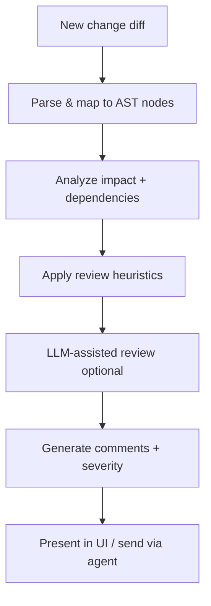
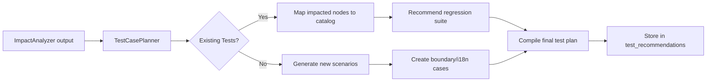

# Code Review & Testing - Detailed Design Specification

**Tạo từ các file nguồn:**

- `docs/RaD/ideas/code-review-strategy.md`
- `docs/RaD/ideas/testcase-strategy.md`

**Phiên bản:** 1.0  
**Ngày tạo:** 2025-11-15

---

## 1. Tổng quan

Tài liệu này mô tả chi tiết hai chức năng quan trọng của PCM Desktop:

1. **Automated Code Review**: Tự động review code changes và highlight risks
2. **Test Case Generation**: Tự động sinh test cases dựa trên impact analysis

Cả hai chức năng đều leverage metadata từ AST, semantic search, và LLM integration.

---

## 2. Code Review Strategy

### 2.1 Review Objectives

✅ Identify functional regressions và risky changes  
✅ Highlight missing tests, documentation, edge cases  
✅ Provide structured comments với file paths và line numbers  
✅ Integrate với RAG/LLM để generate explanations

### 2.2 Inputs

- **Diff information**: Git diff hoặc AST snapshot comparison
- **Impact analysis**: Affected nodes/files từ `ImpactAnalyzer`
- **Test coverage**: Map test cases → code (từ `test_catalog`)
- **Historical rules**: Coding standards, security guidelines
- **Past defects**: Bug history liên quan đến modules tương tự

### 2.3 Processing Flow



### 2.4 Data Model

```sql
CREATE TABLE review_comments (
    comment_id INTEGER PRIMARY KEY AUTOINCREMENT,
    request_id INTEGER REFERENCES user_requests(request_id) ON DELETE SET NULL,
    file_id    INTEGER REFERENCES source_files(file_id) ON DELETE SET NULL,
    start_line INTEGER,
    end_line   INTEGER,
    severity   TEXT CHECK (severity IN ('info', 'warning', 'error', 'critical')),
    category   TEXT,
    message    TEXT NOT NULL,
    suggestion TEXT,
    rule_id    TEXT,
    metadata   TEXT,
    created_at DATETIME DEFAULT CURRENT_TIMESTAMP
);

CREATE INDEX idx_review_comments_request ON review_comments(request_id);
CREATE INDEX idx_review_comments_file ON review_comments(file_id);
CREATE INDEX idx_review_comments_severity ON review_comments(severity);
CREATE INDEX idx_review_comments_category ON review_comments(category);
```

**Categories:**

- `naming`: Naming conventions
- `null_safety`: Null checks, NPE risks
- `security`: SQL injection, XSS, auth issues
- `i18n`: Hardcoded strings, encoding
- `performance`: Inefficient loops, large allocations
- `error_handling`: Missing try-catch, generic exceptions
- `test_coverage`: Missing tests
- `documentation`: Missing Javadoc/comments

### 2.5 Heuristic Rules

```java
public interface ReviewRule {
    String getRuleId();
    String getCategory();
    List<ReviewComment> check(AstNode node, ChangeContext context);
}

// Example: Null safety check
public class NullSafetyRule implements ReviewRule {
    @Override
    public String getRuleId() {
        return "NULL_CHECK_001";
    }
    
    @Override
    public String getCategory() {
        return "null_safety";
    }
    
    @Override
    public List<ReviewComment> check(AstNode node, ChangeContext context) {
        List<ReviewComment> comments = new ArrayList<>();
        
        if (!"method".equals(node.getNodeType())) {
            return comments;
        }
        
        Map<String, Object> payload = parsePayload(node.getPayload());
        List<Map<String, String>> params = (List) payload.get("parameters");
        
        if (params == null) return comments;
        
        // Check if method has null checks for parameters
        String methodContent = context.getNodeContent(node);
        
        for (Map<String, String> param : params) {
            String paramName = param.get("name");
            String paramType = param.get("type");
            
            // Skip primitives
            if (isPrimitive(paramType)) continue;
            
            // Check for null validation
            boolean hasNullCheck = 
                methodContent.contains(paramName + " == null") ||
                methodContent.contains(paramName + " != null") ||
                methodContent.contains("Objects.requireNonNull(" + paramName);
            
            if (!hasNullCheck) {
                ReviewComment comment = new ReviewComment();
                comment.setFileId(node.getFileId());
                comment.setStartLine(node.getStartLine());
                comment.setEndLine(node.getEndLine());
                comment.setSeverity("warning");
                comment.setCategory("null_safety");
                comment.setRuleId(getRuleId());
                comment.setMessage(String.format(
                    "Parameter '%s' may be null but is not validated",
                    paramName
                ));
                comment.setSuggestion(String.format(
                    "Add null check: if (%s == null) throw new IllegalArgumentException();",
                    paramName
                ));
                
                comments.add(comment);
            }
        }
        
        return comments;
    }
}

// Example: Security - SQL Injection
public class SqlInjectionRule implements ReviewRule {
    @Override
    public String getRuleId() {
        return "SEC_SQL_001";
    }
    
    @Override
    public String getCategory() {
        return "security";
    }
    
    @Override
    public List<ReviewComment> check(AstNode node, ChangeContext context) {
        List<ReviewComment> comments = new ArrayList<>();
        
        if (!"method".equals(node.getNodeType())) {
            return comments;
        }
        
        String content = context.getNodeContent(node);
        
        // Check for string concatenation in SQL queries
        Pattern pattern = Pattern.compile(
            "\"SELECT.*?\"\\s*\\+.*?|" +
            "\"UPDATE.*?\"\\s*\\+.*?|" +
            "\"DELETE.*?\"\\s*\\+.*?|" +
            "\"INSERT.*?\"\\s*\\+.*?"
        );
        
        Matcher matcher = pattern.matcher(content);
        if (matcher.find()) {
            ReviewComment comment = new ReviewComment();
            comment.setFileId(node.getFileId());
            comment.setStartLine(node.getStartLine());
            comment.setEndLine(node.getEndLine());
            comment.setSeverity("critical");
            comment.setCategory("security");
            comment.setRuleId(getRuleId());
            comment.setMessage(
                "Potential SQL injection: SQL query built with string concatenation"
            );
            comment.setSuggestion(
                "Use PreparedStatement with parameterized queries instead of string concatenation"
            );
            
            Map<String, Object> metadata = new HashMap<>();
            metadata.put("owasp_ref", "A03:2021-Injection");
            comment.setMetadata(toJson(metadata));
            
            comments.add(comment);
        }
        
        return comments;
    }
}

// Example: I18N - Hardcoded strings
public class I18nRule implements ReviewRule {
    @Override
    public String getRuleId() {
        return "I18N_STRING_001";
    }
    
    @Override
    public String getCategory() {
        return "i18n";
    }
    
    @Override
    public List<ReviewComment> check(AstNode node, ChangeContext context) {
        List<ReviewComment> comments = new ArrayList<>();
        
        String content = context.getNodeContent(node);
        
        // Find UI-facing strings (buttons, labels, messages)
        Pattern pattern = Pattern.compile(
            "setText\\s*\\(\\s*\"([^\"]+)\"\\)|" +
            "setTitle\\s*\\(\\s*\"([^\"]+)\"\\)|" +
            "showMessage\\s*\\(\\s*\"([^\"]+)\"\\)|" +
            "throw new.*?Exception\\s*\\(\\s*\"([^\"]+)\"\\)"
        );
        
        Matcher matcher = pattern.matcher(content);
        while (matcher.find()) {
            String text = matcher.group(1);
            if (text == null) text = matcher.group(2);
            if (text == null) text = matcher.group(3);
            if (text == null) text = matcher.group(4);
            
            // Check if it looks like user-facing text (has spaces, not a code identifier)
            if (text.contains(" ") && !text.matches("[A-Z_]+")) {
                ReviewComment comment = new ReviewComment();
                comment.setFileId(node.getFileId());
                comment.setStartLine(node.getStartLine());
                comment.setEndLine(node.getEndLine());
                comment.setSeverity("warning");
                comment.setCategory("i18n");
                comment.setRuleId(getRuleId());
                comment.setMessage(
                    "Hardcoded user-facing string: \"" + text + "\""
                );
                comment.setSuggestion(
                    "Use resource bundle: ResourceBundle.getString(\"key\")"
                );
                
                comments.add(comment);
            }
        }
        
        return comments;
    }
}
```

### 2.6 Review Service

```java
@Service
public class CodeReviewService {
    private final List<ReviewRule> rules = new ArrayList<>();
    
    public void registerRule(ReviewRule rule) {
        rules.add(rule);
    }
    
    public ReviewResult reviewChange(long requestId, SnapshotDiff diff) {
        UserRequest request = userRequestRepo.findById(requestId);
        ReviewResult result = new ReviewResult(request);
        
        // 1. Parse diff and map to AST nodes
        List<AstNode> changedNodes = mapDiffToNodes(diff);
        
        // 2. Gather context
        ChangeContext context = buildChangeContext(changedNodes, diff);
        
        // 3. Apply heuristic rules
        for (AstNode node : changedNodes) {
            for (ReviewRule rule : rules) {
                try {
                    List<ReviewComment> comments = rule.check(node, context);
                    result.addComments(comments);
                } catch (Exception e) {
                    log.error("Rule {} failed for node {}", 
                        rule.getRuleId(), node.getNodeId(), e);
                }
            }
        }
        
        // 4. Check test coverage
        List<ReviewComment> testComments = checkTestCoverage(changedNodes);
        result.addComments(testComments);
        
        // 5. Optional: LLM-assisted review
        if (shouldUseLlm(result)) {
            List<ReviewComment> llmComments = llmAssistedReview(
                changedNodes, 
                context, 
                result
            );
            result.addComments(llmComments);
        }
        
        // 6. Save comments
        for (ReviewComment comment : result.getAllComments()) {
            comment.setRequestId(requestId);
            reviewCommentRepo.save(comment);
        }
        
        return result;
    }
    
    private List<ReviewComment> checkTestCoverage(List<AstNode> changedNodes) {
        List<ReviewComment> comments = new ArrayList<>();
        
        for (AstNode node : changedNodes) {
            // Only check methods/functions
            if (!node.getNodeType().equals("method")) continue;
            
            // Check if there's a test for this method
            List<TestCase> tests = testCatalogRepo.findByNode(node.getNodeId());
            
            if (tests.isEmpty()) {
                ReviewComment comment = new ReviewComment();
                comment.setFileId(node.getFileId());
                comment.setStartLine(node.getStartLine());
                comment.setEndLine(node.getEndLine());
                comment.setSeverity("warning");
                comment.setCategory("test_coverage");
                comment.setRuleId("TEST_COV_001");
                comment.setMessage(
                    "Method '" + node.getName() + "' has no associated test cases"
                );
                comment.setSuggestion(
                    "Add unit test covering normal flow and edge cases"
                );
                
                comments.add(comment);
            }
        }
        
        return comments;
    }
    
    private List<ReviewComment> llmAssistedReview(
        List<AstNode> nodes,
        ChangeContext context,
        ReviewResult existingResult
    ) {
        // Build prompt
        StringBuilder prompt = new StringBuilder();
        prompt.append("You are a code reviewer. Analyze the following changes:\n\n");
        
        for (AstNode node : nodes) {
            prompt.append(formatNodeForReview(node, context));
            prompt.append("\n---\n");
        }
        
        prompt.append("\nExisting automated checks found:\n");
        for (ReviewComment comment : existingResult.getAllComments()) {
            prompt.append(String.format("- [%s] %s\n", 
                comment.getSeverity(), comment.getMessage()));
        }
        
        prompt.append("\nProvide additional review comments focusing on:\n");
        prompt.append("- Logic errors or bugs\n");
        prompt.append("- Potential race conditions\n");
        prompt.append("- Design issues\n");
        prompt.append("- Performance concerns\n");
        prompt.append("\nFormat: [severity] message | suggestion\n");
        
        // Call LLM
        String response = llmService.generate(prompt.toString());
        
        // Parse response
        return parseL llmReviewComments(response, nodes);
    }
}
```

---

## 3. Test Case Generation Strategy

### 3.1 Test Generation Objectives

✅ Derive relevant test cases based on code changes  
✅ Consider dependencies (call graph, data flow)  
✅ Enforce edge-case coverage (boundaries, special chars, locales)  
✅ Provide actionable artifacts for QA

### 3.2 Data Model

```sql
CREATE TABLE test_catalog (
    test_id       INTEGER PRIMARY KEY AUTOINCREMENT,
    name          TEXT NOT NULL,
    description   TEXT,
    scope         TEXT CHECK (scope IN ('unit', 'integration', 'e2e', 'performance')),
    related_nodes TEXT,
    test_file     TEXT,
    tags          TEXT,
    created_at    DATETIME DEFAULT CURRENT_TIMESTAMP
);

CREATE INDEX idx_test_catalog_scope ON test_catalog(scope);

CREATE TABLE test_recommendations (
    recommendation_id INTEGER PRIMARY KEY AUTOINCREMENT,
    request_id        INTEGER REFERENCES user_requests(request_id) ON DELETE CASCADE,
    test_type         TEXT,
    description       TEXT NOT NULL,
    priority          TEXT CHECK (priority IN ('low', 'medium', 'high', 'critical')),
    test_data         TEXT,
    metadata          TEXT,
    created_at        DATETIME DEFAULT CURRENT_TIMESTAMP
);

CREATE INDEX idx_test_recs_request ON test_recommendations(request_id);
CREATE INDEX idx_test_recs_priority ON test_recommendations(priority);
```

### 3.3 Test Planning Workflow



### 3.4 Test Generation Service

```java
@Service
public class TestGenerationService {
    
    public List<TestRecommendation> planTests(long requestId) {
        UserRequest request = userRequestRepo.findById(requestId);
        
        // 1. Get impacted nodes from impact analysis
        ImpactAnalysis impact = impactAnalyzer.suggestImpact(requestId);
        Set<Long> impactedNodeIds = impact.getImpactedNodes().stream()
            .map(ImpactCandidate::getNodeId)
            .collect(Collectors.toSet());
        
        // 2. Cross-reference with test catalog
        List<TestCase> existingTests = testCatalogRepo.findByNodes(impactedNodeIds);
        
        // 3. Generate recommendations
        List<TestRecommendation> recommendations = new ArrayList<>();
        
        // Regression tests (re-run existing)
        if (!existingTests.isEmpty()) {
            TestRecommendation regression = new TestRecommendation();
            regression.setRequestId(requestId);
            regression.setTestType("regression");
            regression.setPriority("high");
            regression.setDescription(String.format(
                "Re-run %d existing tests affected by changes",
                existingTests.size()
            ));
            regression.setMetadata(toJson(Map.of(
                "test_ids", existingTests.stream()
                    .map(TestCase::getTestId)
                    .collect(Collectors.toList())
            )));
            recommendations.add(regression);
        }
        
        // New unit tests
        for (ImpactCandidate candidate : impact.getImpactedNodes()) {
            if ("method".equals(candidate.getNodeType())) {
                recommendations.addAll(generateUnitTests(candidate, requestId));
            }
        }
        
        // Edge case tests
        recommendations.addAll(generateEdgeCaseTests(impact, requestId));
        
        // I18N tests
        recommendations.addAll(generateI18nTests(impact, requestId));
        
        // Integration tests (if multiple files affected)
        if (impact.getImpactedFiles().size() > 1) {
            recommendations.addAll(generateIntegrationTests(impact, requestId));
        }
        
        // Save recommendations
        for (TestRecommendation rec : recommendations) {
            testRecommendationRepo.save(rec);
        }
        
        return recommendations;
    }
    
    private List<TestRecommendation> generateUnitTests(
        ImpactCandidate candidate,
        long requestId
    ) {
        List<TestRecommendation> tests = new ArrayList<>();
        
        AstNode node = astNodeRepo.findById(candidate.getNodeId());
        Map<String, Object> payload = parsePayload(node.getPayload());
        
        List<Map<String, String>> params = (List) payload.get("parameters");
        if (params == null || params.isEmpty()) {
            return tests;
        }
        
        // Normal flow test
        TestRecommendation normalTest = new TestRecommendation();
        normalTest.setRequestId(requestId);
        normalTest.setTestType("unit");
        normalTest.setPriority("high");
        normalTest.setDescription(String.format(
            "Test %s with valid inputs",
            node.getFqName()
        ));
        normalTest.setTestData(generateNormalTestData(params));
        tests.add(normalTest);
        
        // Null parameter tests
        for (Map<String, String> param : params) {
            String paramType = param.get("type");
            if (!isPrimitive(paramType)) {
                TestRecommendation nullTest = new TestRecommendation();
                nullTest.setRequestId(requestId);
                nullTest.setTestType("unit");
                nullTest.setPriority("high");
                nullTest.setDescription(String.format(
                    "Test %s with null %s",
                    node.getFqName(),
                    param.get("name")
                ));
                nullTest.setTestData(toJson(Map.of(
                    "param", param.get("name"),
                    "value", "null",
                    "expected", "IllegalArgumentException"
                )));
                tests.add(nullTest);
            }
        }
        
        // Boundary tests
        for (Map<String, String> param : params) {
            String paramType = param.get("type");
            if (isNumeric(paramType)) {
                tests.addAll(generateBoundaryTests(node, param, requestId));
            } else if ("String".equals(paramType)) {
                tests.addAll(generateStringBoundaryTests(node, param, requestId));
            }
        }
        
        return tests;
    }
    
    private List<TestRecommendation> generateEdgeCaseTests(
        ImpactAnalysis impact,
        long requestId
    ) {
        List<TestRecommendation> tests = new ArrayList<>();
        
        // Boundary values
        TestRecommendation boundary = new TestRecommendation();
        boundary.setRequestId(requestId);
        boundary.setTestType("boundary");
        boundary.setPriority("high");
        boundary.setDescription("Test with boundary values");
        boundary.setTestData(toJson(Map.of(
            "cases", List.of(
                Map.of("type", "numeric", "values", List.of(
                    "Integer.MIN_VALUE", "Integer.MAX_VALUE", "0", "-1"
                )),
                Map.of("type", "string", "values", List.of(
                    "\"\"", "null", "\" \"", "very long string (>1000 chars)"
                )),
                Map.of("type", "collection", "values", List.of(
                    "empty list", "single element", "max size list"
                ))
            )
        )));
        tests.add(boundary);
        
        // Special characters
        TestRecommendation specialChars = new TestRecommendation();
        specialChars.setRequestId(requestId);
        specialChars.setTestType("security");
        specialChars.setPriority("high");
        specialChars.setDescription("Test with special characters and injection attempts");
        specialChars.setTestData(toJson(Map.of(
            "cases", List.of(
                "' OR '1'='1",
                "<script>alert('XSS')</script>",
                "../../etc/passwd",
                "%00",
                "😀🎉",
                "test\r\nInjected: header"
            )
        )));
        tests.add(specialChars);
        
        return tests;
    }
    
    private List<TestRecommendation> generateI18nTests(
        ImpactAnalysis impact,
        long requestId
    ) {
        List<TestRecommendation> tests = new ArrayList<>();
        
        // Korean (Hangul)
        TestRecommendation korean = new TestRecommendation();
        korean.setRequestId(requestId);
        korean.setTestType("i18n");
        korean.setPriority("medium");
        korean.setDescription("Test with Korean (Hangul) input");
        korean.setTestData(toJson(Map.of(
            "locale", "ko_KR",
            "samples", List.of(
                "안녕하세요",
                "사용자 이름",
                "가나다라마바사아자차카타파하"
            )
        )));
        tests.add(korean);
        
        // Chinese (Simplified)
        TestRecommendation chinese = new TestRecommendation();
        chinese.setRequestId(requestId);
        chinese.setTestType("i18n");
        chinese.setPriority("medium");
        chinese.setDescription("Test with Chinese (Simplified) input");
        chinese.setTestData(toJson(Map.of(
            "locale", "zh_CN",
            "samples", List.of(
                "你好",
                "用户名",
                "测试数据"
            )
        )));
        tests.add(chinese);
        
        // Japanese (Kanji + Hiragana)
        TestRecommendation japanese = new TestRecommendation();
        japanese.setRequestId(requestId);
        japanese.setTestType("i18n");
        japanese.setPriority("medium");
        japanese.setDescription("Test with Japanese input");
        japanese.setTestData(toJson(Map.of(
            "locale", "ja_JP",
            "samples", List.of(
                "こんにちは",
                "ユーザー名",
                "テストデータ"
            )
        )));
        tests.add(japanese);
        
        // Vietnamese (diacritics)
        TestRecommendation vietnamese = new TestRecommendation();
        vietnamese.setRequestId(requestId);
        vietnamese.setTestType("i18n");
        vietnamese.setPriority("medium");
        vietnamese.setDescription("Test with Vietnamese diacritics");
        vietnamese.setTestData(toJson(Map.of(
            "locale", "vi_VN",
            "samples", List.of(
                "Xin chào",
                "Tên người dùng",
                "Dữ liệu thử nghiệm"
            )
        )));
        tests.add(vietnamese);
        
        // Emoji and mixed scripts
        TestRecommendation mixed = new TestRecommendation();
        mixed.setRequestId(requestId);
        mixed.setTestType("i18n");
        mixed.setPriority("medium");
        mixed.setDescription("Test with emojis and mixed scripts");
        mixed.setTestData(toJson(Map.of(
            "samples", List.of(
                "Hello 你好 안녕",
                "User 😀 Name",
                "Test🎉Data"
            )
        )));
        tests.add(mixed);
        
        // RTL (Right-to-Left) languages
        TestRecommendation rtl = new TestRecommendation();
        rtl.setRequestId(requestId);
        rtl.setTestType("i18n");
        rtl.setPriority("low");
        rtl.setDescription("Test with RTL languages (Arabic, Hebrew)");
        rtl.setTestData(toJson(Map.of(
            "locales", List.of("ar_SA", "he_IL"),
            "samples", List.of(
                "مرحبا",
                "שלום"
            )
        )));
        tests.add(rtl);
        
        return tests;
    }
    
    private List<TestRecommendation> generateIntegrationTests(
        ImpactAnalysis impact,
        long requestId
    ) {
        List<TestRecommendation> tests = new ArrayList<>();
        
        TestRecommendation integration = new TestRecommendation();
        integration.setRequestId(requestId);
        integration.setTestType("integration");
        integration.setPriority("high");
        integration.setDescription(String.format(
            "Integration test covering %d affected files",
            impact.getImpactedFiles().size()
        ));
        integration.setTestData(toJson(Map.of(
            "files", impact.getImpactedFiles().stream()
                .map(ImpactCandidate::getFilePath)
                .collect(Collectors.toList()),
            "scenario", "End-to-end flow through affected components"
        )));
        tests.add(integration);
        
        return tests;
    }
}
```

### 3.5 Test Report Generation

```java
public class TestReportGenerator {
    public String generateTestPlan(List<TestRecommendation> recommendations) {
        StringBuilder report = new StringBuilder();
        
        report.append("# Test Plan\n\n");
        report.append(String.format("Generated: %s\n\n", LocalDateTime.now()));
        
        // Group by type
        Map<String, List<TestRecommendation>> byType = recommendations.stream()
            .collect(Collectors.groupBy(TestRecommendation::getTestType));
        
        for (Map.Entry<String, List<TestRecommendation>> entry : byType.entrySet()) {
            report.append(String.format("## %s Tests\n\n", capitalize(entry.getKey())));
            
            for (TestRecommendation rec : entry.getValue()) {
                report.append(String.format("### %s [%s]\n\n", 
                    rec.getDescription(), rec.getPriority()));
                
                if (rec.getTestData() != null) {
                    Map<String, Object> data = fromJson(rec.getTestData());
                    report.append("**Test Data:**\n");
                    report.append("```json\n");
                    report.append(toFormattedJson(data));
                    report.append("\n```\n\n");
                }
                
                report.append("---\n\n");
            }
        }
        
        return report.toString();
    }
}
```

---

## 4. UI Integration

### 4.1 Review Comments Panel

```java
public class ReviewCommentsPanel extends VBox {
    private final TableView<ReviewComment> commentsTable = new TableView<>();
    private final TextArea detailArea = new TextArea();
    
    public ReviewCommentsPanel() {
        // Setup table columns
        TableColumn<ReviewComment, String> severityCol = new TableColumn<>("Severity");
        severityCol.setCellFactory(col -> new TableCell<>() {
            @Override
            protected void updateItem(String severity, boolean empty) {
                super.updateItem(severity, empty);
                if (empty || severity == null) {
                    setText(null);
                    setStyle("");
                } else {
                    setText(severity);
                    setStyle(getSeverityStyle(severity));
                }
            }
        });
        
        TableColumn<ReviewComment, String> categoryCol = new TableColumn<>("Category");
        TableColumn<ReviewComment, String> messageCol = new TableColumn<>("Message");
        TableColumn<ReviewComment, String> fileCol = new TableColumn<>("File");
        
        commentsTable.getColumns().addAll(severityCol, categoryCol, messageCol, fileCol);
        
        // Selection handler
        commentsTable.getSelectionModel().selectedItemProperty().addListener((obs, old, selected) -> {
            if (selected != null) {
                showCommentDetail(selected);
            }
        });
        
        // Layout
        SplitPane split = new SplitPane(commentsTable, detailArea);
        split.setOrientation(Orientation.VERTICAL);
        split.setDividerPositions(0.6);
        
        getChildren().add(split);
    }
    
    private String getSeverityStyle(String severity) {
        return switch (severity) {
            case "critical" -> "-fx-background-color: #ff0000; -fx-text-fill: white;";
            case "error" -> "-fx-background-color: #ff6b6b;";
            case "warning" -> "-fx-background-color: #ffd93d;";
            case "info" -> "-fx-background-color: #6bcf7f;";
            default -> "";
        };
    }
    
    private void showCommentDetail(ReviewComment comment) {
        StringBuilder detail = new StringBuilder();
        detail.append(String.format("[%s] %s\n\n", 
            comment.getSeverity().toUpperCase(), 
            comment.getCategory()));
        detail.append(String.format("**Message:**\n%s\n\n", comment.getMessage()));
        
        if (comment.getSuggestion() != null) {
            detail.append(String.format("**Suggestion:**\n%s\n\n", comment.getSuggestion()));
        }
        
        if (comment.getRuleId() != null) {
            detail.append(String.format("**Rule:** %s\n", comment.getRuleId()));
        }
        
        detailArea.setText(detail.toString());
    }
}
```

---

## 5. Best Practices

### 5.1 Code Review

✅ **DO:**

- Run automated checks before manual review
- Provide actionable suggestions with code examples
- Link to coding standards/guidelines
- Prioritize critical issues (security, data loss)
- Log all review actions for audit

❌ **DON'T:**

- Fail build on minor style issues (use warnings)
- Generate too many false positives
- Review auto-generated code
- Block on documentation-only changes

### 5.2 Test Generation

✅ **DO:**

- Generate tests for edge cases and boundaries
- Include locale-specific test data (CJK, emojis)
- Suggest integration tests for multi-file changes
- Map tests to code coverage metrics
- Provide sample test data in recommendations

❌ **DON'T:**

- Generate tests for trivial getters/setters
- Duplicate existing test cases
- Skip performance tests for critical paths
- Ignore security test scenarios

---

## 6. Future Enhancements

### 6.1 Code Review

- **Machine learning**: Train model on past review comments
- **Auto-fix**: Generate patches for simple issues
- **Diff visualization**: Show before/after in UI
- **Team standards**: Customizable rule sets per project

### 6.2 Testing

- **Auto-generate test code**: Produce actual JUnit/TestNG code
- **Mutation testing**: Suggest mutation operators
- **Test prioritization**: Run high-risk tests first
- **Coverage tracking**: Visualize test coverage heatmap

---

**Document Version:** 1.0  
**Last Updated:** 2025-11-15  
**Maintainer:** PCM Desktop Team

