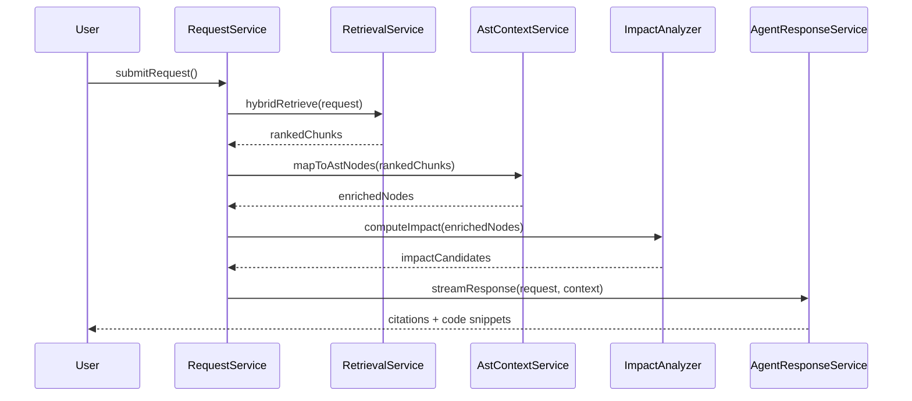

# Integration Flow & System Architecture - Detailed Design Specification

**Tạo từ các file nguồn:**
- `docs/RaD/ideas/request-to-code-flow.md`
- `docs/RaD/ideas/function-calling-spec.md`
- `docs/RaD/ideas/project-structure.md`

**Phiên bản:** 1.0  
**Ngày tạo:** 2025-11-15

---

## 1. Tổng quan

Tài liệu này mô tả chi tiết:
1. **Request-to-Code Flow**: Pipeline xử lý từ user request đến code location
2. **Function Calling Specification**: API endpoints và service contracts
3. **Project Structure**: Clean Architecture organization

---

## 2. Request-to-Code Flow

### 2.1 Objective

Map user requirement/question to **exact source code location(s)** cần investigation hoặc modification.

### 2.2 Architecture Diagram

```
┌─────────────────┐
│  User Request   │
└────────┬────────┘
         │
         ▼
┌──────────────────────────────────────┐
│      RequestService                  │
│  - Persist request                   │
│  - Kick off analysis                 │
└────────┬─────────────────────────────┘
         │
         ▼
┌──────────────────────────────────────┐
│     RetrievalService                 │
│  - Hybrid retrieval (vector + FTS)  │
│  - Returns ranked chunks             │
└────────┬─────────────────────────────┘
         │
         ▼
┌──────────────────────────────────────┐
│    AstContextService                 │
│  - Map chunks → AST nodes            │
│  - Enrich with relationships         │
└────────┬─────────────────────────────┘
         │
         ▼
┌──────────────────────────────────────┐
│     ImpactAnalyzer                   │
│  - Expand context (call graph)      │
│  - Find related files/symbols        │
└────────┬─────────────────────────────┘
         │
         ▼
┌──────────────────────────────────────┐
│   AgentResponseService               │
│  - Build prompt with context         │
│  - Stream LLM response               │
│  - Log artifacts & citations         │
└────────┬─────────────────────────────┘
         │
         ▼
┌─────────────────┐
│  User receives  │
│  answer with    │
│  code citations │
└─────────────────┘
```

### 2.3 Module Overview

| Module | Responsibility |
|--------|----------------|
| `RequestService` | Persist user requests, kick off analysis |
| `RetrievalService` | Hybrid retrieval (vector + FTS), ranking |
| `AstContextService` | Map chunk hits → AST nodes/relationships |
| `ImpactAnalyzer` | Expand context to related files/symbols |
| `SnippetFormatter` | Read file segments, format markdown snippets |
| `AgentResponseService` | Orchestrate LLM call, log artifacts, stream result |

### 2.4 Sequence Diagram



### 2.5 Implementation

#### RequestService

```java
@Service
public class RequestService {
    private final RetrievalService retrievalService;
    private final AstContextService astContextService;
    private final ImpactAnalyzer impactAnalyzer;
    private final AgentResponseService agentResponseService;
    private final UserRequestRepository requestRepo;
    
    public Flux<ResponseChunk> handleRequest(RequestPayload payload) {
        // 1. Persist request
        UserRequest request = requestRepo.create(payload);
        
        // 2. Retrieve relevant chunks
        List<ChunkHit> rankedChunks = retrievalService.hybridRetrieve(request);
        
        // 3. Map to AST nodes
        List<AstContext> astNodes = astContextService.enrich(rankedChunks);
        
        // 4. Compute impact
        List<ImpactCandidate> impact = impactAnalyzer.compute(astNodes);
        
        // 5. Build context
        ContextBundle context = ContextBundle.builder()
            .chunks(rankedChunks)
            .astNodes(astNodes)
            .impact(impact)
            .build();
        
        // 6. Stream response
        return agentResponseService.streamResponse(request, context);
    }
}
```

#### RetrievalService

```java
@Service
public class RetrievalService {
    private final QdrantClient vectorClient;
    private final SearchCorpusDao semanticSearchDao;
    private final HybridFusion fusionStrategy;
    
    public List<ChunkHit> hybridRetrieve(UserRequest request) {
        // Generate embedding for query
        float[] embedding = embeddingService.generate(request.getDescription());
        
        // Vector search
        List<ChunkHit> vectorHits = vectorClient.search(
            embedding, 
            buildFilters(request),
            50
        );
        
        // Lexical search (FTS5)
        List<ChunkHit> lexicalHits = semanticSearchDao.query(
            request.getDescription(),
            buildFilters(request),
            50
        );
        
        // Fuse and deduplicate
        List<ChunkHit> fused = fusionStrategy.fuse(vectorHits, lexicalHits);
        
        // Log metrics
        metricsService.recordRetrieval(
            request.getRequestId(),
            vectorHits.size(),
            lexicalHits.size(),
            fused.size()
        );
        
        return fused;
    }
    
    private Filters buildFilters(UserRequest request) {
        Filters filters = new Filters();
        
        if (request.getProjectId() != null) {
            filters.add("project_id", request.getProjectId());
        }
        
        if (request.getSubsystemId() != null) {
            filters.add("subsystem_id", request.getSubsystemId());
        }
        
        return filters;
    }
}
```

#### AstContextService

```java
@Service
public class AstContextService {
    private final AstNodeRepository astNodeRepo;
    private final AstRelationshipRepository relationshipRepo;
    private final SourceFileRepository fileRepo;
    
    public List<AstContext> enrich(List<ChunkHit> chunks) {
        List<AstContext> enriched = new ArrayList<>();
        
        for (ChunkHit chunk : chunks) {
            // Extract node_id from metadata
            Long nodeId = chunk.getMetadata().get("node_id") != null ?
                Long.parseLong(chunk.getMetadata().get("node_id")) : null;
            
            if (nodeId == null) {
                // Try to find node by file and line range
                nodeId = astNodeRepo.findByFileAndLines(
                    chunk.getFileId(),
                    chunk.getStartLine(),
                    chunk.getEndLine()
                );
            }
            
            AstContext context = new AstContext(chunk);
            
            if (nodeId != null) {
                AstNode node = astNodeRepo.findById(nodeId);
                if (node != null) {
                    context.setNode(node);
                    
                    // Add parent context (class declaration)
                    List<AstRelationship> parents = relationshipRepo
                        .findByChildAndType(nodeId, "parent");
                    context.setParents(parents);
                    
                    // Add relationships (calls, extends, etc.)
                    List<AstRelationship> rels = relationshipRepo
                        .findByNode(nodeId);
                    context.setRelationships(rels);
                }
            }
            
            enriched.add(context);
        }
        
        return enriched;
    }
}
```

#### ImpactAnalyzer

```java
@Service
public class ImpactAnalyzer {
    private final FileDependencyRepository dependencyRepo;
    private final AstRelationshipRepository relationshipRepo;
    
    public List<ImpactCandidate> compute(List<AstContext> astContexts) {
        Set<Long> impactedFileIds = new HashSet<>();
        Set<Long> impactedNodeIds = new HashSet<>();
        
        // Start with directly referenced nodes
        for (AstContext ctx : astContexts) {
            if (ctx.getNode() != null) {
                impactedNodeIds.add(ctx.getNode().getNodeId());
                impactedFileIds.add(ctx.getNode().getFileId());
            }
        }
        
        // Expand through AST relationships (call graph, inheritance)
        expandThroughRelationships(impactedNodeIds, 2); // 2 levels deep
        
        // Expand through file dependencies
        for (Long fileId : new HashSet<>(impactedFileIds)) {
            List<FileDependency> deps = dependencyRepo.findByTargetFile(fileId);
            for (FileDependency dep : deps) {
                impactedFileIds.add(dep.getFileId());
            }
        }
        
        // Build candidates
        List<ImpactCandidate> candidates = new ArrayList<>();
        for (Long fileId : impactedFileIds) {
            SourceFile file = sourceFileRepo.findById(fileId);
            double score = calculateImportanceScore(file, impactedNodeIds);
            candidates.add(new ImpactCandidate(file, score));
        }
        
        // Sort by score
        candidates.sort(Comparator.comparingDouble(
            ImpactCandidate::getScore).reversed());
        
        return candidates;
    }
    
    private void expandThroughRelationships(
        Set<Long> nodeIds, 
        int depth
    ) {
        if (depth == 0) return;
        
        Set<Long> newNodes = new HashSet<>();
        
        for (Long nodeId : nodeIds) {
            List<AstRelationship> rels = relationshipRepo.findByNode(nodeId);
            for (AstRelationship rel : rels) {
                Long relatedId = rel.getParentNodeId().equals(nodeId) ?
                    rel.getChildNodeId() : rel.getParentNodeId();
                
                if (nodeIds.add(relatedId)) {
                    newNodes.add(relatedId);
                }
            }
        }
        
        // Recurse
        if (!newNodes.isEmpty()) {
            expandThroughRelationships(newNodes, depth - 1);
        }
    }
}
```

#### AgentResponseService

```java
@Service
public class AgentResponseService {
    private final LlmProvider llmProvider;
    private final PromptTemplate promptTemplate;
    private final SnippetFormatter snippetFormatter;
    
    public Flux<ResponseChunk> streamResponse(
        UserRequest request,
        ContextBundle context
    ) {
        // Build prompt
        String promptContext = formatContext(context);
        String prompt = promptTemplate.build(
            request.getDescription(),
            promptContext
        );
        
        // Stream LLM response
        return llmProvider.stream(prompt, buildLlmConfig())
            .doOnNext(chunk -> {
                // Process each chunk
                processChunk(request, chunk);
            })
            .doOnComplete(() -> {
                // Finalize response
                finalizeResponse(request, context);
            })
            .doOnError(error -> {
                // Handle error
                handleError(request, error);
            });
    }
    
    private String formatContext(ContextBundle context) {
        StringBuilder formatted = new StringBuilder();
        
        int sourceIndex = 1;
        for (AstContext astCtx : context.getAstNodes()) {
            formatted.append(String.format("=== Source %d ===\n", sourceIndex++));
            formatted.append(snippetFormatter.format(astCtx));
            formatted.append("\n\n");
        }
        
        return formatted.toString();
    }
    
    private void processChunk(UserRequest request, String chunk) {
        // Stream to UI via WebSocket or SSE
        responseStreamService.sendChunk(request.getRequestId(), chunk);
    }
    
    private void finalizeResponse(UserRequest request, ContextBundle context) {
        // Store complete response
        String fullResponse = responseStreamService.getAccumulated(
            request.getRequestId()
        );
        
        AgentResponse response = new AgentResponse();
        response.setRequestId(request.getRequestId());
        response.setAnswerText(fullResponse);
        response.setCitedSources(extractCitations(fullResponse, context));
        response.setStatus("complete");
        agentResponseRepo.save(response);
        
        // Store artifacts (retrieved chunks)
        for (ChunkHit chunk : context.getChunks()) {
            RequestArtifact artifact = new RequestArtifact();
            artifact.setRequestId(request.getRequestId());
            artifact.setArtifactType("retrieved_chunk");
            artifact.setReferencePath(chunk.getFilePath());
            artifact.setMetadata(toJson(chunk.getMetadata()));
            requestArtifactRepo.save(artifact);
        }
    }
}
```

#### SnippetFormatter

```java
@Service
public class SnippetFormatter {
    private final FileService fileService;
    
    public String format(AstContext context) {
        StringBuilder snippet = new StringBuilder();
        
        // File and location info
        snippet.append(String.format("**File:** `%s`\n", 
            context.getChunk().getFilePath()));
        snippet.append(String.format("**Lines:** %d-%d\n",
            context.getChunk().getStartLine(),
            context.getChunk().getEndLine()));
        
        if (context.getNode() != null) {
            snippet.append(String.format("**Symbol:** `%s`\n",
                context.getNode().getFqName()));
            snippet.append(String.format("**Type:** %s\n",
                context.getNode().getNodeType()));
        }
        
        snippet.append("\n");
        
        // Code snippet
        SourceFile file = sourceFileRepo.findById(context.getChunk().getFileId());
        List<String> lines = fileService.readLines(
            file,
            context.getChunk().getStartLine(),
            context.getChunk().getEndLine()
        );
        
        snippet.append("```").append(file.getLanguage()).append("\n");
        for (int i = 0; i < lines.size(); i++) {
            int lineNum = context.getChunk().getStartLine() + i;
            snippet.append(String.format("%4d | %s\n", lineNum, lines.get(i)));
        }
        snippet.append("```\n");
        
        return snippet.toString();
    }
}
```

---

## 3. Function Calling Specification

### 3.1 API Endpoints

| Function | Purpose | Entities |
|----------|---------|----------|
| `registerSystem` | Create/update System/Subsystem/Project tree | `systems`, `subsystems`, `projects` |
| `attachSourceRoot` | Map project to source path, schedule scan | `project_sources` |
| `triggerSourceScan` | Run checksum diff, AST rebuild, reindex | `source_files`, `ast_snapshots` |
| `ingestChmPackage` | Import CHM into knowledge base | `chm_imports`, `chm_documents` |
| `upsertKnowledgeChunk` | Register arbitrary doc chunk | `search_corpus`, `vector_documents` |
| `runSemanticSearch` | Execute FTS5/BM25 query | `search_index` |
| `runVectorSearch` | Query Qdrant for embeddings | Qdrant |
| `hybridRetrieve` | Combine lexical + vector | retrieval layer |
| `submitUserRequest` | Persist requirement, start analysis | `user_requests` |
| `streamAgentResponse` | Stream LLM answer, log context | `agent_responses` |
| `recordFeedback` | Store rating/comments | `answer_feedback` |
| `getAstNodeDetail` | Return AST info for symbol/node | `ast_nodes` |
| `listRequests` | Filter/search historical requests | `user_requests` |

### 3.2 REST API Design

```java
@RestController
@RequestMapping("/api/v1")
public class PcmApiController {
    
    // System management
    @PostMapping("/systems")
    public ResponseEntity<System> registerSystem(@RequestBody SystemPayload payload) {
        System system = systemService.create(payload);
        return ResponseEntity.ok(system);
    }
    
    // Source management
    @PostMapping("/projects/{projectId}/sources")
    public ResponseEntity<ProjectSource> attachSourceRoot(
        @PathVariable Long projectId,
        @RequestBody SourceRootPayload payload
    ) {
        ProjectSource source = sourceService.attach(projectId, payload);
        return ResponseEntity.ok(source);
    }
    
    @PostMapping("/sources/{sourceId}/scan")
    public ResponseEntity<ScanResult> triggerSourceScan(
        @PathVariable Long sourceId,
        @RequestParam(defaultValue = "incremental") String mode
    ) {
        ScanResult result = sourceService.scan(sourceId, ScanMode.valueOf(mode));
        return ResponseEntity.ok(result);
    }
    
    // CHM import
    @PostMapping("/chm/import")
    public ResponseEntity<ChmImport> ingestChmPackage(
        @RequestParam Long projectId,
        @RequestParam String chmPath
    ) {
        ChmImport chmImport = chmService.startImport(chmPath, projectId);
        return ResponseEntity.ok(chmImport);
    }
    
    // Knowledge management
    @PostMapping("/knowledge/chunks")
    public ResponseEntity<VectorDocument> upsertKnowledgeChunk(
        @RequestBody ChunkPayload payload
    ) {
        VectorDocument doc = knowledgeService.upsertChunk(payload);
        return ResponseEntity.ok(doc);
    }
    
    // Search
    @GetMapping("/search/semantic")
    public ResponseEntity<List<ChunkHit>> runSemanticSearch(
        @RequestParam String query,
        @RequestParam(required = false) Long projectId,
        @RequestParam(defaultValue = "50") int limit
    ) {
        List<ChunkHit> hits = searchService.semanticSearch(query, projectId, limit);
        return ResponseEntity.ok(hits);
    }
    
    @GetMapping("/search/vector")
    public ResponseEntity<List<ChunkHit>> runVectorSearch(
        @RequestParam String query,
        @RequestParam(required = false) Long projectId,
        @RequestParam(defaultValue = "50") int limit
    ) {
        float[] embedding = embeddingService.generate(query);
        List<ChunkHit> hits = vectorService.search(embedding, projectId, limit);
        return ResponseEntity.ok(hits);
    }
    
    @GetMapping("/search/hybrid")
    public ResponseEntity<List<ChunkHit>> hybridRetrieve(
        @RequestParam String query,
        @RequestParam(required = false) Long projectId,
        @RequestParam(defaultValue = "50") int topKVector,
        @RequestParam(defaultValue = "50") int topKLexical
    ) {
        List<ChunkHit> hits = retrievalService.hybridRetrieve(
            query, projectId, topKVector, topKLexical);
        return ResponseEntity.ok(hits);
    }
    
    // User requests
    @PostMapping("/requests")
    public ResponseEntity<UserRequest> submitUserRequest(
        @RequestBody RequestPayload payload
    ) {
        UserRequest request = requestService.submit(payload);
        return ResponseEntity.ok(request);
    }
    
    @GetMapping("/requests/{requestId}/stream")
    @SneakyThrows
    public SseEmitter streamAgentResponse(@PathVariable Long requestId) {
        SseEmitter emitter = new SseEmitter();
        
        requestService.streamResponse(requestId)
            .subscribe(
                chunk -> emitter.send(chunk),
                error -> emitter.completeWithError(error),
                () -> emitter.complete()
            );
        
        return emitter;
    }
    
    @PostMapping("/responses/{responseId}/feedback")
    public ResponseEntity<AnswerFeedback> recordFeedback(
        @PathVariable Long responseId,
        @RequestBody FeedbackPayload payload
    ) {
        AnswerFeedback feedback = feedbackService.record(responseId, payload);
        return ResponseEntity.ok(feedback);
    }
    
    // AST queries
    @GetMapping("/ast/nodes/{nodeId}")
    public ResponseEntity<AstNodeDetail> getAstNodeDetail(@PathVariable Long nodeId) {
        AstNodeDetail detail = astService.getNodeDetail(nodeId);
        return ResponseEntity.ok(detail);
    }
    
    @GetMapping("/ast/nodes/search")
    public ResponseEntity<List<AstNode>> searchNodes(
        @RequestParam Long projectId,
        @RequestParam(required = false) String name,
        @RequestParam(required = false) String type
    ) {
        List<AstNode> nodes = astService.findNodesBySymbol(projectId, name, type);
        return ResponseEntity.ok(nodes);
    }
    
    // Request history
    @GetMapping("/requests")
    public ResponseEntity<Page<UserRequest>> listRequests(
        @RequestParam(required = false) Long projectId,
        @RequestParam(required = false) String status,
        @RequestParam(defaultValue = "0") int page,
        @RequestParam(defaultValue = "20") int size
    ) {
        Page<UserRequest> requests = requestService.list(projectId, status, page, size);
        return ResponseEntity.ok(requests);
    }
}
```

---

## 4. Project Structure (Clean Architecture)

### 4.1 High-Level Layout

```
pcm-desktop/
├─ docs/                 # Documentation
├─ scripts/              # Helper scripts
├─ data/                 # Local SQLite, cache
├─ models/               # ML/embedding models
├─ src/
│  ├─ main/
│  │   ├─ java/com/noteflix/pcm/
│  │   │    ├─ application/      # Use cases/orchestration
│  │   │    ├─ domain/           # Entities, repository interfaces
│  │   │    ├─ infrastructure/   # Adapters, datasource, clients
│  │   │    ├─ ui/               # JavaFX UI
│  │   │    └─ shared/           # Utilities, config
│  │   └─ resources/
│  │        ├─ db/migrations/    # SQL migrations
│  │        ├─ i18n/             # Localization
│  │        ├─ styles/           # CSS
│  │        ├─ templates/        # Prompt templates
│  │        └─ config/           # Configuration files
│  └─ test/
└─ logs/
```

### 4.2 Package Breakdown

#### application (Use Cases)

```
com.noteflix.pcm.application/
├─ request/
│  ├─ SubmitUserRequestUseCase.java
│  ├─ StreamAgentResponseUseCase.java
│  └─ RecordFeedbackUseCase.java
├─ retrieval/
│  ├─ HybridRetrievalUseCase.java
│  ├─ SemanticSearchUseCase.java
│  └─ VectorSearchUseCase.java
├─ review/
│  ├─ ReviewChangeUseCase.java
│  └─ ApplyReviewRuleUseCase.java
├─ testcase/
│  ├─ PlanTestsUseCase.java
│  └─ GenerateTestDataUseCase.java
└─ ingestion/
   ├─ ScanProjectSourceUseCase.java
   ├─ BuildAstSnapshotUseCase.java
   └─ IngestChmPackageUseCase.java
```

#### domain (Core Domain)

```
com.noteflix.pcm.domain/
├─ system/
│  ├─ System.java
│  ├─ Subsystem.java
│  ├─ Project.java
│  ├─ Batch.java
│  └─ SystemRepository.java (interface)
├─ code/
│  ├─ SourceFile.java
│  ├─ AstNode.java
│  ├─ AstSnapshot.java
│  ├─ FileDependency.java
│  └─ AstRepository.java (interface)
├─ request/
│  ├─ UserRequest.java
│  ├─ AgentResponse.java
│  ├─ Feedback.java
│  └─ RequestRepository.java (interface)
├─ testcase/
│  ├─ TestCase.java
│  ├─ TestRecommendation.java
│  └─ TestRepository.java (interface)
└─ review/
   ├─ ReviewComment.java
   ├─ ReviewRule.java (interface)
   └─ ReviewRepository.java (interface)
```

#### infrastructure (Adapters)

```
com.noteflix.pcm.infrastructure/
├─ persistence/
│  ├─ sqlite/
│  │  ├─ SqliteSystemRepository.java
│  │  ├─ SqliteAstRepository.java
│  │  └─ SqliteRequestRepository.java
│  └─ migrations/
│     └─ FlywayMigration.java
├─ vectorstore/
│  ├─ QdrantClient.java
│  └─ QdrantVectorRepository.java
├─ search/
│  ├─ Fts5SearchService.java
│  └─ SearchCorpusRepository.java
├─ ingestion/
│  ├─ SourceFileScanner.java
│  ├─ AstParser.java
│  ├─ JavaParserImpl.java
│  ├─ PythonParserImpl.java
│  └─ ChmExtractor.java
└─ llm/
   ├─ OpenAiProvider.java
   ├─ AnthropicProvider.java
   ├─ LocalLlmProvider.java
   └─ LlmProviderRegistry.java
```

#### ui (JavaFX)

```
com.noteflix.pcm.ui/
├─ pages/
│  ├─ AIAssistantPage.java
│  ├─ SystemManagerPage.java
│  ├─ KnowledgeImportPage.java
│  ├─ ReviewPanelPage.java
│  └─ SettingsPage.java
├─ components/
│  ├─ ChatBubble.java
│  ├─ CodeSnippet.java
│  ├─ AstTreeView.java
│  └─ SearchResultList.java
├─ viewmodel/
│  ├─ AIAssistantViewModel.java
│  ├─ SystemManagerViewModel.java
│  └─ SettingsViewModel.java
└─ layout/
   └─ MainLayout.java
```

#### shared (Utilities)

```
com.noteflix.pcm.shared/
├─ config/
│  ├─ AppConfig.java
│  └─ DatabaseConfig.java
├─ events/
│  ├─ EventBus.java
│  └─ DomainEvent.java
├─ utils/
│  ├─ JsonUtils.java
│  ├─ ChecksumUtils.java
│  └─ LoggingUtils.java
└─ constants/
   ├─ AppConstants.java
   └─ IconPaths.java
```

### 4.3 Dependency Rules

```
┌──────────────────┐
│        UI        │
└────────┬─────────┘
         │ depends on
         ▼
┌──────────────────┐
│   Application    │
└────────┬─────────┘
         │ depends on
         ▼
┌──────────────────┐
│      Domain      │ ◄──── Infrastructure implements
└──────────────────┘
```

**Rules:**
1. `application` depends on `domain` abstractions only
2. `domain` depends on nothing (pure domain logic)
3. `infrastructure` depends on `domain` to implement interfaces
4. `ui` depends on `application` and `domain` (view models reference domain objects)
5. `shared` should not depend on `ui` (utilities only)

---

## 5. Configuration Management

### 5.1 application.yml

```yaml
app:
  name: PCM Desktop
  version: 1.0.0

database:
  path: data/pcm-desktop.db
  pool_size: 10
  migration_enabled: true

qdrant:
  url: http://localhost:6333
  collection: pcm_chunks
  api_key: ${QDRANT_API_KEY:}

embedding:
  provider: openai  # openai | local
  model: text-embedding-3-large
  dimensions: 3072
  cache_enabled: true

llm:
  provider: openai  # openai | anthropic | local
  model: gpt-4o
  temperature: 0.2
  max_tokens: 2000
  stream: true

search:
  vector_top_k: 50
  lexical_top_k: 50
  fusion_strategy: rrf  # rrf | weighted
  rrf_k: 60

logging:
  level: INFO
  file: logs/pcm-desktop.log
  max_size: 10MB
  max_history: 30
```

---

## 6. Testing Strategy

### 6.1 Unit Tests

```java
// Domain tests (no dependencies)
@Test
public void testUserRequestCreation() {
    UserRequest request = UserRequest.builder()
        .userId("user1")
        .projectId(1L)
        .description("How does login work?")
        .build();
    
    assertEquals("user1", request.getUserId());
    assertEquals("received", request.getStatus());
}

// Use case tests (mock repositories)
@Test
public void testHybridRetrievalUseCase() {
    // Arrange
    when(vectorService.search(any(), any(), anyInt()))
        .thenReturn(List.of(mockChunk1, mockChunk2));
    when(fts5Service.search(any(), any(), anyInt()))
        .thenReturn(List.of(mockChunk2, mockChunk3));
    
    // Act
    List<ChunkHit> results = hybridRetrievalUseCase.execute(query);
    
    // Assert
    assertEquals(3, results.size());
    verify(vectorService).search(any(), any(), anyInt());
    verify(fts5Service).search(any(), any(), anyInt());
}
```

### 6.2 Integration Tests

```java
@SpringBootTest
@Testcontainers
public class RequestToCodeFlowIntegrationTest {
    
    @Container
    static QdrantContainer qdrant = new QdrantContainer();
    
    @Test
    public void testFullRequestFlow() {
        // 1. Create project and source
        Project project = projectService.create("Test Project");
        ProjectSource source = sourceService.attach(
            project.getId(), 
            "src/test/resources/sample-code"
        );
        
        // 2. Scan and index
        sourceService.scan(source.getSourceId());
        
        // 3. Submit request
        UserRequest request = requestService.submit(
            "How does login work?",
            project.getId()
        );
        
        // 4. Verify response
        AgentResponse response = agentResponseRepo
            .findByRequestId(request.getRequestId());
        
        assertNotNull(response);
        assertTrue(response.getAnswerText().contains("login"));
        assertFalse(response.getCitedSources().isEmpty());
    }
}
```

---

## 7. Deployment

### 7.1 Build & Package

```bash
# Build application
./scripts/build.sh

# Run tests
mvn test

# Package
mvn clean package

# Generate executable JAR with dependencies
mvn assembly:single
```

### 7.2 Distribution

```
pcm-desktop-1.0.0/
├─ bin/
│  ├─ pcm-desktop (Unix launcher)
│  └─ pcm-desktop.bat (Windows launcher)
├─ lib/
│  ├─ pcm-desktop-1.0.0.jar
│  └─ dependencies/*.jar
├─ data/
│  └─ pcm-desktop.db (created on first run)
├─ models/
│  └─ all-MiniLM-L6-v2/ (if using local embeddings)
├─ config/
│  └─ application.yml
└─ README.md
```

---

**Document Version:** 1.0  
**Last Updated:** 2025-11-15  
**Maintainer:** PCM Desktop Team

