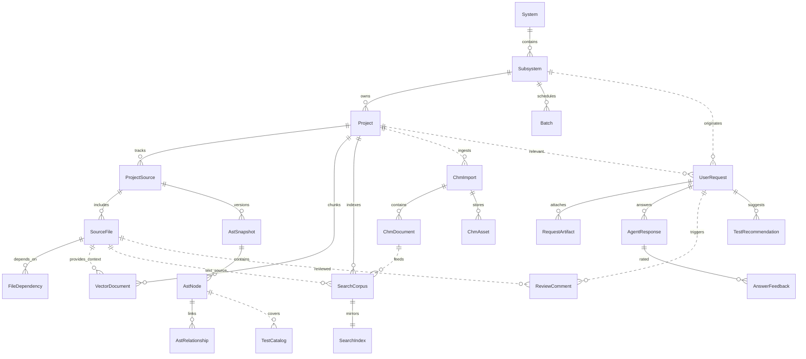

# UI & Domain Overview - Detailed Design Specification

**Tạo từ các file nguồn:**

- `docs/RaD/ideas/ui-domain-overview.md`
- `docs/RaD/ideas/ui-ui-review.md`

**Phiên bản:** 1.0  
**Ngày tạo:** 2025-11-15

---

## 1. Tổng quan

Tài liệu này consolidates các entities và screens được quản lý bởi PCM Desktop, bao gồm:

1. **Core Domain Entities**: Tất cả domain objects và relationships
2. **Screen Catalogue**: Chi tiết từng screen và chức năng
3. **UI Architecture**: MVVM pattern và data binding
4. **Known Issues**: Các vấn đề hiện tại cần fix

---

## 2. Core Domain Entities

### 2.1 Entity Overview

| Entity                  | Description                                | Source Docs     |
|-------------------------|--------------------------------------------|-----------------|
| **System**              | Top-level platform/business domain         | Database schema |
| **Subsystem**           | Logical grouping (module, capability)      | Database schema |
| **Project**             | Specific initiative/application            | Database schema |
| **Batch**               | Scheduled job tied to subsystem            | Database schema |
| **Project Source**      | Repository metadata (path, branch, commit) | Database schema |
| **Source File**         | File-level metadata (language, checksum)   | Database schema |
| **AST Snapshot/Node**   | Structural representation of code          | AST design      |
| **Vector Document**     | Chunk metadata for embeddings              | RAG design      |
| **Search Corpus Entry** | Text record for FTS/semantic search        | Search design   |
| **CHM Import/Document** | Legacy docs from CHM packages              | CHM design      |
| **User Request**        | Question/requirement from users            | Database schema |
| **Agent Response**      | Answer produced by LLM                     | RAG design      |
| **Feedback**            | Evaluation for quality loop                | Database schema |

### 2.2 Entity Relationship Diagram



---

## 3. Screen Catalogue

### 3.1 System Hierarchy Management

**Purpose:** Maintain System → Subsystem → Project → Batch structure

**UI Components:**

```
SystemManagerPage
├─ TreeView<HierarchyNode>
│  ├─ System nodes (expandable)
│  ├─ Subsystem nodes (expandable)
│  ├─ Project nodes (leaf)
│  └─ Batch nodes (leaf)
├─ DetailPanel
│  ├─ Form fields (code, name, description, etc.)
│  ├─ Save/Cancel buttons
│  └─ Delete button
└─ ToolBar
   ├─ Add System button
   ├─ Add Subsystem button
   ├─ Add Project button
   ├─ Add Batch button
   └─ Refresh button
```

**Key Actions:**

- Create/Edit/Delete entities
- View ownership and metadata
- Assign source repositories to projects
- View batch schedules

**ViewModel:**

```java
public class SystemManagerViewModel {
    private final ObservableList<HierarchyNode> hierarchyTree = FXCollections.observableArrayList();
    private final ObjectProperty<HierarchyNode> selectedNode = new SimpleObjectProperty<>();
    private final ObjectProperty<System> selectedSystem = new SimpleObjectProperty<>();
    
    public void loadHierarchy() {
        List<System> systems = systemService.getAllSystems();
        hierarchyTree.clear();
        
        for (System system : systems) {
            HierarchyNode systemNode = new HierarchyNode(system);
            
            for (Subsystem subsystem : system.getSubsystems()) {
                HierarchyNode subsystemNode = new HierarchyNode(subsystem);
                systemNode.getChildren().add(subsystemNode);
                
                for (Project project : subsystem.getProjects()) {
                    subsystemNode.getChildren().add(new HierarchyNode(project));
                }
                
                for (Batch batch : subsystem.getBatches()) {
                    subsystemNode.getChildren().add(new HierarchyNode(batch));
                }
            }
            
            hierarchyTree.add(systemNode);
        }
    }
    
    public void saveNode(HierarchyNode node) {
        switch (node.getType()) {
            case SYSTEM -> systemService.save((System) node.getData());
            case SUBSYSTEM -> subsystemService.save((Subsystem) node.getData());
            case PROJECT -> projectService.save((Project) node.getData());
            case BATCH -> batchService.save((Batch) node.getData());
        }
        loadHierarchy();
    }
}
```

### 3.2 Source Repository Manager

**Purpose:** Register project source roots, track scan status, trigger re-scan

**UI Components:**

```
SourceManagerPage
├─ TableView<ProjectSource>
│  ├─ Project column
│  ├─ Root path column
│  ├─ VCS type column
│  ├─ Scan status column
│  └─ Last scanned column
├─ DetailPanel
│  ├─ Source configuration form
│  ├─ File statistics
│  └─ Scan history
└─ ActionBar
   ├─ Add Source button
   ├─ Scan Now button
   ├─ View Files button
   └─ Delete button
```

**Key Actions:**

- Select folder as source root
- Set VCS info (type, branch, commit)
- View checksum/change status
- Launch AST/vector rebuild

**Data Sources:** `project_sources`, `source_files`, `ast_snapshots`

**Scan Logic:**

```java
public class SourceManagerViewModel {
    public void triggerScan(ProjectSource source) {
        source.setScanStatus("scanning");
        projectSourceRepo.save(source);
        
        CompletableFuture.runAsync(() -> {
            try {
                ScanResult result = sourceScanService.scan(source.getSourceId());
                
                Platform.runLater(() -> {
                    source.setScanStatus("complete");
                    source.setLastScannedAt(LocalDateTime.now());
                    projectSourceRepo.save(source);
                    refreshTable();
                    
                    showNotification(String.format(
                        "Scan complete: %d files processed",
                        result.getProcessedCount()
                    ));
                });
            } catch (Exception e) {
                Platform.runLater(() -> {
                    source.setScanStatus("failed");
                    projectSourceRepo.save(source);
                    showError("Scan failed: " + e.getMessage());
                });
            }
        });
    }
}
```

### 3.3 AST & Dependency Explorer

**Purpose:** Visualize AST nodes, relationships, dependencies for impact analysis

**UI Components:**

```
AstExplorerPage
├─ SplitPane (horizontal)
│  ├─ Left: TreeView<AstNode> (AST hierarchy)
│  └─ Right: SplitPane (vertical)
│     ├─ Top: CodeView (syntax highlighted)
│     └─ Bottom: TabPane
│        ├─ Properties tab (node metadata)
│        ├─ Relationships tab (call graph viz)
│        └─ Dependencies tab (file deps)
└─ SearchBar
   ├─ Symbol search field
   ├─ Type filter dropdown
   └─ Scope filter (project/subsystem)
```

**Features:**

- Tree view per snapshot
- Search symbol by name/type
- Show references (inbound/outbound)
- Visualize call graph (D3.js or GraphStream)
- Link to vector docs for context preview

**Integration:**

```java
public class AstExplorerViewModel {
    private final ObservableList<AstNode> searchResults = FXCollections.observableArrayList();
    private final ObjectProperty<AstNode> selectedNode = new SimpleObjectProperty<>();
    
    public void searchSymbol(String query, String type) {
        List<AstNode> nodes = astService.findNodesBySymbol(
            currentProjectId.get(),
            query,
            type
        );
        searchResults.setAll(nodes);
    }
    
    public void selectNode(AstNode node) {
        selectedNode.set(node);
        
        // Load detail
        AstNodeDetail detail = astService.getNodeDetail(node.getNodeId());
        
        // Update UI
        codeView.setText(detail.getSnippet());
        propertiesTab.setContent(formatProperties(detail.getNode()));
        relationshipsTab.setContent(renderCallGraph(detail.getRelationships()));
    }
}
```

### 3.4 Semantic Search Console

**Purpose:** Run TF-IDF/BM25 queries over `search_corpus`

**UI Components:**

```
SearchConsolePage
├─ SearchBar
│  ├─ Query input field
│  ├─ Search button
│  └─ Advanced filters (collapsed)
│     ├─ System/Subsystem/Project filters
│     ├─ Source type checkboxes
│     └─ Date range picker
├─ ResultsTable
│  ├─ Score column
│  ├─ Label column
│  ├─ Source type badge
│  ├─ File path column
│  └─ Preview snippet (highlighted)
└─ ActionBar
   ├─ Send to RAG button
   ├─ Export button
   └─ Clear button
```

**Integration:**

```java
public class SearchConsoleViewModel {
    public void executeSearch(String query, SearchFilters filters) {
        // Lexical search
        List<ChunkHit> lexicalHits = fts5Service.search(
            query,
            filters.getProjectId(),
            filters.getSourceTypes(),
            50
        );
        
        // Optional: hybrid search
        if (filters.isHybridEnabled()) {
            List<ChunkHit> vectorHits = vectorService.search(
                embeddingService.generate(query),
                filters.getProjectId(),
                50
            );
            
            lexicalHits = fusionService.fuse(lexicalHits, vectorHits);
        }
        
        searchResults.setAll(lexicalHits);
    }
    
    public void sendToRag(List<ChunkHit> selectedHits) {
        // Create request with pre-selected context
        UserRequest request = new UserRequest();
        request.setDescription("Analyze selected code");
        request.setProjectId(filters.getProjectId());
        requestService.submit(request);
        
        // Attach artifacts
        for (ChunkHit hit : selectedHits) {
            RequestArtifact artifact = new RequestArtifact();
            artifact.setRequestId(request.getRequestId());
            artifact.setArtifactType("preselected_chunk");
            artifact.setReferencePath(hit.getFilePath());
            requestArtifactRepo.save(artifact);
        }
        
        // Navigate to AI Assistant
        navigationService.navigateTo("AIAssistant", request.getRequestId());
    }
}
```

### 3.5 Knowledge Import Center

**Purpose:** Manage CHM and other knowledge sources

**UI Components:**

```
KnowledgeImportPage
├─ TabPane
│  ├─ CHM Import tab
│  │  ├─ TableView<ChmImport> (imports history)
│  │  ├─ Import button → ChmImportDialog
│  │  └─ View/Delete actions
│  ├─ Documents tab
│  │  ├─ TreeView<TocNode> (TOC browser)
│  │  └─ WebView (document preview)
│  └─ Assets tab
│     └─ GridView<ChmAsset> (images, CSS, JS)
└─ StatusBar
   └─ Import progress indicator
```

**Workflow:**

1. User uploads CHM → track status (`chm_imports.status`)
2. View extracted docs (`chm_documents`)
3. Preview doc, set tags/mapping to subsystems
4. Re-ingest, delete import

**Implementation:**

```java
public class KnowledgeImportViewModel {
    public void startChmImport(Path chmFile, Long projectId) {
        ChmImport chmImport = chmService.startImport(chmFile, projectId);
        
        // Poll status
        Timeline statusPoller = new Timeline(new KeyFrame(
            Duration.seconds(1),
            e -> {
                ChmImport updated = chmImportRepo.findById(chmImport.getImportId());
                statusProperty.set(updated.getStatus());
                
                if ("complete".equals(updated.getStatus()) ||
                    "failed".equals(updated.getStatus())) {
                    ((Timeline) e.getSource()).stop();
                    refreshImports();
                }
            }
        ));
        statusPoller.setCycleCount(Timeline.INDEFINITE);
        statusPoller.play();
    }
    
    public void loadToc(ChmImport chmImport) {
        TocStructure toc = chmService.getTocStructure(chmImport);
        TreeItem<TocNode> root = buildTreeItem(toc.getRoot());
        tocTree.setRoot(root);
    }
}
```

### 3.6 RAG Workspace (AI Assistant Page)

**Purpose:** User chat interface for requirement analysis

**UI Components:**

```
AIAssistantPage
├─ SideBar (conversations)
│  ├─ New chat button
│  ├─ Search conversations
│  └─ ConversationList
│     └─ ConversationPreview (title, date, token count)
├─ ChatArea
│  ├─ MessageList (ScrollPane)
│  │  ├─ UserMessage bubble
│  │  └─ AssistantMessage bubble
│  │     ├─ Markdown content
│  │     ├─ Code snippets (syntax highlighted)
│  │     └─ Citations (clickable)
│  └─ InputArea
│     ├─ TextArea (multi-line input)
│     ├─ Send button
│     ├─ Attach file button
│     └─ Voice input button (future)
└─ ContextPanel (collapsible)
   ├─ Project selector
   ├─ Retrieved sources list
   └─ Feedback buttons (👍 👎)
```

**Data Flow:**

```java
public class AIAssistantViewModel {
    private final ObservableList<Message> messages = FXCollections.observableArrayList();
    private final ObjectProperty<Conversation> currentConversation = new SimpleObjectProperty<>();
    
    public void sendMessage(String userInput) {
        // Add user message to UI
        Message userMsg = new Message(
            MessageType.USER,
            userInput,
            LocalDateTime.now()
        );
        messages.add(userMsg);
        
        // Create request
        UserRequest request = new UserRequest();
        request.setDescription(userInput);
        request.setProjectId(selectedProjectId.get());
        request.setConversationId(currentConversation.get().getConversationId());
        requestService.submit(request);
        
        // Stream response
        Message assistantMsg = new Message(
            MessageType.ASSISTANT,
            "",
            LocalDateTime.now()
        );
        messages.add(assistantMsg);
        
        requestService.streamResponse(request.getRequestId())
            .subscribe(
                chunk -> {
                    Platform.runLater(() -> {
                        assistantMsg.appendContent(chunk);
                    });
                },
                error -> {
                    Platform.runLater(() -> {
                        assistantMsg.setContent("Error: " + error.getMessage());
                    });
                },
                () -> {
                    Platform.runLater(() -> {
                        assistantMsg.setComplete(true);
                        persistMessage(assistantMsg, request.getRequestId());
                    });
                }
            );
    }
    
    private void persistMessage(Message message, Long requestId) {
        conversationService.addMessage(
            currentConversation.get().getConversationId(),
            message
        );
        
        // Update conversation preview
        refreshConversations();
    }
}
```

### 3.7 Request Tracking & History

**Purpose:** Dashboard to review all `user_requests`, statuses, assigned projects

**UI Components:**

```
RequestHistoryPage
├─ FilterBar
│  ├─ Date range picker
│  ├─ Project filter
│  ├─ Status filter
│  └─ Search box
├─ RequestsTable
│  ├─ ID column
│  ├─ Title column
│  ├─ Project column
│  ├─ Status badge
│  ├─ Created date column
│  └─ Rating column (⭐)
└─ DetailPanel (bottom)
   ├─ Request description
   ├─ Response preview
   ├─ Artifacts list (retrieved chunks)
   └─ Action buttons (View full, Re-analyze, Export)
```

**Features:**

- Filter by date, project, status, rating
- Link to responses and artifacts
- View conversation history
- Export to PDF/Markdown

**Implementation:**

```java
public class RequestHistoryViewModel {
    public void loadRequests(RequestFilters filters) {
        Page<UserRequest> page = requestService.list(
            filters.getProjectId(),
            filters.getStatus(),
            filters.getStartDate(),
            filters.getEndDate(),
            filters.getPage(),
            filters.getSize()
        );
        
        requestsTable.setItems(FXCollections.observableArrayList(page.getContent()));
    }
    
    public void viewFullRequest(UserRequest request) {
        // Load complete details
        List<AgentResponse> responses = agentResponseRepo
            .findByRequestId(request.getRequestId());
        List<RequestArtifact> artifacts = requestArtifactRepo
            .findByRequestId(request.getRequestId());
        
        // Show in dialog or navigate to detail page
        RequestDetailDialog dialog = new RequestDetailDialog(request, responses, artifacts);
        dialog.show();
    }
}
```

### 3.8 Settings & Analytics

**Purpose:** Theme/system settings plus analytics (retrieval latency, answer quality)

**UI Components:**

```
SettingsPage
├─ TabPane
│  ├─ General tab
│  │  ├─ Theme selector (Light/Dark)
│  │  ├─ Language selector
│  │  └─ Default project selector
│  ├─ AI Configuration tab
│  │  ├─ LLM provider dropdown
│  │  ├─ API key field
│  │  ├─ Model selector
│  │  ├─ Temperature slider
│  │  └─ Max tokens field
│  ├─ Search Configuration tab
│  │  ├─ Embedding model selector
│  │  ├─ Top-k sliders (vector/lexical)
│  │  ├─ Fusion strategy dropdown
│  │  └─ Cache settings
│  └─ Analytics tab
│     ├─ Charts
│     │  ├─ Request volume (line chart)
│     │  ├─ Average rating (bar chart)
│     │  ├─ Retrieval latency (histogram)
│     │  └─ Popular topics (word cloud)
│     └─ Export button
└─ Save/Cancel buttons
```

**Analytics Queries:**

```java
public class AnalyticsViewModel {
    public ChartData getRequestVolumeData(int days) {
        String sql = """
            SELECT DATE(created_at) AS date, COUNT(*) AS count
            FROM user_requests
            WHERE created_at >= DATE('now', ?)
            GROUP BY DATE(created_at)
            ORDER BY date
            """;
        
        List<Map<String, Object>> rows = jdbcTemplate.queryForList(
            sql, 
            String.format("-%d days", days)
        );
        
        return ChartData.fromRows(rows);
    }
    
    public ChartData getAverageRatingData() {
        String sql = """
            SELECT 
                DATE(af.created_at) AS date,
                AVG(af.rating) AS avg_rating
            FROM answer_feedback af
            WHERE af.created_at >= DATE('now', '-30 days')
            GROUP BY DATE(af.created_at)
            ORDER BY date
            """;
        
        List<Map<String, Object>> rows = jdbcTemplate.queryForList(sql);
        return ChartData.fromRows(rows);
    }
}
```

---

## 4. MVVM Architecture

### 4.1 Pattern Overview

```
┌──────────┐        ┌─────────────┐        ┌────────────┐
│   View   │◄──────►│  ViewModel  │◄──────►│   Model    │
│ (FXML +  │ binding│  (business  │ calls  │ (domain +  │
│  Java)   │        │   logic)    │        │  services) │
└──────────┘        └─────────────┘        └────────────┘
```

**Responsibilities:**

- **View**: UI layout, rendering, user interactions
- **ViewModel**: Observable properties, commands, state management
- **Model**: Domain objects, repositories, services

### 4.2 Data Binding

```java
// ViewModel
public class AIAssistantViewModel {
    private final StringProperty userInput = new SimpleStringProperty("");
    private final BooleanProperty sendButtonDisabled = new SimpleBooleanProperty(true);
    private final ObservableList<Message> messages = FXCollections.observableArrayList();
    
    public AIAssistantViewModel() {
        // Bind send button state to input
        sendButtonDisabled.bind(userInput.isEmpty());
    }
    
    // Properties for binding
    public StringProperty userInputProperty() { return userInput; }
    public BooleanProperty sendButtonDisabledProperty() { return sendButtonDisabled; }
    public ObservableList<Message> getMessages() { return messages; }
}

// View (Java code, not FXML)
public class AIAssistantPage extends VBox {
    private final AIAssistantViewModel viewModel;
    
    public AIAssistantPage(AIAssistantViewModel viewModel) {
        this.viewModel = viewModel;
        
        TextField inputField = new TextField();
        inputField.textProperty().bindBidirectional(viewModel.userInputProperty());
        
        Button sendButton = new Button("Send");
        sendButton.disableProperty().bind(viewModel.sendButtonDisabledProperty());
        sendButton.setOnAction(e -> viewModel.sendMessage());
        
        ListView<Message> messageList = new ListView<>();
        messageList.setItems(viewModel.getMessages());
    }
}
```

### 4.3 Command Pattern

```java
public interface Command {
    void execute();
    boolean canExecute();
}

public class SendMessageCommand implements Command {
    private final AIAssistantViewModel viewModel;
    
    @Override
    public boolean canExecute() {
        return !viewModel.getUserInput().isEmpty() && 
               !viewModel.isProcessing();
    }
    
    @Override
    public void execute() {
        if (canExecute()) {
            viewModel.sendMessage();
        }
    }
}
```

---

## 5. Known UI Issues (from ui-ui-review.md)

### 5.1 DatabaseObjectsPage: Schema tree never updates

**Issue:**

- `updateSchemaTree()` called only once in constructor
- `onPageActivated()` triggers async `loadDatabaseInfo()` but tree never observes changes

**Fix:**

```java
public class DatabaseObjectsPage extends VBox {
    public DatabaseObjectsPage(DatabaseObjectsViewModel viewModel) {
        this.viewModel = viewModel;
        
        // Observe schema objects
        viewModel.getSchemaObjects().addListener((ListChangeListener<SchemaObject>) change -> {
            updateSchemaTree();
        });
        
        // Observe database name
        viewModel.databaseNameProperty().addListener((obs, old, newName) -> {
            updateSchemaTree();
        });
    }
}
```

### 5.2 DatabaseObjectsPage: Object detail panel never reflects selection

**Issue:**

- Selection triggers `viewModel.selectSchemaObject()` but `objectDetails` never updated
- `showObjectDetails()` method is unused

**Fix:**

```java
public DatabaseObjectsPage(DatabaseObjectsViewModel viewModel) {
    // ...
    
    // Observe selected object
    viewModel.selectedObjectDetailsProperty().addListener((obs, old, newDetails) -> {
        if (newDetails != null) {
            showObjectDetails(newDetails);
        } else {
            objectDetails.clear();
        }
    });
}
```

### 5.3 AIAssistantPage: Chat messages never persist

**Issue:**

- `handleSendMessage()` shows messages in UI but never calls `ConversationService.addMessageToConversation()`
- When `loadMessages()` runs, it reloads from repository (still old state)

**Fix:**

```java
private void handleSendMessage() {
    String input = messageInput.getText();
    if (input.trim().isEmpty()) return;
    
    // Clear input
    messageInput.clear();
    
    // Persist user message FIRST
    Message userMsg = new Message(MessageType.USER, input, LocalDateTime.now());
    conversationService.addMessageToConversation(
        currentConversation.getConversationId(),
        userMsg
    );
    
    // Add to UI
    messages.add(userMsg);
    
    // Stream assistant response
    Message assistantMsg = new Message(MessageType.ASSISTANT, "", LocalDateTime.now());
    messages.add(assistantMsg);
    
    requestService.streamResponse(...)
        .subscribe(
            chunk -> assistantMsg.appendContent(chunk),
            error -> handleError(error),
            () -> {
                // Persist assistant message
                conversationService.addMessageToConversation(
                    currentConversation.getConversationId(),
                    assistantMsg
                );
            }
        );
}
```

### 5.4 AIAssistantPage: Service calls block JavaFX thread

**Issue:**

- Methods like `handleSearch`, `loadConversations`, `loadMessages` call services synchronously on FX thread

**Fix:**

```java
private void loadConversations() {
    // Show loading indicator
    conversationList.setPlaceholder(new ProgressIndicator());
    
    // Load async
    CompletableFuture.supplyAsync(() -> {
        return conversationService.getAllConversations();
    }).thenAcceptAsync(conversations -> {
        // Update UI on FX thread
        conversationList.setItems(FXCollections.observableArrayList(conversations));
    }, Platform::runLater);
}

private void handleSearch(String query) {
    // Debounce (only search after 300ms of no input)
    if (searchDebounceTimer != null) {
        searchDebounceTimer.cancel();
    }
    
    searchDebounceTimer = new Timer();
    searchDebounceTimer.schedule(new TimerTask() {
        @Override
        public void run() {
            CompletableFuture.supplyAsync(() -> {
                return conversationService.searchConversations(query);
            }).thenAcceptAsync(results -> {
                conversationList.setItems(FXCollections.observableArrayList(results));
            }, Platform::runLater);
        }
    }, 300);
}
```

### 5.5 SettingsPage: Listeners registered repeatedly

**Issue:**

- `onPageActivated()` calls `loadSettings()` every time page shown
- `loadSettings()` attaches new listeners without guarding against duplicates

**Fix:**

```java
public class SettingsViewModel {
    private boolean listenersRegistered = false;
    
    public void loadSettings() {
        if (!listenersRegistered) {
            selectedTheme.addListener((obs, old, newTheme) -> {
                applyTheme(newTheme);
            });
            
            selectedLanguage.addListener((obs, old, newLang) -> {
                applyLanguage(newLang);
            });
            
            listenersRegistered = true;
        }
        
        // Load current settings
        Settings settings = settingsService.getSettings();
        selectedTheme.set(settings.getTheme());
        selectedLanguage.set(settings.getLanguage());
    }
}
```

---

## 6. UI Best Practices

### 6.1 Threading

✅ **DO:**

- Always update UI on JavaFX Application Thread (`Platform.runLater()`)
- Run long operations (I/O, network) on background threads
- Use `Task` or `CompletableFuture` for async operations
- Show progress indicators during loading

❌ **DON'T:**

- Call repository/service methods directly from UI event handlers
- Block FX thread with `Thread.sleep()` or synchronous waits
- Update Observable collections from background threads

### 6.2 Data Binding

✅ **DO:**

- Use bidirectional binding for input fields
- Observe ViewModel properties in View
- Keep ViewModel properties as `Property<T>` types
- Bind button disabled state to validation rules

❌ **DON'T:**

- Directly manipulate UI from ViewModel
- Pass UI components to ViewModel
- Mix business logic in View code

### 6.3 Error Handling

✅ **DO:**

- Show user-friendly error messages in dialogs
- Log detailed errors for debugging
- Provide recovery options (Retry, Cancel)
- Validate input before submitting

❌ **DON'T:**

- Show stack traces to users
- Silently swallow exceptions
- Crash app on non-critical errors

---

## 7. Future UI Enhancements

### 7.1 Planned Features

- **Dark mode**: Complete theme support
- **Keyboard shortcuts**: Vim-style navigation
- **Code diff viewer**: Side-by-side comparison
- **Drag-and-drop**: File upload, reorder
- **Export**: PDF, Markdown, HTML reports
- **Collaboration**: Share conversations, comments

### 7.2 Accessibility

- Screen reader support (ARIA labels)
- High contrast mode
- Keyboard navigation for all features
- Configurable font sizes
- Color-blind friendly palettes

---

**Document Version:** 1.0  
**Last Updated:** 2025-11-15  
**Maintainer:** PCM Desktop Team

