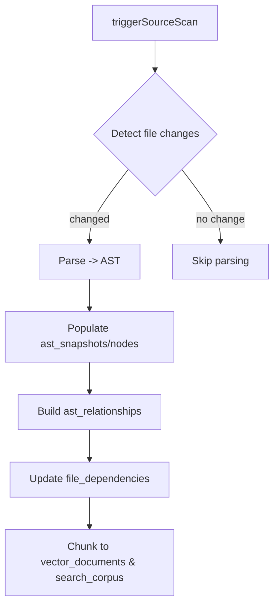

# AST & Source Analysis Technical Guide

This document explains how the PCM Desktop platform parses, stores, and leverages AST (Abstract Syntax Tree) and
source-file metadata to answer user questions, identify impact areas, and guide remediation tasks. It
complements `system-analysis.md`, `rag-strategy.md`, and other RaD artifacts.

---

## 1. Objectives

1. Maintain a precise structural representation of source code (per commit/snapshot).
2. Track relationships between files, symbols, and references to support impact analysis.
3. Surface relevant code sections in response to user queries, integrating with RAG functions.

---

## 2. Data Structures (SQLite)

- **`source_files`**: File-level metadata (`relative_path`, `language`, `checksum`, `last_modified`). Used for change
  detection.
- **`ast_snapshots`**: Captures each parsing run (commit hash, tool version, timestamp) to keep AST tied to a specific
  code state.
- **`ast_nodes`**: One row per AST node with `node_type`, `name`, `fq_name`, `start_line`, `end_line`, `payload` (JSON
  attributes). Foreign keys: `snapshot_id`, `file_id`.
- **`ast_relationships`**: Edges describing parent-child and semantic
  relations (`parent`, `implements`, `calls`, `references`).
- **`file_dependencies`**: File-to-file (imports, includes, call graphs) for coarse impact estimation.
- **`vector_documents` / `search_corpus`**: Derived context for embeddings/FTS, enabling cross-reference between AST
  nodes and textual chunks.

Schema definitions appear in `system-analysis.md` §2.2–2.4.

---

## 3. Processing Pipeline



1. **Source Scan** (`triggerSourceScan` function)
    - Walk project root; update `source_files` with new/changed/deleted files using checksum.
    - Identify parseable files by language; queue for AST parsing.

2. **AST Generation**
    - Per file, run language-specific parser (JavaParser, TypeScript AST, tree-sitter, etc.).
    - Create an `ast_snapshots` entry (per run/commit).
    - For each node: insert into `ast_nodes` with structural metadata; store additional properties in `payload` (e.g.,
      modifiers, parameters).
    - Capture relationships: parent-child (tree) and semantic edges (calls, extends, implements, references)
      in `ast_relationships`.

3. **Dependency Extraction**
    - Analyze imports/calls to populate `file_dependencies` and optional symbol-level links.

4. **Context Generation**
    - Convert relevant nodes/files into textual chunks (with line ranges) stored in `vector_documents`
      and `search_corpus` for retrieval.

5. **Snapshot Management**
    - Each run produces a new snapshot ID; maintain mapping to commit hash for reproducibility.
    - Optional cleanup: prune old snapshots, or keep all for historical diff.

---

## 4. Core Functions & APIs

### `getAstNodeDetail(node_id)`

- Returns node metadata, source snippet, relationships (parents, children, references) and linked files.
- Used by AST Explorer and LLM analysis.

### `findNodesBySymbol(project_id, name, type)`

- Searches `ast_nodes` for matching `name/fq_name/node_type`.
- Supports regex or fuzzy matching.

### `listReferences(node_id)`

- Traverses `ast_relationships` to list inbound/outbound edges (who calls with what type).

### `diffSnapshots(snapshot_a, snapshot_b, path?)`

- Compares AST nodes between two snapshots to highlight changes (new/removed/modified nodes).
- Useful for regression analysis and targeted re-indexing.

### `suggestImpact(request_id)`

- Given a user question (mapped to project/subsystem) and relevant AST nodes (from retrieval), compute impacted
  files/symbols:
    1. Identify nodes referenced in retrieval context (via `vector_documents` metadata linking to `node_id`
       or `file_id`).
    2. Expand through `ast_relationships` (call graph, inheritance) and `file_dependencies`.
    3. Rank candidate nodes/files by proximity/importance.
- Returns structured list for UI/LLM.

### `mapResponseCitations(response_id)`

- Stores mapping from response citations to AST/file references, aiding traceability.

---

## 5. Determining Relevant Code for Answers

When a user asks a question:

1. **Hybrid Retrieval** (`hybridRetrieve`)
    - Query `vector_documents` (embeddings) and `search_index` (FTS) to get candidate chunks referencing file paths and
      line ranges.

2. **Node Mapping**
    - Each chunk stores metadata about `file_id` and optionally `node_id` (when generated from AST). Map chunk → AST
      node using `vector_documents` or `search_corpus` metadata.

3. **Relationship Expansion**
    - For each node hit, fetch `parent` (class/module) and `references` (calls, extends) to understand context.
    - Optionally fetch siblings (other methods in class) to decide if modifications are systemic.

4. **Relevance Scoring**
    - Score nodes based on retrieval relevance + structural importance (e.g., entry points, public API).
    - Combine with heuristics: recent changes, dependency fan-out.

5. **Answer Composition**
    - Provide citations including file path, line range, symbol name.
    - Suggest actionable locations (files/methods) to inspect or modify.

6. **Feedback Loop**
    - If user rates response poorly, flag nodes used, enabling future tuning.

---

## 6. Detecting Required Fixes / Changes

- Use AST diffing to compare current snapshot with baseline; highlight nodes that changed, aiding regression analysis.
- For a reported issue, cross-reference reported symbols with `ast_nodes` to locate code; then use call graph to find
  downstream effects.
- `suggestImpact` function can be extended to include heuristics (complexity, test coverage) to prioritize fixes.
- Combine with search for TODO/FIXME remarks in `search_corpus` to surface known debt.

---

## 7. Integration with LLM/RAG

- Retrieval context includes structural metadata; prompts instruct the LLM to reference AST node names, line numbers,
  and relationships when explaining fixes.
- When LLM suggests code changes, map recommended symbols back to `ast_nodes` to verify existence and highlight file
  sections for the user.
- Functions like `getAstNodeDetail` and `listReferences` can be exposed as function-calling endpoints, enabling the LLM
  to fetch precise code structure on demand.

---

## 8. Sample Code Snippets

### 8.1 Query AST Details (Pseudo Java/Kotlin)

```java
public AstNodeDetail getAstNodeDetail(long nodeId) {
    // Fetch node
    AstNode node = astNodeDao.findById(nodeId);

    // Load source snippet
    SourceFile file = sourceFileDao.findById(node.getFileId());
    String snippet = fileService.readSnippet(file, node.getStartLine(), node.getEndLine());

    // Relationships
    List<AstRelationship> parents = relationshipDao.findByChild(nodeId);
    List<AstRelationship> children = relationshipDao.findByParent(nodeId);

    return new AstNodeDetail(node, snippet, parents, children);
}
```

### 8.2 Chunk Code and Link to AST

```python
import textwrap

def create_code_chunk(file_record, node):
    lines = file_record.read_lines(node.start_line, node.end_line)
    content = "\n".join(lines)
    chunk = {
        "project_id": file_record.project_id,
        "file_id": file_record.file_id,
        "node_id": node.node_id,
        "label": f"{node.fq_name}:{node.start_line}-{node.end_line}",
        "content": content,
        "metadata": {
            "language": file_record.language,
            "snapshot_id": node.snapshot_id
        }
    }
    insert_into_search_corpus(chunk)
    upsert_vector_embedding(chunk)
```

### 8.3 Render Snippet in Chat

```java
public String formatCodeSnippet(SourceFile file, AstNode node) {
    List<String> lines = fileService.readLines(file, node.getStartLine(), node.getEndLine());
    StringBuilder builder = new StringBuilder();
    builder.append("```" + file.getLanguage() + "\n");
    for (int i = 0; i < lines.size(); i++) {
        int lineNumber = node.getStartLine() + i;
        builder.append(String.format("%4d | %s%n", lineNumber, lines.get(i)));
    }
    builder.append("````); // Close code fence
    return builder.toString();
}
```

---

## 9. Displaying Code in Messages

To show a code segment in the chat/AI response exactly as in the source file:

1. **Retrieve Snippet**: Use `fileService.readLines(file, start_line, end_line)` (as in sample above) to capture the
   exact lines.
2. **Format with Markdown**: Wrap in fenced code block (```language) and include optional line numbers for clarity.
3. **Escape Content**: Ensure special characters (`\`, ```, etc.) are escaped to avoid breaking markdown.
4. **Attach Metadata**: Prepend a caption like `src/main/.../Foo.java:42-60` so users know where it comes from.
5. **Citations**: Link back to `vector_documents` or `request_artifacts` entry so the chat history maintains
   traceability.

Example message component:

````
**AuthService.java:55-72**
```java
 55 | public void login(User user) {
 56 |     validate(user);
 ....
 72 | }
```
````

This ensures the snippet renders identically to the file and matches the context used by the retrieval pipeline.

---

## 10. Performance & Maintenance Tips

- Batch insert AST nodes within transactions to minimize SQLite overhead.
- Compress `payload` fields (JSON) if they grow large.
- Maintain indexes on `ast_nodes(node_type, name, snapshot_id)` and `ast_relationships(parent_node_id)` for fast lookup.
- Implement GC/cleanup strategies if snapshots accumulate (e.g., keep last N per project or per release).

---

By following this guide, engineers can implement consistent AST parsing, storage, and query capabilities that power both
manual analysis and automated RAG experiences.
