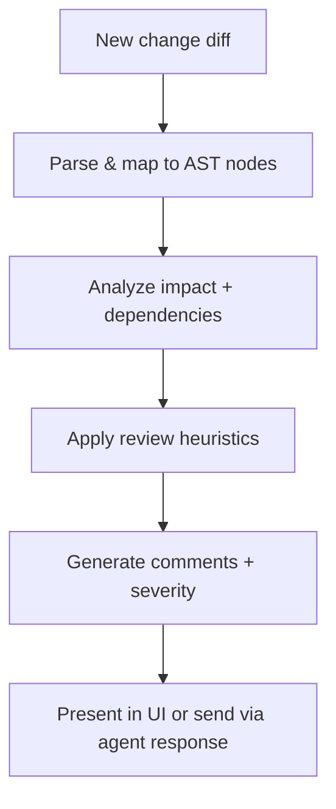

# Source Code Review Strategy

This document outlines how PCM Desktop can support automated and assisted code reviews, leveraging the existing
metadata (AST, semantic search, impact analysis) to highlight risks and ensure consistency.

---

## 1. Review Objectives

1. Identify functional regressions or risky changes across the system hierarchy.
2. Highlight missing tests, documentation, or edge-case handling.
3. Provide structured review comments that link directly to file paths and line numbers.
4. Integrate with existing RAG/LLM pipeline to generate explanations or remediation suggestions.

---

## 2. Inputs

- **Diff information**: either from VCS commit (git diff) or from `ast_snapshot` comparison.
- **ImpactAnalyzer results**: list of affected nodes/files.
- **Test recommendations**: output from `testcase-strategy.md`.
- **Historical review rules**: coding standards, security guidelines.

---

## 3. Processing Steps



### Detailed Flow

1. **Diff Parsing**
    - Map changed lines to `source_files` and `ast_nodes` (use `snapshot_id` comparison).
2. **Context Gathering**
    - Retrieve surrounding code, dependencies, existing comments/TODOs.
    - Run `hybridRetrieve` to fetch documentation or previous discussions relevant to the change.
3. **Heuristic Checks**
    - Coding standards: naming, null checks, error handling.
    - Security: input validation, authentication, injection risks.
    - Internationalization: string literals vs. resource bundles, encoding.
    - Performance: unbounded loops, large allocations.
    - Test impact: verify affected components have corresponding tests or recommendations.
4. **LLM-assisted Review (optional)**
    - Provide diff + context to LLM with instructions to highlight issues, referencing `function-calling-spec.md` for
      any necessary lookups.
5. **Comment Generation**
    - Merge heuristic and LLM findings into structured comments with severity levels (`info`, `warning`, `critical`).
6. **Presentation**
    - Display in UI review panel or embed in agent response with citations (file path, lines, node ID).

---

## 4. Data Structures

```sql
CREATE TABLE review_comments (
  comment_id    INTEGER PRIMARY KEY AUTOINCREMENT,
  request_id    INTEGER REFERENCES user_requests(request_id),
  file_id       INTEGER REFERENCES source_files(file_id),
  start_line    INTEGER,
  end_line      INTEGER,
  severity      TEXT,
  message       TEXT,
  suggestion    TEXT,
  metadata      TEXT,
  created_at    DATETIME DEFAULT CURRENT_TIMESTAMP
);
```

This table allows persistent storage of review feedback tied to requests or commits.

---

## 5. Function Interfaces

- `reviewChange(request_id, diff): List<ReviewComment>`
    - Orchestrates the flow above and stores comments in `review_comments`.
- `listReviewComments(request_id)`
    - Retrieves comments for display/export.
- `applyReviewRule(ruleId, context)`
    - Allows plugging in additional heuristic or ML rules.

---

## 6. Example Review Comment Payload

```json
{
  "file": "src/main/java/com/noteflix/auth/AuthService.java",
  "lines": "42-55",
  "severity": "warning",
  "message": "User input is concatenated into SQL query without parameterization.",
  "suggestion": "Use prepared statements or ORM bindings to avoid SQL injection.",
  "references": ["AST node 12345", "OWASP A1"]
}
```

---

## 7. Integration with UI & Agents

- **UI Review Panel**: Show list of comments, highlight code snippet (reuse `SnippetFormatter`). Allow users to mark
  resolved/unresolved.
- **Agent Responses**: When a user asks for a review, the LLM can cite these comments and propose fixes.
- **Notifications**: Optionally send alerts (email/Slack) when critical issues are detected.

---

## 8. Best Practices

- Keep review rules in version control; allow customization per project/subsystem.
- Correlate review findings with test recommendations to ensure new tests exist where needed.
- Provide quick actions: “generate fix snippet”, “create task”, “open file in IDE”.
- Log all automated review actions for audit and continuous improvement.

This strategy ensures code reviews are consistent, traceable, and integrated with the overall requirement-analysis
workflow.
