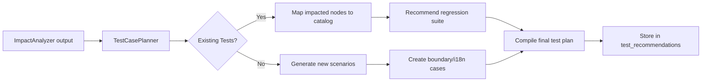

# Test Case Generation & Impact Analysis Guide

This document describes how PCM Desktop can automate and guide test-case creation whenever source code changes are
analyzed. It complements `ast-source-analysis.md`, `request-to-code-flow.md`, and the broader RAG architecture.

---

## 1. Goals

1. Derive relevant test cases based on code segments impacted by a user request or change.
2. Consider system-wide dependencies (call graph, data flow) to ensure coverage beyond the modified file.
3. Enforce edge-case coverage: boundary values, special characters, locale-specific data (Korean, Chinese, etc.).
4. Provide actionable artifacts for QA engineers or automated test generators.

---

## 2. Inputs Required

- **Impact analysis output** (`ImpactAnalyzer` from `request-to-code-flow.md`): list of affected files, methods, and
  dependencies.
- **Existing test metadata**: map test cases → code coverage (if available) or `test_catalog` table (optional future
  feature).
- **Domain rules**: heuristics for input classes, special-character handling, internationalization.
- **Historical defects**: to prioritize critical flows (e.g., past bugs referencing similar modules).

---

## 3. Recommended Data Extensions

```sql
CREATE TABLE IF NOT EXISTS test_catalog (
  test_id       INTEGER PRIMARY KEY AUTOINCREMENT,
  name          TEXT,
  description   TEXT,
  scope         TEXT, -- unit/integration/e2e
  related_nodes TEXT, -- JSON array of ast_node_ids
  tags          TEXT
);

CREATE TABLE IF NOT EXISTS test_recommendations (
  recommendation_id INTEGER PRIMARY KEY AUTOINCREMENT,
  request_id        INTEGER REFERENCES user_requests(request_id) ON DELETE CASCADE,
  test_type         TEXT,
  description       TEXT,
  priority          TEXT,
  metadata          TEXT
);
```

These tables let the system store reusable test cases and recommendations per request.

---

## 4. Workflow



### Steps

1. **Identify impacted nodes/files** (from AST + dependencies).
2. **Cross-reference** `test_catalog` to find tests touching those nodes (if coverage data exists).
3. **Generate additional scenarios**:
    - Input boundary values (min/max, empty, null, large payload).
    - Special characters (Unicode ranges, emojis, SQL injection strings).
    - Locale-specific: Hangul (한국어), Simplified Chinese (中文), Vietnamese accents, RTL languages, etc.
    - Error-path tests (exceptions, timeouts, failure retries).
4. **Assess system impact**: If the changed code is part of shared services, include integration/E2E tests covering
   downstream systems.
5. **Document recommendations** in `test_recommendations`, linking to affected files/symbols.
6. **Present** the test plan in UI/agent response, optionally exporting to test management tools.

---

## 5. Function Interfaces

- `planTests(request_id: Long): List<TestRecommendation>`
    - Gathers impact data, consults `test_catalog`, and produces structured recommendations.
- `registerTestCase(testCase: TestCase)`
    - Allows QA team to expand `test_catalog` with manual/automated tests tied to AST nodes.
- `mapTestToNode(test_id, node_id)`
    - Maintains relationships between tests and code symbols for future impact analysis.

---

## 6. Edge & Locale Coverage Guidelines

1. **Boundary/Range Tests**
    - For numeric inputs: min/max, zero, negative, overflow values.
    - For collections: empty list, single element, max size.
2. **Special Characters**
    - ASCII control characters, quotes, slashes, newline sequences.
    - SQL/HTML injection samples.
3. **Unicode & Locale**
    - Korean Hangul combinations: "안녕하세요", "가나다".
    - Simplified Chinese strings: "测试", "数据".
    - Japanese Kana/Kanji, emojis, right-to-left scripts (Arabic, Hebrew).
    - Mixed-language scenarios (Latin + CJK).
4. **Encoding/Normalization**
    - NFC/NFD normalization forms for accented characters.
    - Byte-order marks (BOM) handling.
5. **Security & Permissions**
    - Invalid tokens, expired sessions, privilege escalation attempts.
6. **Performance & Load**
    - High-volume inputs, concurrent access patterns.

Include these considerations when generating synthetic test cases or advising QA.

---

## 7. Output Format Example

```json
{
  "request_id": 42,
  "tests": [
    {
      "type": "unit",
      "description": "Validate login() rejects empty password",
      "priority": "high",
      "files": ["AuthService.java"],
      "cases": ["password=null", "password=''"],
      "notes": "Boundary condition"
    },
    {
      "type": "i18n",
      "description": "Ensure username accepts Hangul and Chinese characters",
      "priority": "medium",
      "cases": ["username='홍길동'", "username='测试'"],
      "notes": "Special character coverage"
    }
  ]
}
```

---

By following this strategy, the system can respond to code changes with targeted, high-quality test recommendations that
account for both structural impact and edge-case coverage.
