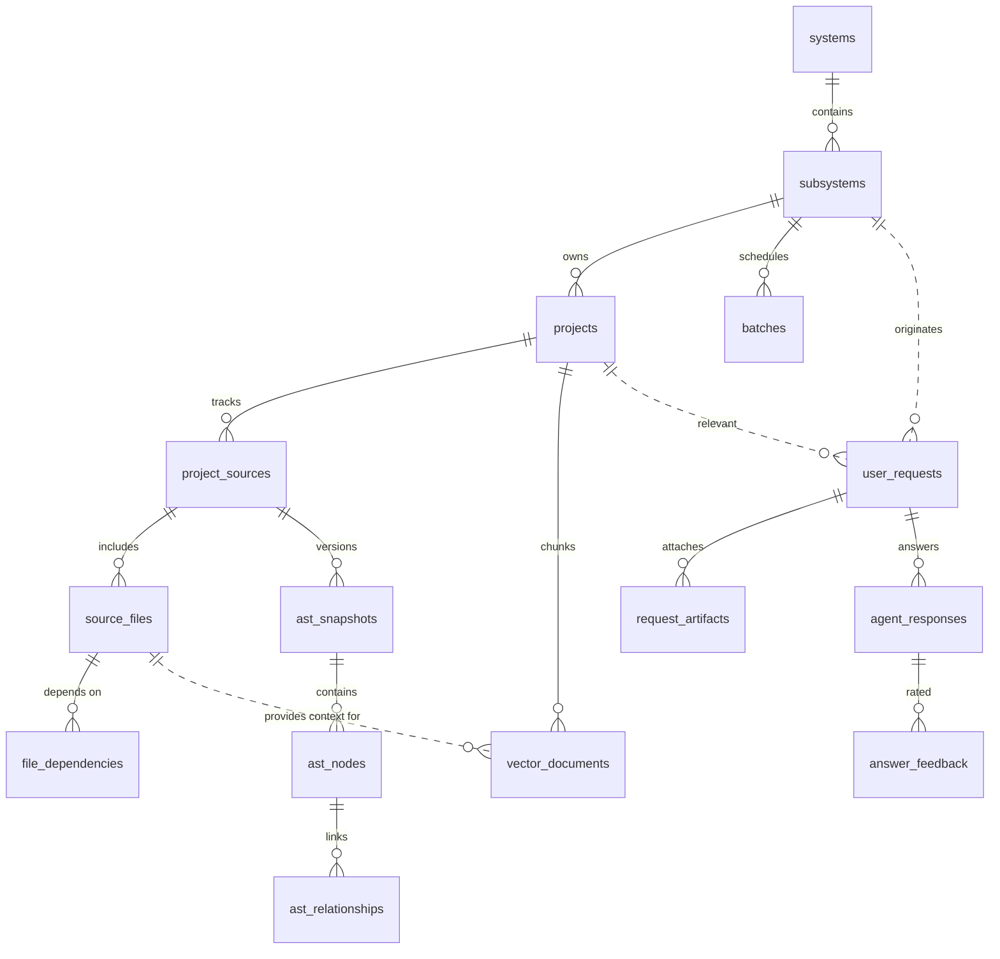

# System Analysis ERD

Below is a Mermaid ER diagram that captures the main entities and relationships introduced in the requirement-analysis design.

## Legend

- `||--o{` indicates one-to-many.
- `||..o{` denotes optional relationships (the foreign key may be null).

This diagram mirrors the schema defined in `system-analysis.md`; update both artifacts together when the data model evolves.
