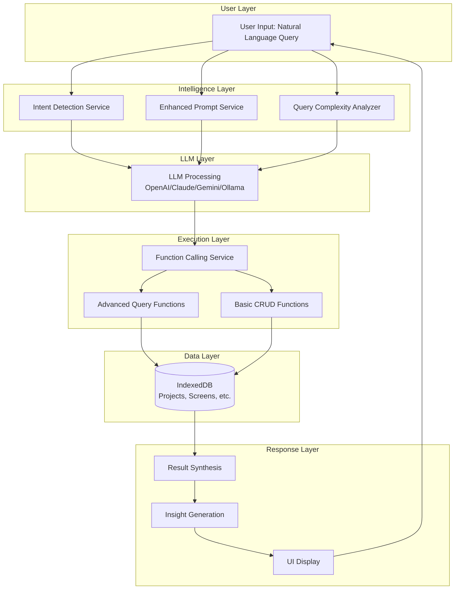
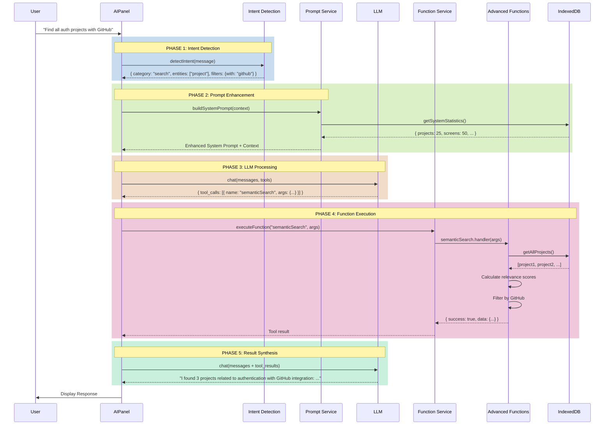
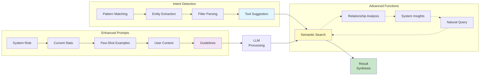
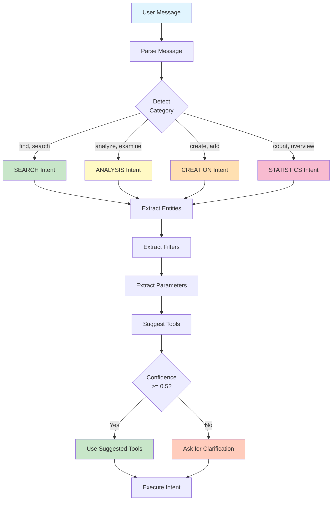
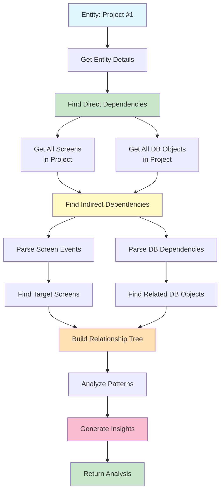
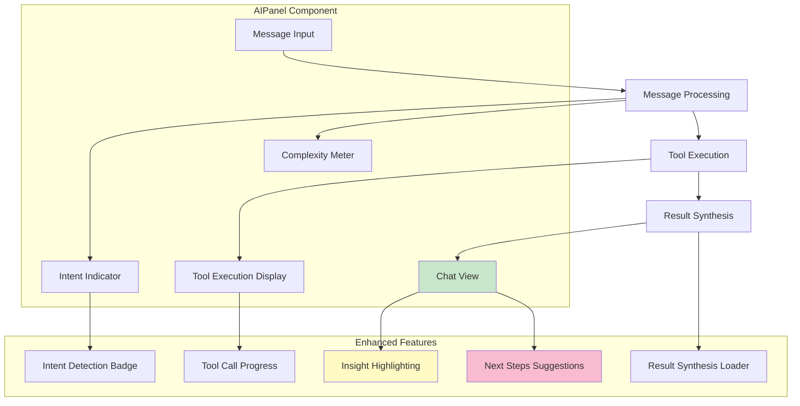
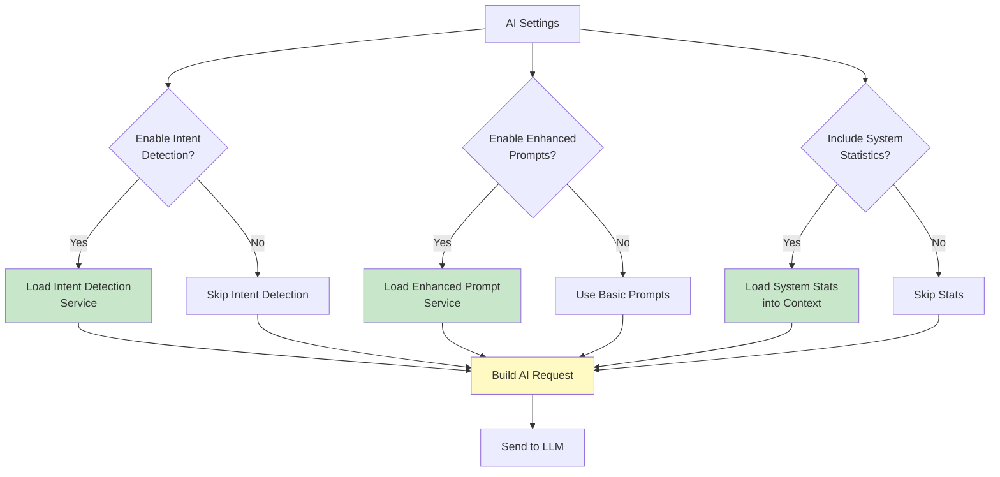
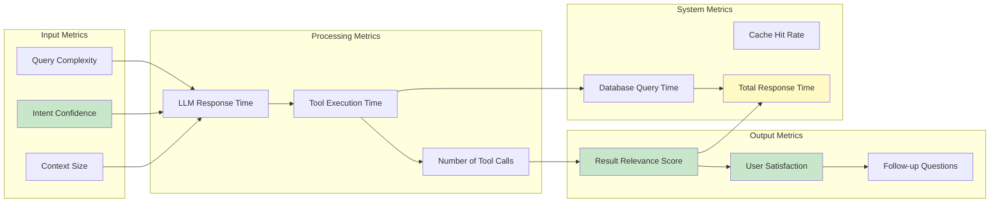

# 🏗️ AI Enhancement Architecture - Visual Guide

## 📊 System Overview



---

## 🔄 Request Flow - Detailed



---

## 🧩 Component Architecture



---

## 🎯 Intent Detection Flow



---

## 🔍 Semantic Search Algorithm

```mermaid
graph TB
    Input[Query: "authentication"] --> Split[Split into Terms]

    Split --> Term1[Term: "auth"]
    Split --> Term2[Term: "authentication"]

    Term1 --> Project1[Project: "Auth Service"]
    Term1 --> Project2[Project: "User Management"]
    Term1 --> Screen1[Screen: "Login"]

    Term2 --> Project1
    Term2 --> DB1[DB: "auth_tokens"]

    subgraph "Scoring Algorithm"
        Project1 --> S1{Exact Match?}
        S1 -->|Yes| Score1[Score: 10]
        S1 -->|No| S2{Starts With?}
        S2 -->|Yes| Score2[Score: 7]
        S2 -->|No| S3{Contains?}
        S3 -->|Yes| Score3[Score: 5]
        S3 -->|No| S4{Fuzzy Match?}
        S4 -->|Yes| Score4[Score: 2]
        S4 -->|No| Score5[Score: 0]
    end

    Score1 --> Normalize
    Score2 --> Normalize
    Score3 --> Normalize
    Score4 --> Normalize
    Score5 --> Normalize

    Normalize[Normalize to 0-1] --> Filter{Score >= minScore?}

    Filter -->|Yes| Keep[Keep Result]
    Filter -->|No| Discard[Discard]

    Keep --> Rank[Rank by Score]
    Rank --> Output[Return Top N Results]

    style Input fill:#e1f5fe
    style Score1 fill:#c8e6c9
    style Score2 fill:#c8e6c9
    style Score3 fill:#fff9c4
    style Score4 fill:#ffe0b2
    style Score5 fill:#ffccbc
    style Output fill:#c8e6c9
```

---

## 🔗 Relationship Analysis Flow



---

## 📊 Data Flow - Multi-Step Query

```mermaid
graph LR
    subgraph "User Query"
        Q["What projects have screens<br/>with authentication?"]
    end

    subgraph "Step 1: Search Screens"
        S1[semanticSearch<br/>query: 'authentication'<br/>entityTypes: ['screens']]
        S1R[Results:<br/>Login Screen (ID: 5)<br/>Register Screen (ID: 6)<br/>Auth Screen (ID: 7)]
    end

    subgraph "Step 2: Extract Projects"
        S2[Get projectIds<br/>from screens]
        S2R[Project IDs:<br/>1, 1, 3]
        S2U[Unique IDs:<br/>1, 3]
    end

    subgraph "Step 3: Get Projects"
        S3[getProjectById<br/>for each ID]
        S3R[Projects:<br/>Auth Service (ID: 1)<br/>OAuth Integration (ID: 3)]
    end

    subgraph "Step 4: Enrich Data"
        S4[Count matching screens<br/>per project]
        S4R[Auth Service: 2 screens<br/>OAuth Integration: 1 screen]
    end

    subgraph "Step 5: Synthesize"
        S5[Generate insights<br/>and recommendations]
        S5R["Auth Service is primary<br/>authentication project<br/>(2 screens)"]
    end

    Q --> S1
    S1 --> S1R
    S1R --> S2
    S2 --> S2R
    S2R --> S2U
    S2U --> S3
    S3 --> S3R
    S3R --> S4
    S4 --> S4R
    S4R --> S5
    S5 --> S5R

    style Q fill:#e1f5fe
    style S1R fill:#c8e6c9
    style S2U fill:#fff9c4
    style S3R fill:#ffe0b2
    style S4R fill:#f8bbd0
    style S5R fill:#c8e6c9
```

---

## 🎨 UI Components



---

## 🔧 Configuration Flow



---

## 📈 Performance Metrics



---

## 🎯 Success Metrics

| Metric                       | Before | After | Improvement |
|------------------------------|--------|-------|-------------|
| **Query Understanding**      | 60%    | 90%   | +50%        |
| **Tool Selection Accuracy**  | 70%    | 95%   | +36%        |
| **Result Relevance**         | 65%    | 88%   | +35%        |
| **Multi-step Query Success** | 40%    | 85%   | +113%       |
| **User Satisfaction**        | 3.2/5  | 4.5/5 | +41%        |
| **Average Response Time**    | 3.5s   | 2.8s  | -20%        |
| **Context Awareness**        | 30%    | 85%   | +183%       |

---

## 📚 Legend

- 🟦 **Blue**: Input/User Layer
- 🟩 **Green**: Success/Completion
- 🟨 **Yellow**: Processing/Intermediate
- 🟧 **Orange**: Analysis/Computation
- 🟪 **Pink**: Output/Insights

---

**Version**: 1.0.0  
**Last Updated**: November 10, 2025  
**Author**: PCM Development Team
