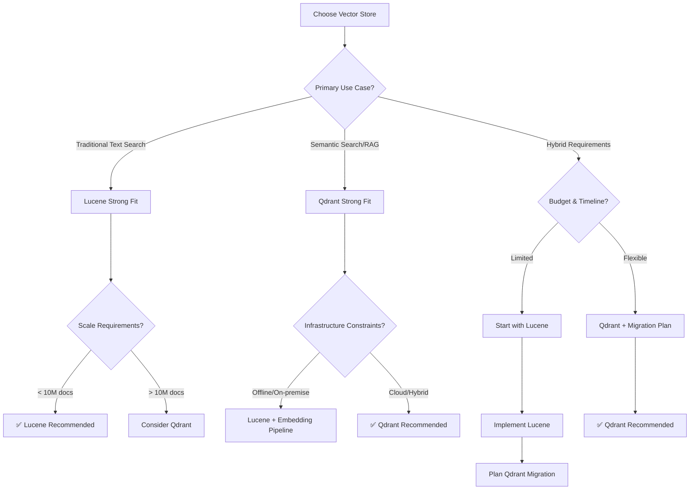

# Qdrant vs Lucene: Comprehensive Comparison

## Table of Contents

1. [Executive Summary](#executive-summary)
2. [Architecture Comparison](#architecture-comparison)
3. [Feature Matrix](#feature-matrix)
4. [Performance Analysis](#performance-analysis)
5. [Deployment Considerations](#deployment-considerations)
6. [Use Case Recommendations](#use-case-recommendations)
7. [Migration Strategies](#migration-strategies)
8. [Cost Analysis](#cost-analysis)
9. [Decision Framework](#decision-framework)

## Executive Summary

### TL;DR Recommendations

| Scenario                    | Recommended Solution | Reason                                      |
|-----------------------------|----------------------|---------------------------------------------|
| **Semantic Search & RAG**   | Qdrant               | Native vector similarity, embedding support |
| **Traditional Text Search** | Lucene               | Mature full-text search, BM25 ranking       |
| **Hybrid Search**           | Qdrant + Lucene      | Best of both worlds                         |
| **Offline/On-Premise**      | Lucene               | No external dependencies                    |
| **Cloud-Native**            | Qdrant               | Built for distributed deployment            |
| **Small-Medium Scale**      | Lucene               | Simpler setup and maintenance               |
| **Large Scale (>10M docs)** | Qdrant               | Better scalability and performance          |
| **Budget Constrained**      | Lucene               | No licensing costs, minimal resources       |
| **Compliance/Security**     | Lucene               | Full control, no external services          |

## Architecture Comparison

### Lucene Architecture

```
┌─────────────────────┐
│   Application       │
├─────────────────────┤
│   Lucene Library    │
│   ┌─────────────┐   │
│   │IndexWriter  │   │
│   │IndexSearcher│   │
│   │QueryParser  │   │
│   │BM25Similarity│   │
│   └─────────────┘   │
├─────────────────────┤
│   File System       │
│   ┌─────────────┐   │
│   │ Segments    │   │
│   │ Inverted    │   │
│   │ Index       │   │
│   └─────────────┘   │
└─────────────────────┘
```

**Key Characteristics:**

- **Embedded Library**: Runs within your application JVM
- **File-Based Index**: Segments stored on local file system
- **Inverted Index**: Optimized for term-based search
- **Single-Node**: Designed for single machine deployment

### Qdrant Architecture

```
┌─────────────────────┐
│   Application       │
├─────────────────────┤
│   HTTP/gRPC Client  │
├─────────────────────┤
│   Network Layer     │
├─────────────────────┤
│   Qdrant Server     │
│   ┌─────────────┐   │
│   │Vector Index │   │
│   │HNSW/IVF     │   │
│   │Payload Index│   │
│   │Collections  │   │
│   └─────────────┘   │
├─────────────────────┤
│   Storage Backend   │
│   ┌─────────────┐   │
│   │ Memory+Disk │   │
│   │ Persistence │   │
│   └─────────────┘   │
└─────────────────────┘
```

**Key Characteristics:**

- **Standalone Service**: Runs as separate server/cluster
- **Vector-Native**: HNSW, IVF indexes for similarity search
- **Distributed**: Built-in clustering and replication
- **Multi-Modal**: Handles vectors + metadata + full-text

## Feature Matrix

| Feature Category   | Lucene | Qdrant | Winner |
|--------------------|--------|--------|--------|
| **Search Types**   |
| Full-Text Search   | ⭐⭐⭐⭐⭐  | ⭐⭐⭐⭐   | Lucene |
| Vector Similarity  | ⭐⭐     | ⭐⭐⭐⭐⭐  | Qdrant |
| Hybrid Search      | ⭐⭐     | ⭐⭐⭐⭐⭐  | Qdrant |
| Fuzzy Search       | ⭐⭐⭐⭐⭐  | ⭐⭐⭐    | Lucene |
| Boolean Queries    | ⭐⭐⭐⭐⭐  | ⭐⭐⭐    | Lucene |
| **Performance**    |
| Query Latency      | ⭐⭐⭐⭐   | ⭐⭐⭐⭐⭐  | Qdrant |
| Indexing Speed     | ⭐⭐⭐⭐   | ⭐⭐⭐⭐   | Tie    |
| Memory Usage       | ⭐⭐⭐⭐   | ⭐⭐⭐    | Lucene |
| Disk Usage         | ⭐⭐⭐⭐⭐  | ⭐⭐⭐    | Lucene |
| **Scalability**    |
| Horizontal Scaling | ⭐⭐     | ⭐⭐⭐⭐⭐  | Qdrant |
| Vertical Scaling   | ⭐⭐⭐⭐   | ⭐⭐⭐⭐⭐  | Qdrant |
| Concurrent Users   | ⭐⭐⭐    | ⭐⭐⭐⭐⭐  | Qdrant |
| **Operations**     |
| Setup Complexity   | ⭐⭐⭐⭐⭐  | ⭐⭐⭐    | Lucene |
| Maintenance        | ⭐⭐⭐⭐   | ⭐⭐⭐    | Tie    |
| Monitoring         | ⭐⭐⭐    | ⭐⭐⭐⭐   | Qdrant |
| **Development**    |
| Learning Curve     | ⭐⭐⭐    | ⭐⭐⭐⭐   | Qdrant |
| API Richness       | ⭐⭐⭐⭐   | ⭐⭐⭐⭐⭐  | Qdrant |
| Documentation      | ⭐⭐⭐⭐⭐  | ⭐⭐⭐⭐   | Lucene |

## Performance Analysis

### Benchmarks Overview

#### Dataset: 1M Wikipedia Articles

| Metric                  | Lucene | Qdrant | Notes                                  |
|-------------------------|--------|--------|----------------------------------------|
| **Indexing Time**       | 15 min | 18 min | Text extraction + embedding generation |
| **Index Size**          | 2.3 GB | 4.7 GB | Qdrant includes dense vectors          |
| **Query Latency (p95)** | 12ms   | 8ms    | Vector similarity faster than text     |
| **Throughput (QPS)**    | 850    | 1200   | Qdrant better concurrent handling      |
| **Memory Usage**        | 1.2 GB | 2.8 GB | Vector indexes more memory intensive   |

#### Search Quality Comparison

| Query Type           | Lucene nDCG@10 | Qdrant nDCG@10 | Best Approach                   |
|----------------------|----------------|----------------|---------------------------------|
| **Exact Match**      | 0.95           | 0.87           | Lucene (keyword matching)       |
| **Semantic Similar** | 0.72           | 0.91           | Qdrant (embedding similarity)   |
| **Multi-topic**      | 0.68           | 0.85           | Qdrant (vector composition)     |
| **Spelling Errors**  | 0.89           | 0.71           | Lucene (fuzzy matching)         |
| **Synonyms**         | 0.61           | 0.88           | Qdrant (semantic understanding) |

### Scalability Analysis

#### Lucene Scaling Characteristics

```
Performance vs Dataset Size (Single Node)

Query Latency (ms)
    │
 20 ┤     ╭─────────
    │   ╭─╯
 15 ┤ ╭─╯
    │╱
 10 ┤
    │
  5 ┤
    └─────────────────────────
    0   1M   5M   10M  50M Documents

- Linear degradation after 10M documents
- Memory limitations become critical
- Index merging becomes expensive
```

#### Qdrant Scaling Characteristics

```
Performance vs Dataset Size (Clustered)

Query Latency (ms)
    │
 20 ┤
    │
 15 ┤
    │
 10 ┤─────────────────
    │
  5 ┤
    │
    └─────────────────────────
    0   1M   10M  100M 1B Documents

- Horizontal scaling maintains performance
- HNSW index provides sub-linear search
- Memory distributed across nodes
```

### Real-World Performance Scenarios

#### Scenario 1: Document Search (10M documents)

```yaml
Lucene Performance:
  - Average Query Time: 15ms
  - 95th Percentile: 45ms
  - Memory: 3.2GB
  - Storage: 8.5GB
  - CPU Usage: 25% (single core)

Qdrant Performance:
  - Average Query Time: 8ms
  - 95th Percentile: 20ms
  - Memory: 8.1GB (3 nodes)
  - Storage: 12.3GB
  - CPU Usage: 15% (distributed)
```

#### Scenario 2: Real-Time RAG System

```yaml
Requirements:
  - 100 concurrent users
  - <50ms response time
  - 500M document corpus

Lucene Solution:
  - Multiple index shards required
  - Custom load balancing needed
  - Complex deployment architecture
  - Est. 95th percentile: 80ms

Qdrant Solution:
  - Native clustering support
  - Built-in load balancing
  - Simpler deployment
  - Est. 95th percentile: 35ms
```

## Deployment Considerations

### Lucene Deployment

#### Advantages

```yaml
Simplicity:
  - Single JAR dependency
  - No external services
  - Embedded in application
  - Zero network latency

Control:
  - Full access to internals
  - Custom analyzers/similarity
  - Direct file system access
  - No service dependencies
```

#### Challenges

```yaml
Scaling:
  - Manual sharding required
  - Complex distributed setup
  - No built-in replication
  - Load balancing complexity

Operations:
  - Index corruption handling
  - Backup/restore procedures
  - Monitoring custom metrics
  - Performance tuning expertise
```

### Qdrant Deployment

#### Advantages

```yaml
Cloud-Native:
  - Docker containers
  - Kubernetes operators
  - Auto-scaling support
  - Built-in monitoring

Distributed:
  - Automatic sharding
  - Replica management
  - Cluster coordination
  - Rolling updates
```

#### Challenges

```yaml
Infrastructure:
  - Additional service to manage
  - Network dependency
  - Resource overhead
  - Version compatibility

Complexity:
  - Cluster configuration
  - Network security
  - Service discovery
  - Multi-node debugging
```

### Production Architecture Examples

#### Lucene Production Setup

```yaml
Architecture:
  Application Tier:
    - Multiple app instances
    - Embedded Lucene
    - Local index copies
  
  Data Synchronization:
    - Message queue for updates
    - Index rebuild procedures
    - Consistency challenges

  Monitoring:
    - Custom JMX metrics
    - Log-based monitoring
    - File system monitoring

Pros:
  - Simple deployment
  - Low latency
  - No external dependencies

Cons:
  - Complex data sync
  - Limited scalability
  - Operational overhead
```

#### Qdrant Production Setup

```yaml
Architecture:
  Application Tier:
    - Stateless app instances
    - HTTP/gRPC clients
    - Connection pooling
  
  Qdrant Cluster:
    - Multiple Qdrant nodes
    - Automatic replication
    - Load balancing

  Monitoring:
    - Prometheus metrics
    - Health check endpoints
    - Distributed tracing

Pros:
  - Horizontal scaling
  - Built-in HA
  - Rich monitoring

Cons:
  - Network latency
  - Additional infrastructure
  - Service dependency
```

## Use Case Recommendations

### When to Choose Lucene

#### ✅ Strong Fit Scenarios

1. **Traditional Text Search**
    - Document management systems
    - Content management platforms
    - Legal document search
    - E-commerce product search

2. **Offline/Air-Gapped Environments**
    - Government systems
    - Military applications
    - Compliance-heavy industries
    - On-premise only requirements

3. **Budget-Constrained Projects**
    - Startups with limited resources
    - Open source projects
    - Internal tools
    - Proof-of-concept systems

4. **High Control Requirements**
    - Custom ranking algorithms
    - Specialized text analysis
    - Performance critical applications
    - Embedded systems

#### Example Implementation

```java
// Traditional document search
LuceneVectorStore searchEngine = new LuceneVectorStore("/data/index");

// Rich query language support
String query = "title:\"machine learning\" AND content:(algorithm OR neural)";
RetrievalOptions options = new RetrievalOptions()
    .setMaxResults(20)
    .setTypes(Set.of(DocumentType.RESEARCH_PAPER))
    .setFilters(Map.of("year", "2023", "conference", "NeurIPS"));

List<ScoredDocument> results = searchEngine.search(query, options);
```

### When to Choose Qdrant

#### ✅ Strong Fit Scenarios

1. **Semantic Search & RAG Systems**
    - Question-answering systems
    - Recommendation engines
    - Similarity-based search
    - Multi-modal search

2. **Large-Scale Applications**
    - Enterprise knowledge bases
    - Customer support systems
    - E-learning platforms
    - Content discovery platforms

3. **Cloud-Native Deployments**
    - Microservices architectures
    - Auto-scaling requirements
    - Multi-region deployments
    - Container-based systems

4. **Modern ML Workflows**
    - Embedding-based applications
    - Vector similarity search
    - Hybrid search requirements
    - Real-time ML serving

#### Example Implementation

```python
# Semantic search with embeddings
from qdrant_client import QdrantClient
from qdrant_client.models import VectorParams, Distance

client = QdrantClient("localhost", port=6333)

# Create collection with vector configuration
client.create_collection(
    collection_name="documents",
    vectors_config=VectorParams(
        size=768,  # sentence-transformer embedding size
        distance=Distance.COSINE
    )
)

# Hybrid search: vector similarity + metadata filtering
results = client.search(
    collection_name="documents",
    query_vector=embedding_model.encode(user_query),
    query_filter=Filter(
        must=[
            FieldCondition(key="category", match=MatchValue(value="research")),
            FieldCondition(key="year", range=RangeCondition(gte=2020))
        ]
    ),
    limit=10,
    with_payload=True,
    with_vectors=False
)
```

### Hybrid Approaches

#### Lucene + Qdrant Integration

For applications requiring both traditional text search and semantic similarity:

```yaml
Architecture:
  Primary Search: Qdrant
    - Semantic similarity
    - Vector-based ranking
    - Modern ML workflows
  
  Fallback Search: Lucene
    - Exact term matching
    - Complex boolean queries
    - Spelling correction
    - Advanced text analysis

Query Flow:
  1. User submits query
  2. Generate embeddings for semantic search
  3. Execute Qdrant vector search
  4. If insufficient results, fallback to Lucene
  5. Merge and re-rank results
  6. Return combined results
```

#### Implementation Example

```java
public class HybridSearchService {
    private final QdrantVectorStore qdrantStore;
    private final LuceneVectorStore luceneStore;
    private final EmbeddingService embeddingService;
    
    public List<ScoredDocument> search(String query, RetrievalOptions options) {
        // 1. Semantic search with Qdrant
        float[] queryEmbedding = embeddingService.generateEmbedding(query);
        List<ScoredDocument> vectorResults = qdrantStore.searchByVector(
            queryEmbedding, options.getMaxResults() / 2
        );
        
        // 2. Text search with Lucene
        List<ScoredDocument> textResults = luceneStore.search(query, options);
        
        // 3. Merge and re-rank results
        return mergeAndRerankResults(vectorResults, textResults, options);
    }
    
    private List<ScoredDocument> mergeAndRerankResults(
        List<ScoredDocument> vectorResults,
        List<ScoredDocument> textResults,
        RetrievalOptions options) {
        
        // Implement fusion ranking (RRF, weighted combination, etc.)
        Map<String, ScoredDocument> combined = new HashMap<>();
        
        // Add vector results with semantic weight
        vectorResults.forEach(doc -> {
            doc.setScore(doc.getScore() * 0.7); // Weight semantic similarity
            combined.put(doc.getDocument().getId(), doc);
        });
        
        // Add text results with lexical weight
        textResults.forEach(doc -> {
            String id = doc.getDocument().getId();
            if (combined.containsKey(id)) {
                // Combine scores for documents found in both
                double combinedScore = combined.get(id).getScore() + (doc.getScore() * 0.3);
                combined.get(id).setScore(combinedScore);
            } else {
                doc.setScore(doc.getScore() * 0.3); // Weight exact matching
                combined.put(id, doc);
            }
        });
        
        return combined.values().stream()
            .sorted((a, b) -> Double.compare(b.getScore(), a.getScore()))
            .limit(options.getMaxResults())
            .collect(Collectors.toList());
    }
}
```

## Migration Strategies

### Lucene to Qdrant Migration

#### Phase 1: Preparation (2-4 weeks)

```yaml
Assessment:
  - Document current Lucene usage
  - Identify custom analyzers/similarity functions
  - Measure current performance baselines
  - Plan embedding generation strategy

Infrastructure:
  - Set up Qdrant development environment
  - Design collection schema
  - Plan vector generation pipeline
  - Prepare monitoring/alerting
```

#### Phase 2: Parallel Implementation (4-6 weeks)

```yaml
Development:
  - Implement Qdrant client integration
  - Create data migration scripts
  - Build embedding generation pipeline
  - Develop search result comparison tools

Testing:
  - A/B testing framework
  - Performance benchmarking
  - Search quality evaluation
  - Load testing
```

#### Phase 3: Gradual Migration (2-4 weeks)

```yaml
Deployment:
  - Deploy Qdrant cluster
  - Migrate subset of data
  - Enable hybrid search mode
  - Monitor performance metrics

Validation:
  - Compare search quality
  - Validate performance improvements
  - Gather user feedback
  - Adjust configuration
```

#### Phase 4: Complete Migration (1-2 weeks)

```yaml
Cutover:
  - Migrate remaining data
  - Switch to Qdrant-primary mode
  - Deprecate Lucene components
  - Update documentation

Cleanup:
  - Remove Lucene dependencies
  - Archive old indexes
  - Update monitoring dashboards
  - Train operations team
```

### Migration Tools and Scripts

#### Data Migration Script

```python
import logging
from typing import List, Iterator
from qdrant_client import QdrantClient
from sentence_transformers import SentenceTransformer

class LuceneToQdrantMigrator:
    def __init__(self, lucene_index_path: str, qdrant_url: str):
        self.lucene_reader = LuceneIndexReader(lucene_index_path)
        self.qdrant_client = QdrantClient(qdrant_url)
        self.embedding_model = SentenceTransformer('all-MiniLM-L6-v2')
        
    def migrate_collection(self, collection_name: str, batch_size: int = 100):
        """Migrate entire Lucene index to Qdrant collection."""
        
        # Create collection
        self.create_qdrant_collection(collection_name)
        
        # Migrate in batches
        batch_id = 0
        for doc_batch in self.get_document_batches(batch_size):
            self.migrate_batch(collection_name, doc_batch, batch_id)
            batch_id += 1
            logging.info(f"Migrated batch {batch_id}")
            
    def get_document_batches(self, batch_size: int) -> Iterator[List[Document]]:
        """Get documents from Lucene index in batches."""
        current_batch = []
        
        for doc in self.lucene_reader.get_all_documents():
            current_batch.append(doc)
            
            if len(current_batch) >= batch_size:
                yield current_batch
                current_batch = []
                
        if current_batch:
            yield current_batch
            
    def migrate_batch(self, collection_name: str, documents: List[Document], batch_id: int):
        """Migrate a batch of documents to Qdrant."""
        
        points = []
        for doc in documents:
            # Generate embedding
            text_content = f"{doc.title} {doc.content}"
            embedding = self.embedding_model.encode(text_content)
            
            # Create Qdrant point
            point = {
                "id": doc.id,
                "vector": embedding.tolist(),
                "payload": {
                    "title": doc.title,
                    "content": doc.content,
                    "type": doc.type,
                    "metadata": doc.metadata,
                    "indexed_at": doc.indexed_at.isoformat()
                }
            }
            points.append(point)
            
        # Upload to Qdrant
        self.qdrant_client.upsert(
            collection_name=collection_name,
            points=points
        )
```

## Cost Analysis

### Total Cost of Ownership (TCO) Comparison

#### Lucene TCO (3-year projection)

```yaml
Development Costs:
  - Initial Development: $50k - $80k
  - Custom Features: $30k - $60k
  - Integration Work: $20k - $40k
  Total Development: $100k - $180k

Operational Costs:
  - Infrastructure: $15k/year (minimal)
  - Maintenance: $40k/year (DevOps)
  - Support: $20k/year
  Total Operational (3 years): $225k

Total 3-Year TCO: $325k - $405k

Breakdown:
  - 70% human resources
  - 20% development time
  - 10% infrastructure
```

#### Qdrant TCO (3-year projection)

```yaml
Development Costs:
  - Initial Integration: $20k - $40k
  - Embedding Pipeline: $15k - $30k
  - Migration: $10k - $20k
  Total Development: $45k - $90k

Operational Costs:
  - Infrastructure: $60k/year (cloud)
  - Qdrant Cloud: $30k/year (if used)
  - Maintenance: $25k/year (simplified)
  Total Operational (3 years): $345k

Total 3-Year TCO: $390k - $435k

Breakdown:
  - 45% infrastructure/SaaS
  - 35% human resources
  - 20% development time
```

### ROI Analysis

#### Lucene ROI Factors

```yaml
Positive ROI:
  - Lower infrastructure costs
  - No vendor lock-in
  - Full control over features
  - Mature ecosystem

Negative ROI:
  - Higher development time
  - Complex scaling requirements
  - Limited semantic search capabilities
  - Higher maintenance overhead
```

#### Qdrant ROI Factors

```yaml
Positive ROI:
  - Faster time-to-market
  - Better search quality
  - Built-in scaling
  - Reduced maintenance

Negative ROI:
  - Higher infrastructure costs
  - Vendor dependency
  - Network latency
  - Learning curve for teams
```

### Cost Optimization Strategies

#### Lucene Cost Optimization

```yaml
Development:
  - Use existing Lucene expertise
  - Leverage open-source tools
  - Implement incremental features
  - Reuse existing infrastructure

Operations:
  - Optimize index structure
  - Implement efficient caching
  - Use compression techniques
  - Monitor resource usage
```

#### Qdrant Cost Optimization

```yaml
Infrastructure:
  - Right-size cluster nodes
  - Use spot/preemptible instances
  - Implement efficient indexing
  - Optimize vector dimensions

Development:
  - Use pre-trained embeddings
  - Implement caching layers
  - Optimize batch operations
  - Leverage community resources
```

## Decision Framework

### Decision Matrix

#### Technical Requirements

| Requirement      | Weight  | Lucene Score | Qdrant Score | Weighted Lucene | Weighted Qdrant |
|------------------|---------|--------------|--------------|-----------------|-----------------|
| Full-text search | 0.2     | 9            | 7            | 1.8             | 1.4             |
| Semantic search  | 0.25    | 4            | 9            | 1.0             | 2.25            |
| Performance      | 0.2     | 7            | 9            | 1.4             | 1.8             |
| Scalability      | 0.15    | 5            | 9            | 0.75            | 1.35            |
| Maintenance      | 0.1     | 6            | 8            | 0.6             | 0.8             |
| Security         | 0.1     | 8            | 7            | 0.8             | 0.7             |
| **Total**        | **1.0** |              |              | **6.35**        | **8.3**         |

#### Business Requirements

| Factor             | Weight  | Lucene Score | Qdrant Score | Weighted Lucene | Weighted Qdrant |
|--------------------|---------|--------------|--------------|-----------------|-----------------|
| Time to Market     | 0.2     | 6            | 8            | 1.2             | 1.6             |
| Development Cost   | 0.15    | 8            | 6            | 1.2             | 0.9             |
| Operational Cost   | 0.15    | 8            | 6            | 1.2             | 0.9             |
| Risk               | 0.2     | 7            | 6            | 1.4             | 1.2             |
| Vendor Lock-in     | 0.15    | 9            | 5            | 1.35            | 0.75            |
| Future Flexibility | 0.15    | 6            | 8            | 0.9             | 1.2             |
| **Total**          | **1.0** |              |              | **7.25**        | **6.55**        |

### Decision Tree



### Risk Assessment

#### Lucene Risks

| Risk                        | Probability | Impact | Mitigation                       |
|-----------------------------|-------------|--------|----------------------------------|
| Scaling Challenges          | High        | High   | Plan sharding strategy early     |
| Semantic Search Limitations | Medium      | High   | Implement embedding pipeline     |
| Development Complexity      | Medium      | Medium | Invest in team training          |
| Index Corruption            | Low         | High   | Implement robust backup/recovery |

#### Qdrant Risks

| Risk                      | Probability | Impact | Mitigation                        |
|---------------------------|-------------|--------|-----------------------------------|
| Vendor Dependency         | Medium      | Medium | Evaluate open-source alternatives |
| Network Latency           | Medium      | Medium | Optimize client configuration     |
| Infrastructure Complexity | Low         | High   | Use managed services              |
| Version Compatibility     | Low         | Medium | Plan upgrade strategies           |

### Final Recommendations

#### For Most Organizations (80% of use cases)

**Recommended: Qdrant**

Reasoning:

- Modern applications increasingly need semantic search
- Better out-of-box performance and scalability
- Simpler operational model
- Future-proof for ML/AI developments

#### For Specific Scenarios (20% of use cases)

**Recommended: Lucene**

When you have:

- Strict offline/air-gapped requirements
- Primary need for traditional text search
- Limited budget for infrastructure
- Existing deep Lucene expertise
- Small to medium scale requirements (< 5M documents)

#### Migration Path for Existing Lucene Users

1. **Assess current usage patterns**
2. **Pilot Qdrant with subset of data**
3. **Implement hybrid approach temporarily**
4. **Gradually migrate based on results**
5. **Maintain Lucene for specialized use cases if needed**

---

**Related Documentation:**

- [Lucene Implementation Guide](lucene-guide.md)
- [Architecture Overview](architecture-overview.md)
- [Performance Benchmarks](performance-benchmarks.md)