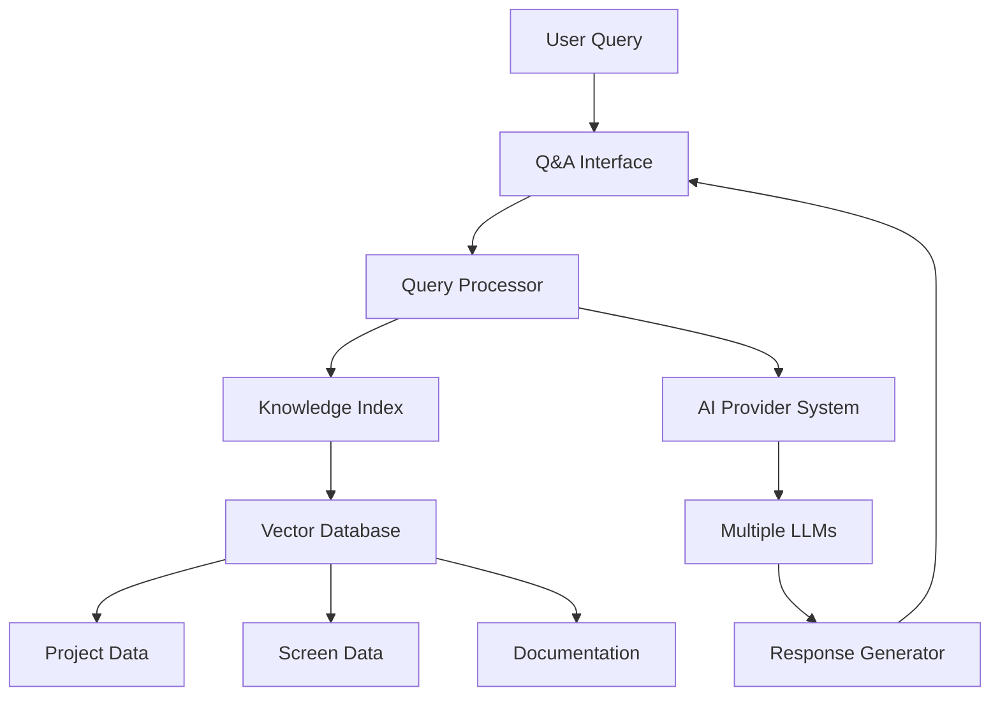

# LLM-Based Q&A Implementation Plan for PCM WebApp

## Executive Summary

This document outlines a comprehensive plan to integrate an LLM-based Question & Answer system into the PCM WebApp. The implementation leverages the existing sophisticated AI provider architecture and rich data sources to create an intelligent knowledge management system.

## 🎯 Project Objectives

### Primary Goals

1. **Intelligent Project Discovery**: Enable natural language queries to find relevant projects and screens
2. **Technical Documentation Assistant**: Provide instant access to architecture knowledge and implementation guidance
3. **Context-Aware Support**: Deliver answers based on current project/screen context
4. **Self-Learning System**: Continuously improve responses based on user interactions

### Success Metrics

- **User Adoption**: >80% of active users try Q&A feature within first month
- **Query Success Rate**: >90% of queries receive relevant, actionable responses
- **Time Savings**: 50% reduction in documentation search time
- **Knowledge Coverage**: 100% of existing documentation indexed and searchable

## 🏗️ System Architecture

### High-Level Architecture



### Component Integration

- **Existing AI Panel**: Extended with Q&A mode toggle
- **Knowledge Indexer**: New service for embedding generation
- **Vector Search**: Enhanced search with semantic capabilities
- **Context Manager**: Maintains conversation and project context

## 📊 Data Sources and Knowledge Base

### Primary Data Sources

#### 1. Project Knowledge

```javascript
// Indexable project content
{
  projectData: {
    name: "User Management Service",
    description: "Core authentication and user management system",
    technologies: ["React", "Node.js", "PostgreSQL"],
    environments: {
      dev: "https://user-dev.company.com",
      qa: "https://user-qa.company.com",
      prod: "https://user.company.com"
    },
    documentation: "Handles user registration, authentication...",
    lastUpdated: "2024-01-15"
  }
}
```

#### 2. Screen Documentation

```javascript
// Screen-level knowledge
{
  screenData: {
    name: "User Profile Page",
    description: "User can view and edit personal information",
    permissions: ["USER_READ", "USER_WRITE"],
    notes: "Requires 2FA for sensitive field updates",
    relatedComponents: ["UserForm", "Avatar", "SecuritySettings"],
    workflows: ["profile-update", "password-change"]
  }
}
```

#### 3. Technical Documentation

```javascript
// Documentation content
{
  documentationData: {
    title: "Adding New AI Provider",
    content: "Step-by-step guide for implementing new AI providers...",
    codeExamples: ["class CustomProvider extends BaseProvider", "..."],
    tags: ["ai", "provider", "integration"],
    lastModified: "2024-01-10"
  }
}
```

#### 4. Conversation History

```javascript
// Previous Q&A interactions
{
  conversationData: {
    query: "How do I deploy to production?",
    response: "To deploy to production, follow these steps...",
    context: { projectId: 123, screenId: 456 },
    helpful: true,
    timestamp: "2024-01-15T10:30:00Z"
  }
}
```

### Knowledge Indexing Strategy

#### Vector Embeddings

```javascript
// Knowledge chunk structure
{
  id: "chunk_123",
  content: "User authentication is handled by the AuthService...",
  metadata: {
    type: "project_documentation",
    projectId: 123,
    section: "authentication",
    tags: ["auth", "security", "user-management"]
  },
  embedding: [0.1, 0.2, -0.3, ...], // Vector representation
  lastUpdated: "2024-01-15T10:30:00Z"
}
```

#### Content Preprocessing

1. **Text Extraction**: Parse markdown, extract code snippets
2. **Chunking**: Split content into 500-token chunks with overlap
3. **Metadata Enhancement**: Add project context, tags, relationships
4. **Embedding Generation**: Create vector representations using AI providers

## 🔧 Technical Implementation

### Phase 1: Foundation (Weeks 1-2)

#### 1.1 Knowledge Indexing Service

```javascript
// File: js/services/KnowledgeIndexer.js
export class KnowledgeIndexer {
  constructor(aiProvider, databaseManager) {
    this.aiProvider = aiProvider;
    this.db = databaseManager;
    this.embeddingCache = new Map();
  }

  async indexProject(project) {
    const chunks = this.createProjectChunks(project);
    const embeddings = await this.generateEmbeddings(chunks);
    await this.storeKnowledgeChunks(chunks, embeddings);
  }

  createProjectChunks(project) {
    return [
      {
        content: `Project: ${project.name}. ${project.description}`,
        metadata: { type: "project_overview", projectId: project.id },
      },
      {
        content: `Technical details: ${project.technologies?.join(", ")}`,
        metadata: { type: "project_tech", projectId: project.id },
      },
      // ... more chunks
    ];
  }

  async generateEmbeddings(chunks) {
    // Use existing AI provider for embedding generation
    const embeddings = [];
    for (const chunk of chunks) {
      const embedding = await this.aiProvider.createEmbedding(chunk.content);
      embeddings.push(embedding);
    }
    return embeddings;
  }
}
```

#### 1.2 Vector Database Extension

```javascript
// File: js/services/VectorDatabaseManager.js
export class VectorDatabaseManager extends DatabaseManager {
  constructor() {
    super();
    this.vectorStore = "KNOWLEDGE_VECTORS";
  }

  async initializeVectorStore() {
    const objectStore = this.db.createObjectStore(this.vectorStore, {
      keyPath: "id",
      autoIncrement: true,
    });

    objectStore.createIndex("type", "metadata.type");
    objectStore.createIndex("projectId", "metadata.projectId");
    objectStore.createIndex("lastUpdated", "lastUpdated");
  }

  async semanticSearch(queryEmbedding, limit = 5) {
    const allVectors = await this.getAll(this.vectorStore);
    const similarities = allVectors.map((vector) => ({
      ...vector,
      similarity: this.cosineSimilarity(queryEmbedding, vector.embedding),
    }));

    return similarities
      .sort((a, b) => b.similarity - a.similarity)
      .slice(0, limit);
  }

  cosineSimilarity(a, b) {
    const dotProduct = a.reduce((sum, val, i) => sum + val * b[i], 0);
    const magnitudeA = Math.sqrt(a.reduce((sum, val) => sum + val * val, 0));
    const magnitudeB = Math.sqrt(b.reduce((sum, val) => sum + val * val, 0));
    return dotProduct / (magnitudeA * magnitudeB);
  }
}
```

#### 1.3 Q&A Service Core

```javascript
// File: js/services/QAService.js
export class QAService {
  constructor(aiProvider, vectorDb) {
    this.aiProvider = aiProvider;
    this.vectorDb = vectorDb;
    this.conversationHistory = [];
  }

  async askQuestion(query, context = {}) {
    // 1. Generate embedding for query
    const queryEmbedding = await this.aiProvider.createEmbedding(query);

    // 2. Find relevant knowledge
    const relevantChunks = await this.vectorDb.semanticSearch(
      queryEmbedding,
      5,
    );

    // 3. Build context for LLM
    const systemContext = this.buildSystemContext(relevantChunks, context);

    // 4. Generate response
    const response = await this.aiProvider.chat([
      { role: "system", content: systemContext },
      { role: "user", content: query },
    ]);

    // 5. Store conversation
    await this.storeConversation(query, response, context);

    return {
      response: response.content,
      sources: relevantChunks,
      confidence: this.calculateConfidence(relevantChunks),
    };
  }

  buildSystemContext(relevantChunks, userContext) {
    const knowledgeContext = relevantChunks
      .map((chunk) => `[${chunk.metadata.type}] ${chunk.content}`)
      .join("\n\n");

    return `You are a knowledgeable assistant for the PCM (Project and Configuration Management) system.

Current Context:
${userContext.projectId ? `Project ID: ${userContext.projectId}` : ""}
${userContext.screenId ? `Screen ID: ${userContext.screenId}` : ""}

Relevant Knowledge:
${knowledgeContext}

Instructions:
- Provide accurate, helpful answers based on the knowledge above
- If you're unsure, say so and suggest where to find more information
- Include specific project names, URLs, or screen references when relevant
- Format code examples clearly
- Be concise but comprehensive`;
  }
}
```

### Phase 2: User Interface (Weeks 3-4)

#### 2.1 Q&A Interface Extension

```javascript
// File: js/components/QAPanel.js
import { BaseComponent } from "./ui/BaseComponent.js";

export class QAPanel extends BaseComponent {
  constructor() {
    super();
    this.qaService = null;
    this.isQAMode = false;
  }

  render() {
    return `
      <div class="qa-panel">
        <div class="qa-header">
          <div class="qa-mode-toggle">
            <button id="chatModeBtn" class="mode-btn active">Chat</button>
            <button id="qaModeBtn" class="mode-btn">Q&A</button>
          </div>
          <div class="qa-context-indicator">
            <span id="contextInfo">General Knowledge</span>
          </div>
        </div>
        
        <div class="qa-content">
          <div id="qaMessages" class="qa-messages"></div>
          <div class="qa-suggestions" id="qaSuggestions">
            <h4>Try asking:</h4>
            <ul>
              <li>"How do I add a new AI provider?"</li>
              <li>"What's the QA URL for user management?"</li>
              <li>"Show me projects using React"</li>
            </ul>
          </div>
        </div>
        
        <div class="qa-input-area">
          <div class="qa-input-wrapper">
            <input type="text" id="qaInput" 
                   placeholder="Ask about projects, screens, or documentation..." />
            <button id="qaSubmitBtn" class="qa-submit-btn">
              <span class="icon">↗</span>
            </button>
          </div>
        </div>
      </div>
    `;
  }

  async handleQuestion(query) {
    const context = this.getCurrentContext();
    this.showThinking();

    try {
      const result = await this.qaService.askQuestion(query, context);
      this.displayAnswer(query, result);
      this.updateSuggestions(result.sources);
    } catch (error) {
      this.displayError("Failed to process question", error);
    } finally {
      this.hideThinking();
    }
  }

  displayAnswer(query, result) {
    const messageElement = this.createMessageElement("user", query);
    const answerElement = this.createMessageElement(
      "assistant",
      result.response,
      {
        sources: result.sources,
        confidence: result.confidence,
      },
    );

    this.messagesContainer.appendChild(messageElement);
    this.messagesContainer.appendChild(answerElement);
    this.scrollToBottom();
  }

  createMessageElement(role, content, metadata = {}) {
    const element = document.createElement("div");
    element.className = `qa-message qa-message--${role}`;

    element.innerHTML = `
      <div class="qa-message-content">
        ${this.formatContent(content)}
        ${metadata.sources ? this.createSourcesFooter(metadata.sources) : ""}
        ${metadata.confidence ? this.createConfidenceIndicator(metadata.confidence) : ""}
      </div>
    `;

    return element;
  }

  createSourcesFooter(sources) {
    if (!sources.length) return "";

    const sourceList = sources
      .map(
        (source) =>
          `<li><span class="source-type">${source.metadata.type}</span> ${source.content.substring(0, 100)}...</li>`,
      )
      .join("");

    return `
      <div class="qa-sources">
        <details>
          <summary>Sources (${sources.length})</summary>
          <ul>${sourceList}</ul>
        </details>
      </div>
    `;
  }
}
```

#### 2.2 Context-Aware Features

```javascript
// File: js/services/ContextManager.js
export class ContextManager {
  constructor() {
    this.currentContext = {
      projectId: null,
      screenId: null,
      page: null,
      searchQuery: null,
    };

    this.eventBus.subscribe("navigation.changed", (data) => {
      this.updateContext(data);
    });
  }

  updateContext(navigationData) {
    this.currentContext = {
      ...this.currentContext,
      projectId: navigationData.projectId,
      screenId: navigationData.screenId,
      page: navigationData.page,
    };

    this.eventBus.emit("context.changed", this.currentContext);
  }

  getContextualSuggestions() {
    const { projectId, screenId, page } = this.currentContext;

    if (projectId && screenId) {
      return [
        "What permissions are needed for this screen?",
        "How do I test this screen functionality?",
        "Show me related screens in this project",
      ];
    } else if (projectId) {
      return [
        "What environments are available for this project?",
        "Who are the team members for this project?",
        "What's the deployment process?",
      ];
    } else {
      return [
        "Show me all React projects",
        "How do I create a new project?",
        "What's the latest documentation update?",
      ];
    }
  }
}
```

### Phase 3: Advanced Features (Weeks 5-6)

#### 3.1 Smart Query Processing

```javascript
// File: js/services/QueryProcessor.js
export class QueryProcessor {
  constructor() {
    this.queryTypes = {
      PROJECT_SEARCH:
        /(?:show|find|list|get).*projects?.*(?:using|with|containing) (.+)/i,
      ENVIRONMENT_INFO:
        /(?:what'?s|show|get).*(?:url|link|environment).*(?:for|of) (.+)/i,
      HOW_TO: /(?:how do i|how to|guide|tutorial) (.+)/i,
      TECHNICAL_INFO: /(?:what|explain|describe) (?:is|are) (.+)/i,
    };
  }

  analyzeQuery(query) {
    for (const [type, pattern] of Object.entries(this.queryTypes)) {
      const match = query.match(pattern);
      if (match) {
        return {
          type,
          intent: type.toLowerCase(),
          entities: this.extractEntities(match[1]),
          confidence: 0.8,
        };
      }
    }

    return {
      type: "GENERAL",
      intent: "general_question",
      entities: [],
      confidence: 0.5,
    };
  }

  extractEntities(text) {
    // Extract technologies, project names, concepts
    const technologies = ["react", "vue", "angular", "node", "python", "java"];
    const found = technologies.filter((tech) =>
      text.toLowerCase().includes(tech),
    );

    return found.map((tech) => ({ type: "technology", value: tech }));
  }
}
```

#### 3.2 Auto-Indexing System

```javascript
// File: js/services/AutoIndexer.js
export class AutoIndexer {
  constructor(knowledgeIndexer, databaseManager) {
    this.indexer = knowledgeIndexer;
    this.db = databaseManager;
    this.indexingQueue = [];
    this.isIndexing = false;
  }

  async initialize() {
    // Set up database change listeners
    this.db.eventBus.subscribe("data.project.created", (project) => {
      this.scheduleIndexing("project", project);
    });

    this.db.eventBus.subscribe("data.project.updated", (project) => {
      this.scheduleIndexing("project", project);
    });

    this.db.eventBus.subscribe("data.screen.created", (screen) => {
      this.scheduleIndexing("screen", screen);
    });

    // Start background indexing
    this.startBackgroundIndexing();
  }

  scheduleIndexing(type, data) {
    this.indexingQueue.push({ type, data, timestamp: Date.now() });
    this.processQueue();
  }

  async processQueue() {
    if (this.isIndexing || this.indexingQueue.length === 0) return;

    this.isIndexing = true;

    try {
      while (this.indexingQueue.length > 0) {
        const item = this.indexingQueue.shift();
        await this.indexItem(item);

        // Add small delay to prevent blocking UI
        await new Promise((resolve) => setTimeout(resolve, 100));
      }
    } finally {
      this.isIndexing = false;
    }
  }

  async indexItem(item) {
    switch (item.type) {
      case "project":
        await this.indexer.indexProject(item.data);
        break;
      case "screen":
        await this.indexer.indexScreen(item.data);
        break;
      case "documentation":
        await this.indexer.indexDocumentation(item.data);
        break;
    }
  }
}
```

### Phase 4: Testing and Optimization (Weeks 7-8)

#### 4.1 Testing Strategy

```javascript
// File: js/tests/QAService.test.js
describe("QA Service", () => {
  let qaService;
  let mockAIProvider;
  let mockVectorDb;

  beforeEach(() => {
    mockAIProvider = new MockAIProvider();
    mockVectorDb = new MockVectorDatabase();
    qaService = new QAService(mockAIProvider, mockVectorDb);
  });

  test("should handle project discovery queries", async () => {
    const query = "Show me React projects";
    const result = await qaService.askQuestion(query);

    expect(result.response).toContain("React");
    expect(result.sources.length).toBeGreaterThan(0);
    expect(result.confidence).toBeGreaterThan(0.7);
  });

  test("should provide contextual answers", async () => {
    const context = { projectId: 123 };
    const query = "What's the QA URL?";
    const result = await qaService.askQuestion(query, context);

    expect(result.response).toContain("qa");
    expect(result.response).toContain("url");
  });

  test("should handle technical documentation queries", async () => {
    const query = "How do I add a new AI provider?";
    const result = await qaService.askQuestion(query);

    expect(result.response).toContain("provider");
    expect(result.response).toContain("extend");
    expect(
      result.sources.some((s) => s.metadata.type === "documentation"),
    ).toBe(true);
  });
});
```

#### 4.2 Performance Optimization

```javascript
// File: js/services/PerformanceOptimizer.js
export class PerformanceOptimizer {
  constructor(qaService) {
    this.qaService = qaService;
    this.responseCache = new Map();
    this.embeddingCache = new Map();
  }

  async optimizedQuery(query, context) {
    // Check cache first
    const cacheKey = this.createCacheKey(query, context);
    if (this.responseCache.has(cacheKey)) {
      return this.responseCache.get(cacheKey);
    }

    // Use cached embeddings if available
    let queryEmbedding = this.embeddingCache.get(query);
    if (!queryEmbedding) {
      queryEmbedding = await this.qaService.aiProvider.createEmbedding(query);
      this.embeddingCache.set(query, queryEmbedding);
    }

    // Process query with optimization
    const result = await this.qaService.askQuestion(query, context);

    // Cache result for future use
    this.responseCache.set(cacheKey, result);

    // Cleanup old cache entries
    this.cleanupCache();

    return result;
  }

  createCacheKey(query, context) {
    return `${query.toLowerCase()}_${JSON.stringify(context)}`;
  }

  cleanupCache() {
    if (this.responseCache.size > 100) {
      const oldestKeys = Array.from(this.responseCache.keys()).slice(0, 20);
      oldestKeys.forEach((key) => this.responseCache.delete(key));
    }
  }
}
```

## 📈 Implementation Timeline

### Week 1-2: Foundation Development

- [ ] Implement KnowledgeIndexer service
- [ ] Extend DatabaseManager with vector capabilities
- [ ] Create QAService core functionality
- [ ] Set up embedding generation pipeline

### Week 3-4: User Interface Development

- [ ] Extend AIPanel with Q&A mode
- [ ] Implement context-aware interface
- [ ] Create query suggestion system
- [ ] Add response formatting with sources

### Week 5-6: Advanced Features

- [ ] Implement smart query processing
- [ ] Add auto-indexing system
- [ ] Create performance optimizations
- [ ] Implement conversation memory

### Week 7-8: Testing and Polish

- [ ] Comprehensive testing suite
- [ ] Performance optimization
- [ ] User acceptance testing
- [ ] Documentation updates

## 🔧 Configuration and Setup

### Environment Variables

```env
# AI Provider Configuration
PCM_AI_PROVIDER=openai
PCM_OPENAI_API_KEY=sk-...
PCM_EMBEDDING_MODEL=text-embedding-ada-002

# Q&A System Configuration
PCM_QA_ENABLED=true
PCM_QA_INDEX_ON_STARTUP=true
PCM_QA_MAX_CONTEXT_LENGTH=4000
PCM_QA_SIMILARITY_THRESHOLD=0.7

# Performance Settings
PCM_QA_CACHE_SIZE=100
PCM_QA_BATCH_SIZE=10
PCM_QA_INDEX_INTERVAL=300000  # 5 minutes
```

### Database Migration

```javascript
// Database version upgrade for Q&A features
const migrations = {
  version: 6,
  upgrade: async (db) => {
    // Create knowledge vectors store
    const vectorStore = db.createObjectStore("KNOWLEDGE_VECTORS", {
      keyPath: "id",
      autoIncrement: true,
    });

    vectorStore.createIndex("type", "metadata.type");
    vectorStore.createIndex("projectId", "metadata.projectId");
    vectorStore.createIndex("similarity", "similarity");

    // Create Q&A conversations store
    const qaStore = db.createObjectStore("QA_CONVERSATIONS", {
      keyPath: "id",
      autoIncrement: true,
    });

    qaStore.createIndex("timestamp", "timestamp");
    qaStore.createIndex("projectId", "context.projectId");
    qaStore.createIndex("helpful", "helpful");
  },
};
```

## 🚀 Deployment Strategy

### Phase 1: Internal Testing (Week 9)

- Deploy to development environment
- Internal team testing and feedback
- Performance monitoring setup
- Bug fixes and optimizations

### Phase 2: Beta Release (Week 10)

- Feature flag for select users
- User feedback collection
- A/B testing for UI variations
- Knowledge base improvements

### Phase 3: General Availability (Week 11)

- Full feature rollout
- Documentation updates
- Training materials
- Success metrics monitoring

## 📊 Success Metrics and KPIs

### User Adoption Metrics

- **Q&A Feature Usage**: % of sessions using Q&A
- **Query Volume**: Daily/weekly question count
- **User Retention**: % users returning to Q&A feature
- **Session Duration**: Time spent in Q&A interactions

### Quality Metrics

- **Response Relevance**: User rating of answer quality
- **Query Success Rate**: % queries receiving helpful answers
- **Source Accuracy**: % responses with relevant citations
- **False Positive Rate**: % irrelevant responses

### Performance Metrics

- **Response Time**: Average time to generate answers
- **Index Size**: Total knowledge base size and growth
- **Cache Hit Rate**: % queries served from cache
- **Error Rate**: % failed queries or system errors

### Business Impact

- **Documentation Access**: Reduction in manual documentation searches
- **Support Ticket Volume**: Decrease in repetitive questions
- **Developer Productivity**: Time saved on information lookup
- **Knowledge Discovery**: New insights revealed through Q&A patterns

## 🔒 Security and Privacy Considerations

### Data Protection

```javascript
// Sensitive data filtering
class SecurityFilter {
  static filterSensitiveData(content) {
    // Remove API keys, passwords, tokens
    const patterns = [
      /sk-[a-zA-Z0-9]{32,}/g, // API keys
      /password[:\s=]+[^\s]+/gi, // Passwords
      /token[:\s=]+[^\s]+/gi, // Tokens
      /secret[:\s=]+[^\s]+/gi, // Secrets
    ];

    let filtered = content;
    patterns.forEach((pattern) => {
      filtered = filtered.replace(pattern, "[REDACTED]");
    });

    return filtered;
  }
}
```

### Access Control

- **User Authentication**: Leverage existing user system
- **Project Permissions**: Respect existing project access controls
- **Data Isolation**: Ensure users only query accessible projects
- **Audit Logging**: Track Q&A usage for compliance

## 🔄 Maintenance and Updates

### Knowledge Base Maintenance

- **Automated Indexing**: Real-time updates for new/modified data
- **Quality Monitoring**: Regular assessment of response accuracy
- **Content Curation**: Manual review and improvement of key knowledge areas
- **Version Control**: Track changes to indexed content

### System Monitoring

```javascript
// Monitoring service for Q&A system
class QAMonitor {
  constructor() {
    this.metrics = {
      totalQueries: 0,
      averageResponseTime: 0,
      errorRate: 0,
      cacheHitRate: 0,
    };
  }

  logQuery(query, responseTime, success) {
    this.metrics.totalQueries++;
    this.updateAverageResponseTime(responseTime);
    if (!success) this.metrics.errorRate++;

    // Alert on high error rate
    if (this.metrics.errorRate / this.metrics.totalQueries > 0.1) {
      this.sendAlert("High Q&A error rate detected");
    }
  }

  generateReport() {
    return {
      period: "last_24h",
      totalQueries: this.metrics.totalQueries,
      avgResponseTime: this.metrics.averageResponseTime,
      errorRate: (
        (this.metrics.errorRate / this.metrics.totalQueries) *
        100
      ).toFixed(2),
      topQueries: this.getTopQueries(),
      failedQueries: this.getFailedQueries(),
    };
  }
}
```

## 🎯 Future Enhancements

### Advanced AI Features

- **Multi-modal Support**: Image and diagram understanding
- **Code Generation**: Auto-generate code snippets based on documentation
- **Workflow Assistance**: Step-by-step guided procedures
- **Predictive Questions**: Suggest relevant questions based on context

### Integration Expansions

- **External APIs**: Connect to external documentation sources
- **Version Control**: Integration with Git repositories for code context
- **Real-time Collaboration**: Shared Q&A sessions for team problem-solving
- **Mobile App**: Native mobile interface for on-the-go access

### Analytics and Intelligence

- **Knowledge Gaps**: Identify areas needing better documentation
- **Usage Patterns**: Understand common user information needs
- **Automated Documentation**: AI-generated documentation from code analysis
- **Smart Notifications**: Proactive information sharing based on user context

## 📚 Technical Documentation

### API Reference

```javascript
// Q&A Service API
class QAServiceAPI {
  /**
   * Ask a question with optional context
   * @param {string} query - The question to ask
   * @param {Object} context - Optional context (projectId, screenId, etc.)
   * @returns {Promise<QAResponse>} The response with sources and metadata
   */
  async askQuestion(query, context = {}) {}

  /**
   * Get suggested questions based on current context
   * @param {Object} context - Current application context
   * @returns {Promise<string[]>} Array of suggested questions
   */
  async getSuggestions(context = {}) {}

  /**
   * Rate the helpfulness of a response
   * @param {string} conversationId - ID of the conversation
   * @param {number} rating - Rating from 1-5
   * @param {string} feedback - Optional feedback text
   */
  async rateResponse(conversationId, rating, feedback = "") {}

  /**
   * Search conversation history
   * @param {string} query - Search terms
   * @param {Object} filters - Optional filters (date range, project, etc.)
   * @returns {Promise<Conversation[]>} Matching conversations
   */
  async searchHistory(query, filters = {}) {}
}
```

### Error Handling

```javascript
// Error types and handling
export class QAError extends Error {
  constructor(message, type, details = {}) {
    super(message);
    this.type = type;
    this.details = details;
    this.timestamp = new Date().toISOString();
  }
}

export const QA_ERROR_TYPES = {
  EMBEDDING_FAILED: "embedding_failed",
  AI_PROVIDER_ERROR: "ai_provider_error",
  INSUFFICIENT_CONTEXT: "insufficient_context",
  RATE_LIMIT_EXCEEDED: "rate_limit_exceeded",
  INVALID_QUERY: "invalid_query",
};

// Error handling middleware
export class QAErrorHandler {
  static handle(error) {
    switch (error.type) {
      case QA_ERROR_TYPES.AI_PROVIDER_ERROR:
        return {
          response:
            "I'm having trouble connecting to the AI service. Please try again.",
          fallback: true,
        };
      case QA_ERROR_TYPES.INSUFFICIENT_CONTEXT:
        return {
          response:
            "I don't have enough information to answer that. Could you provide more context?",
          suggestions: [
            "Try being more specific",
            "Mention the project or screen name",
          ],
        };
      default:
        return {
          response:
            "I encountered an error processing your question. Please try again.",
          error: true,
        };
    }
  }
}
```

## 📋 Checklist for Implementation

### Pre-Implementation

- [ ] Review existing AI provider system
- [ ] Analyze current data structure and relationships
- [ ] Set up development environment with AI provider access
- [ ] Create test datasets for validation

### Development Phase

- [ ] Implement knowledge indexing service
- [ ] Create vector database extension
- [ ] Build Q&A service core
- [ ] Develop user interface components
- [ ] Add context awareness features
- [ ] Implement caching and performance optimizations

### Testing Phase

- [ ] Unit tests for all new services
- [ ] Integration tests for Q&A workflows
- [ ] Performance testing with large datasets
- [ ] User experience testing
- [ ] Security and privacy validation

### Deployment Phase

- [ ] Database migration scripts
- [ ] Feature flags for gradual rollout
- [ ] Monitoring and alerting setup
- [ ] Documentation updates
- [ ] User training materials

### Post-Launch

- [ ] Monitor usage metrics and performance
- [ ] Collect user feedback and iterate
- [ ] Analyze knowledge gaps and improve indexing
- [ ] Plan next phase enhancements

## Conclusion

This comprehensive implementation plan leverages PCM WebApp's existing sophisticated architecture to deliver a powerful LLM-based Q&A system. The modular approach ensures minimal disruption to existing functionality while providing significant value through intelligent knowledge access.

The plan prioritizes user experience, system performance, and maintainability while building upon the strong foundation already present in the application. With proper execution, this implementation will transform how users interact with project knowledge and documentation, significantly improving productivity and user satisfaction.

Success will be measured through adoption metrics, user satisfaction, and tangible improvements in information discovery and problem-solving efficiency. The extensible architecture ensures the system can evolve with future AI advancements and user needs.
