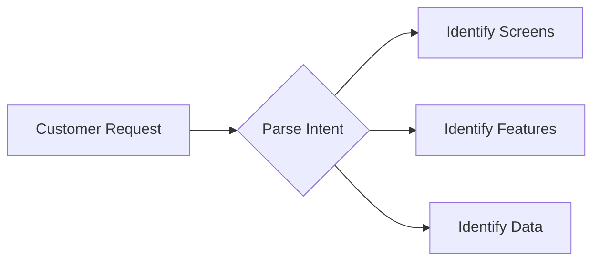
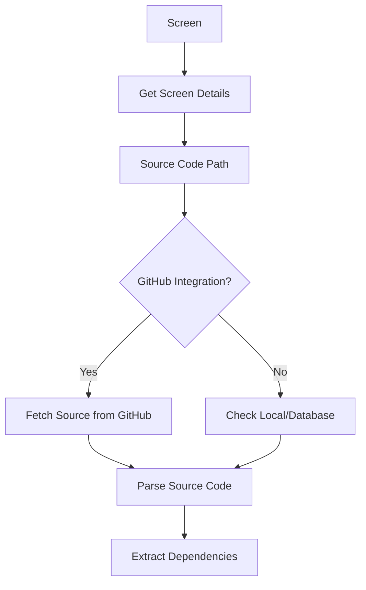
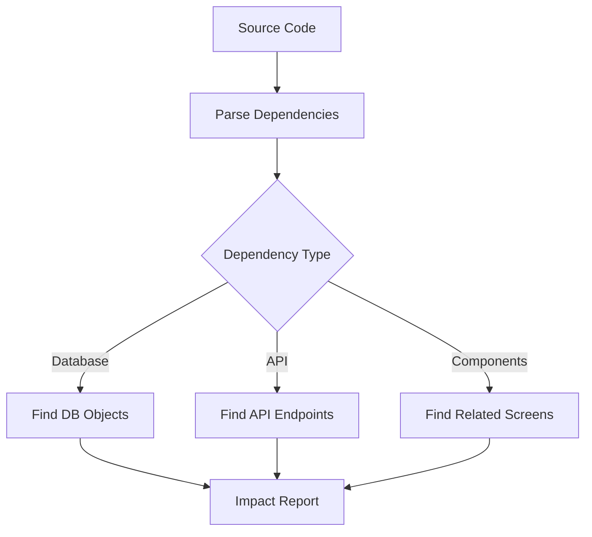
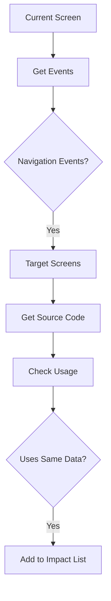
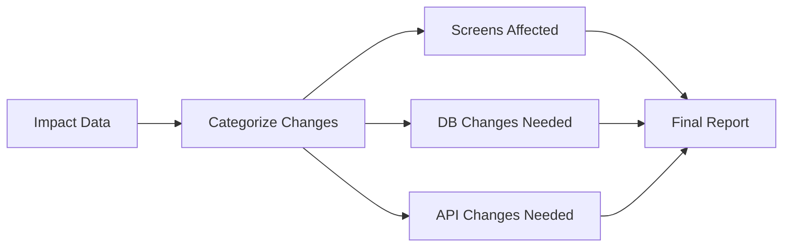

# 🔍 Impact Analysis & Traceability Guide

**Hướng dẫn LLM thực hiện phân tích tác động và truy vết từ yêu cầu đến source code**

**Version**: 1.0.0  
**Last Updated**: November 10, 2025

---

## 📋 Mục Lục

1. [Tổng Quan](#tổng-quan)
2. [Flow Phân Tích](#flow-phân-tích)
3. [Functions Hỗ Trợ](#functions-hỗ-trợ)
4. [Use Cases](#use-cases)
5. [Prompt Engineering](#prompt-engineering)
6. [Best Practices](#best-practices)

---

## 🎯 Tổng Quan

### Mục Đích

Cho phép LLM thực hiện **phân tích tác động** (Impact Analysis) và **truy vết** (Traceability) trong hệ thống:

```
Yêu cầu từ Khách Hàng
    ↓
[LLM lên kế hoạch]
    ↓
Xác định Màn hình liên quan
    ↓
Tìm Source Code của màn hình
    ↓
Phân tích Dependencies & Impact
    ↓
Trace ra màn hình khác bị ảnh hưởng
    ↓
Trace ngược về các màn hình gốc
    ↓
Báo cáo Impact Analysis
```

### Kịch Bản Thực Tế

**Ví dụ**: Khách hàng yêu cầu "Thêm field số điện thoại vào form đăng ký"

**LLM sẽ**:

1. ✅ Xác định màn hình: "Register Screen"
2. ✅ Tìm source code: `RegisterForm.jsx`
3. ✅ Phân tích impact:
   - Database: `users` table cần thêm column `phone`
   - API: `/api/register` cần update
   - Validation: Thêm phone validation
4. ✅ Trace màn hình khác:
   - "Profile Screen" (hiển thị phone)
   - "Admin User List" (show phone)
5. ✅ Báo cáo: "3 màn hình, 1 table, 2 APIs cần update"

---

## 🔄 Flow Phân Tích

### Phase 1: Hiểu Yêu Cầu



**LLM Tasks**:

- Parse yêu cầu khách hàng
- Xác định screens liên quan
- Xác định features cần thêm/sửa
- Xác định data changes

**Functions**:

- `semanticSearch` - Tìm screens liên quan
- `analyzeRelationships` - Phân tích mối quan hệ

---

### Phase 2: Trace Source Code



**LLM Tasks**:

- Get screen details từ database
- Xác định source code path
- Fetch source từ GitHub (nếu có)
- Parse dependencies

**Functions**:

- `getScreenById` - Lấy screen details
- `getGitHubFileContent` - Fetch source code
- `getDBObjectsByProject` - Lấy DB objects liên quan

---

### Phase 3: Impact Analysis



**LLM Tasks**:

- Parse imports và dependencies
- Identify database tables/columns used
- Identify API endpoints called
- Find related components/screens

**Functions**:

- `analyzeDBObjectDependencies` - Phân tích DB dependencies
- `analyzeRelationships` - Phân tích screen relationships
- `searchScreens` - Tìm screens liên quan

---

### Phase 4: Trace Related Screens



**LLM Tasks**:

- Get navigation events từ screen
- Identify target screens
- Check if target screens use same data
- Build impact list

**Functions**:

- `getScreenDetails` - Lấy events
- `analyzeRelationships` - Trace relationships
- Pattern matching trong source code

---

### Phase 5: Generate Report



**LLM Tasks**:

- Categorize tất cả changes
- Estimate effort cho từng change
- Generate action plan
- Provide recommendations

**Functions**:

- Custom formatting
- Generate markdown report

---

## 🛠️ Functions Hỗ Trợ

### 1. Screen Analysis Functions

```javascript
// Get screen with full details
const screen = await getScreenById(screenId);
// Returns: { id, name, projectId, events, notes, regions }

// Get screen source code path
const project = await getProjectById(screen.projectId);
// Returns: { id, name, repositoryUrl, sourceCodePath }

// Search screens by feature
const screens = await semanticSearch({
  query: "user registration",
  entityTypes: ["screens"],
});
```

### 2. Source Code Tracing Functions

```javascript
// Get source code from GitHub
const sourceCode = await getFileContent({
  owner: "org",
  repo: "project",
  path: "src/screens/RegisterScreen.jsx",
  branch: "main",
});

// Get all files in directory
const files = await getRepositoryFiles({
  owner: "org",
  repo: "project",
  path: "src/screens",
});
```

### 3. Dependency Analysis Functions

```javascript
// Get database objects used by project
const dbObjects = await getDBObjectsByProject(projectId);
// Returns: [{ id, name, type, dependencies }]

// Analyze DB object dependencies
const analysis = await analyzeDBObjectDependencies({
  objectId: tableId,
});
// Returns: { dependencies, dependents, impact }

// Analyze screen relationships
const relationships = await analyzeRelationships({
  entityType: "screen",
  entityId: screenId,
  depth: 2,
});
```

### 4. Impact Tracing Functions

```javascript
// Find screens that navigate to target
const incomingScreens = await findScreensNavigatingTo(targetScreenId);

// Find screens that use same data
const relatedScreens = await findScreensUsingData({
  tableName: "users",
  columns: ["phone"],
});

// Get full impact tree
const impactTree = await getFullImpactTree({
  startScreen: screenId,
  changes: ["add phone field"],
});
```

---

## 💡 Use Cases

### Use Case 1: Thêm Field Mới

**Request**: "Thêm số điện thoại vào màn hình đăng ký"

**LLM Flow**:

```javascript
// Step 1: Find Register Screen
const screens = await semanticSearch({
  query: "register registration sign up",
  entityTypes: ["screens"],
  limit: 5,
});
const registerScreen = screens.data.screens[0];

// Step 2: Get Source Code
const project = await getProjectById(registerScreen.projectId);
const sourceCode = await getFileContent({
  owner: parseRepoUrl(project.repositoryUrl).owner,
  repo: parseRepoUrl(project.repositoryUrl).repo,
  path: registerScreen.sourceCodePath,
});

// Step 3: Analyze Database
const dbObjects = await getDBObjectsByProject(project.id);
const usersTable = dbObjects.find((obj) => obj.name === "users");

// Step 4: Find Related Screens
const relationships = await analyzeRelationships({
  entityType: "screen",
  entityId: registerScreen.id,
  depth: 2,
});

// Step 5: Check which screens use users table
const impactedScreens = [];
for (const screen of relationships.relatedEntities) {
  const screenProject = await getProjectById(screen.projectId);
  const screenDbObjects = await getDBObjectsByProject(screenProject.id);
  if (screenDbObjects.find((obj) => obj.name === "users")) {
    impactedScreens.push(screen);
  }
}

// Step 6: Generate Report
const report = {
  request: "Thêm số điện thoại vào màn hình đăng ký",
  mainScreen: registerScreen.name,
  changes: {
    database: [
      {
        table: "users",
        action: "ADD COLUMN phone VARCHAR(20)",
      },
    ],
    screens: [
      {
        name: registerScreen.name,
        changes: ["Add phone input field", "Add phone validation"],
      },
      ...impactedScreens.map((s) => ({
        name: s.name,
        changes: ["Update to display/edit phone"],
      })),
    ],
    apis: [
      { endpoint: "/api/register", action: "Accept phone parameter" },
      { endpoint: "/api/users/:id", action: "Return phone in response" },
    ],
  },
  estimatedEffort: "3-5 days",
  recommendations: [
    "Add phone validation (format check)",
    "Make phone optional or required?",
    "Add phone to Profile screen",
    "Add phone to Admin User List screen",
  ],
};
```

**LLM Response**:

```
📋 IMPACT ANALYSIS: Thêm Số Điện Thoại

🎯 MÀNG HÌNH CHÍNH
• Register Screen (ID: 5)

📊 TÁC ĐỘNG

1. DATABASE CHANGES (1)
   ✓ Table: users
     Action: ADD COLUMN phone VARCHAR(20)

2. SCREENS CẦN UPDATE (3)
   ✓ Register Screen
     - Add phone input field
     - Add phone validation

   ✓ Profile Screen
     - Display phone field
     - Allow edit phone

   ✓ Admin User List Screen
     - Show phone column

3. API CHANGES (2)
   ✓ POST /api/register
     - Accept phone parameter
     - Validate phone format

   ✓ GET /api/users/:id
     - Include phone in response

⏱️ ESTIMATED EFFORT: 3-5 days

💡 RECOMMENDATIONS
• Quyết định: phone là required hay optional?
• Thêm validation: phone format (VN: 10 digits starting with 0)
• Cân nhắc: SMS verification?
• Test: Registration flow với phone
• Update: API documentation
```

---

### Use Case 2: Sửa Business Logic

**Request**: "Thay đổi logic tính discount từ 10% thành 15% cho member VIP"

**LLM Flow**:

```javascript
// Step 1: Find screens with discount logic
const screens = await semanticSearch({
  query: "discount calculation VIP member",
  entityTypes: ["screens", "dbObjects"],
});

// Step 2: Find related database functions/procedures
const dbObjects = screens.data.dbObjects.filter(
  (obj) => obj.type === "FUNCTION" && obj.name.includes("discount"),
);

// Step 3: Analyze impact
const impactedScreens = [];
for (const dbObj of dbObjects) {
  const analysis = await analyzeDBObjectDependencies({
    objectId: dbObj.id,
  });

  // Find screens using this function
  for (const dependent of analysis.dependents) {
    const relatedScreens = await getScreensByProject(dependent.projectId);
    impactedScreens.push(...relatedScreens);
  }
}

// Step 4: Generate report
```

**LLM Response**:

```
📋 IMPACT ANALYSIS: Thay Đổi Discount Logic

🎯 BUSINESS RULE
• Current: 10% discount for VIP
• New: 15% discount for VIP

📊 TÁC ĐỘNG

1. DATABASE CHANGES (2)
   ✓ Function: calculate_discount()
     Line 45: RETURN price * 0.10
     Change to: RETURN price * 0.15

   ✓ Table: discount_rules (optional)
     - Update VIP discount rate from 10 to 15

2. SCREENS AFFECTED (4)
   ✓ Checkout Screen
     - Shows calculated discount
     - No code change (uses DB function)

   ✓ Cart Screen
     - Preview discount
     - No code change

   ✓ VIP Benefits Screen
     - Displays "10% discount"
     - Change text to "15% discount"

   ✓ Admin Discount Settings
     - Config screen
     - Update default value

3. TEST CASES NEEDED
   ✓ Checkout with VIP member
   ✓ Cart preview calculations
   ✓ Historical orders (not affected)
   ✓ Reports (may need adjustment)

⏱️ ESTIMATED EFFORT: 1-2 days

⚠️ CONSIDERATIONS
• Historical orders: Keep old 10% or retroactive?
• Marketing: Notify VIP members?
• Reports: Update discount calculations?
• A/B Testing: Gradual rollout?
```

---

### Use Case 3: Refactor Component

**Request**: "Tách Login form thành component riêng để reuse"

**LLM Flow**:

```javascript
// Step 1: Find Login Screen
const loginScreen = await getScreenById(loginScreenId);

// Step 2: Get source code
const sourceCode = await getFileContent({...});

// Step 3: Find all screens using login logic
const allScreens = await getScreens();
const screensWithLogin = allScreens.filter(screen =>
  screen.notes?.includes("login") ||
  screen.name.toLowerCase().includes("login")
);

// Step 4: Analyze events and navigation
const impactedScreens = [];
for (const screen of screensWithLogin) {
  const relationships = await analyzeRelationships({
    entityType: "screen",
    entityId: screen.id
  });
  impactedScreens.push(...relationships.relatedEntities);
}

// Step 5: Generate refactoring plan
```

**LLM Response**:

````
📋 REFACTORING PLAN: Extract Login Component

🎯 OBJECTIVE
Extract reusable <LoginForm> component

📊 ANALYSIS

1. CURRENT USAGE (3 screens)
   ✓ Login Screen (main)
     - Full login form
     - Redirect after login

   ✓ Modal Login (Cart Screen)
     - Quick login for checkout
     - No redirect

   ✓ Admin Login Screen
     - Different styling
     - Extra security

2. PROPOSED COMPONENT
   ```jsx
   <LoginForm
     onSuccess={handleSuccess}
     redirectTo="/dashboard"
     style="default|modal|admin"
     showRememberMe={true}
   />
````

3. REFACTORING STEPS
   Step 1: Create LoginForm.jsx component (2h)
   - Extract form logic
   - Add props for customization
   - Add unit tests

   Step 2: Update Login Screen (1h)
   - Replace with <LoginForm>
   - Keep redirect logic

   Step 3: Update Cart Modal (1h)
   - Replace with <LoginForm style="modal">
   - Update onSuccess handler

   Step 4: Update Admin Login (2h)
   - Use <LoginForm style="admin">
   - Keep extra security checks

4. TESTING NEEDED
   ✓ Login Screen: Full flow
   ✓ Cart Modal: Login then checkout
   ✓ Admin Login: Security features
   ✓ Mobile: Responsive design

⏱️ ESTIMATED EFFORT: 1 day

💡 BENEFITS
• Code reuse: DRY principle
• Easier maintenance
• Consistent UX
• Testable component

````

---

## 🎨 Prompt Engineering

### System Prompt for Impact Analysis

```javascript
const IMPACT_ANALYSIS_SYSTEM_PROMPT = `
You are an expert software architect specializing in impact analysis and traceability.

Your role is to:
1. Understand customer requirements in natural language
2. Identify affected screens, source code, and data
3. Trace dependencies and relationships
4. Analyze impact on related components
5. Generate comprehensive impact reports

Tools available:
- semanticSearch: Find relevant screens/data
- getScreenById: Get screen details
- getFileContent: Fetch source code from GitHub
- analyzeRelationships: Trace dependencies
- getDBObjectsByProject: Get database objects

Process:
1. Parse the requirement
2. Identify primary screens
3. Get source code
4. Analyze dependencies
5. Trace related screens
6. Calculate impact
7. Generate report with recommendations

Report format:
- Main screen(s) affected
- Database changes needed
- API changes needed
- Related screens to update
- Estimated effort
- Recommendations and considerations

Be thorough, specific, and provide actionable insights.
`;
````

### Example Prompts

**For LLM (with function calling)**:

```
User: "I need to add a 'favorite' feature to product cards"

LLM thinks:
1. Find product-related screens
2. Check database for products table
3. Analyze which screens display products
4. Identify API endpoints
5. Calculate full impact

LLM calls:
- semanticSearch({ query: "product card", entityTypes: ["screens"] })
- getDBObjectsByProject(productProjectId)
- analyzeRelationships for each screen
- Generate report
```

---

## 📝 Best Practices

### 1. Start Broad, Then Narrow

```javascript
// ✅ GOOD
// Step 1: Broad search
const results = await semanticSearch({
  query: "user authentication",
  entityTypes: ["all"],
});

// Step 2: Narrow to specific screens
const loginScreen = results.data.screens.find((s) => s.name.includes("Login"));

// Step 3: Deep dive
const details = await analyzeRelationships({
  entityType: "screen",
  entityId: loginScreen.id,
  depth: 3,
});
```

### 2. Always Check Database Impact

```javascript
// ✅ GOOD
async function analyzeFieldAddition(fieldName, screenId) {
  // Get screen
  const screen = await getScreenById(screenId);

  // Get project
  const project = await getProjectById(screen.projectId);

  // Get DB objects
  const dbObjects = await getDBObjectsByProject(project.id);

  // Analyze each table
  for (const table of dbObjects.filter((o) => o.type === "TABLE")) {
    const deps = await analyzeDBObjectDependencies({
      objectId: table.id,
    });

    // Check if adding field affects other tables/screens
    console.log(`Impact on ${table.name}:`, deps.dependents.length);
  }
}
```

### 3. Trace Both Directions

```javascript
// ✅ GOOD: Trace forward AND backward
async function fullTrace(screenId) {
  const screen = await getScreenById(screenId);

  // Forward: What does this screen use?
  const uses = await analyzeRelationships({
    entityType: "screen",
    entityId: screenId,
    depth: 1,
  });

  // Backward: What uses this screen?
  const allScreens = await getScreens();
  const usedBy = [];

  for (const otherScreen of allScreens) {
    if (otherScreen.events?.some((e) => e.targetScreen === screenId)) {
      usedBy.push(otherScreen);
    }
  }

  return { uses, usedBy };
}
```

### 4. Provide Effort Estimates

```javascript
// ✅ GOOD
function estimateEffort(changes) {
  let hours = 0;

  // Database changes
  hours += changes.database.length * 2; // 2h per table change

  // Screen changes
  hours += changes.screens.length * 4; // 4h per screen

  // API changes
  hours += changes.apis.length * 3; // 3h per API

  // Testing
  hours += (changes.screens.length + changes.apis.length) * 1; // 1h testing each

  return {
    hours,
    days: Math.ceil(hours / 8),
    confidence: "medium", // low/medium/high
  };
}
```

### 5. Consider Non-Code Impact

```javascript
// ✅ GOOD: Include non-code considerations
function generateFullImpactReport(changes) {
  return {
    technical: {
      database: changes.database,
      screens: changes.screens,
      apis: changes.apis,
    },
    nonTechnical: {
      documentation: [
        "Update API docs",
        "Update user manual",
        "Update ERD diagram",
      ],
      testing: [
        "Unit tests for new fields",
        "Integration tests",
        "E2E test scenarios",
      ],
      deployment: [
        "Database migration script",
        "Backward compatibility",
        "Rollback plan",
      ],
      communication: [
        "Notify stakeholders",
        "Update changelog",
        "Training for support team",
      ],
    },
  };
}
```

---

## 🚀 Implementation Guide

### Step 1: Add Tracing Functions

Create new functions in `AdvancedQueryFunctions.js`:

```javascript
export const traceImpactFunctions = {
  traceScreenImpact: {
    name: "traceScreenImpact",
    description: "Trace full impact of changes to a screen",
    parameters: {
      type: "object",
      properties: {
        screenId: { type: "number" },
        changeType: {
          type: "string",
          enum: ["add_field", "remove_field", "change_logic", "refactor"],
        },
        changeDetails: { type: "object" },
      },
      required: ["screenId", "changeType"],
    },
    handler: async ({ screenId, changeType, changeDetails }) => {
      // Implementation
    },
  },

  findRelatedScreens: {
    name: "findRelatedScreens",
    description: "Find all screens related to a given screen",
    // ...
  },

  generateImpactReport: {
    name: "generateImpactReport",
    description: "Generate comprehensive impact analysis report",
    // ...
  },
};
```

### Step 2: Update System Prompt

Add impact analysis guidance to EnhancedPromptService:

```javascript
const IMPACT_ANALYSIS_GUIDANCE = `
When asked about impact analysis or traceability:

1. IDENTIFY affected screens using semanticSearch
2. GET source code using GitHub functions
3. ANALYZE dependencies using analyzeRelationships
4. TRACE related screens and data
5. GENERATE comprehensive report

Always include:
- What changes are needed
- Where changes are needed
- How changes affect other components
- Estimated effort
- Recommendations
`;
```

### Step 3: Test with Examples

```javascript
// Test case 1
const result = await LLM.chat(
  [
    {
      role: "user",
      content: "Analyze impact of adding 'rating' field to products",
    },
  ],
  {
    tools: getAllFunctions(),
  },
);

// Expected: LLM calls multiple functions and generates report
```

---

## 📚 Summary

### ✅ What This Guide Provides

1. **Complete flow** từ yêu cầu → màn hình → source → impact → báo cáo
2. **Concrete examples** với code thực tế
3. **Function definitions** để LLM sử dụng
4. **Prompt templates** cho impact analysis
5. **Best practices** và recommendations

### 🎯 Key Takeaways

- ✅ LLM có thể trace từ yêu cầu → source code → impact
- ✅ Sử dụng semanticSearch + analyzeRelationships
- ✅ Always check database impact
- ✅ Trace cả forward và backward
- ✅ Provide actionable reports

---

**Next**: Implement trace functions và test với real scenarios

**Version**: 1.0.0  
**Last Updated**: November 10, 2025
